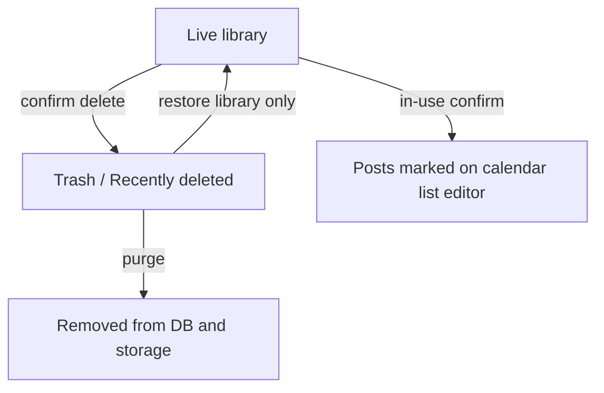
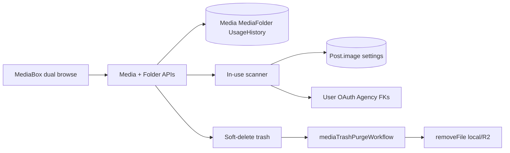

# Media Folders and Bulk Delete - Plan

## Goal Capsule

- **Objective:** Let org members organize media in nested folders (with dual browse), delete media in bulk safely, and find unused or not-currently-in-use files quickly — without leaving orphaned storage objects or silent broken posts.
- **Product authority:** This plan owns media library organization, media delete/trash/purge behavior, usage filters, and problem marking on posts that lose media. Surrounding product areas (post composer internals beyond the shared picker, provider-specific media rules) are not active scope except where the media picker must reuse the same folder/browse model.
- **Open blockers:** None. Implementation defaults for D1–D5 live in Planning Contract KTDs.

---

## Product Contract

### Summary

Ship nested media folders with both drill-in and flat-grid+filter browse, multi-select bulk delete with in-use warnings, trash with restore until storage purge, usage filters for unused and previously-used-but-not-currently-attached media, and clear problem marks on the calendar, posts list, and editor when confirmed deletes leave posts without their media.

### Problem Frame

The media library is a single flat list. People already work around it with filename prefixes and by avoiding uploads. Cleanup is one-file-at-a-time, and there is no productized check for whether a file is still on a scheduled post before delete. Soft-delete exists in the database, but storage backends are not reliably purged, so deleted items can leave orphans on disk or object storage.

### Key Decisions

- KD1. **Dual browse required** — both drill-in (“inside a folder”) and flat grid + folder filters ship in this plan; neither may be dropped. (session-settled: user-directed — chosen over single-mode A or B alone: cover both organization styles) Governs R2, R3, R7.
- KD2. **Nested folders** — folders may contain folders. (session-settled: user-directed — chosen over flat-only / flat-now-nested-later: matches normal file trees) Governs R1, R5.
- KD3. **Warn-and-allow on in-use delete** — show which posts still use the media, then delete only after confirm. (session-settled: user-directed — chosen over hard-block or warn-only-for-bulk: cleanup stays fast) Governs R8, R9, R10.
- KD4. **Cascade folder delete** — deleting a folder deletes the folder and all descendant folders/files, with the same in-use warning flow for any in-use files in the subtree. (session-settled: user-directed — chosen over block-until-empty or move-contents-up) Governs R5, R9.
- KD5. **Trash with restore** — deleted media leave the live library immediately into Recently deleted / trash; restore remains available until storage purge. (session-settled: user-directed — chosen over immediate hard-delete or view-only trash) Governs R10, R11, R12.
- KD9. **Restorable folder trees** — cascade-deleted folders appear in trash and can be restored with their media as a subtree. (session-settled: user-directed — chosen over media-only trash: keep folder organization recoverable) Governs R5, R10, R11.
- KD6. **Problem posts marked broadly** — after confirmed delete of in-use media, affected posts show a clear problem state on calendar, posts list, and editor. (session-settled: user-directed — chosen over leave-as-is or calendar/list-only: user must find broken posts) Governs R13.
- KD7. **Usage filters in scope** — library can show unused media and media used before but not currently attached to any post. (session-settled: user-directed — added after approach A to support “clean unused fast”) Governs R6.
- KD8. **Folders + bulk delete as one work unit** — both outcomes ship together. (session-settled: user-directed — chosen over splitting into separate plans) Governs all R-IDs in this contract.

### Actors

- A1. **Org media user** — any organization member who browses, uploads, organizes, or deletes media, or picks media while composing/scheduling posts.
- A2. **System** — runs automatic trash purge after the retention window (and related non-interactive retention jobs).

### Requirements

**Folders and browse**

- R1. Users can create, rename, and delete nested folders within their organization media library.
- R2. Users can browse media via drill-in navigation where the current folder is the browse context (sidebar/tree and breadcrumbs or equivalent).
- R3. Users can browse media via a flat grid with folder filters (including nested folder filter hierarchy), without requiring drill-in as the only path.
- R4. Users can upload media into a chosen folder and move existing media between folders (including to unfiled).
- R5. Deleting a folder deletes that folder and all descendant folders and media, subject to R8–R10.
- R6. Users can filter the library to unused media and to media that was used before but is not currently attached to any post.
- R7. An All view shows media across folders; media not in any folder remains reachable via an unfiled view and also appears in All, consistent with R2–R3.

**Delete, trash, and storage**

- R8. Before deleting one or many media items, the product checks whether each item is still in use by any post that depends on it (including media attached via post image JSON and settings-embedded media such as provider thumbnails/covers) or by other live org-library consumers (at least user pictures, OAuth app pictures, and agency logos). If so, it warns with a count of affected consumers and a list of each with enough identity to recognize it (title or date plus status), using a summarized/expandable list when the set is large, then proceeds only on confirm. Cancel leaves the library unchanged.
- R9. Bulk delete supports multi-select of many media items and applies R8 across the selection (and across a folder cascade per R5).
- R10. Confirmed deletes remove items from the live library immediately into trash; items remain restorable until purge. The media library exposes a Recently deleted / trash entry point distinct from live All, unfiled, and folder views. Cascade-deleted folders appear in trash and can be restored as a folder subtree with their media.
- R11. Users can restore trashed media and trashed folders (as subtrees with their media) back into the live library until purge runs. Restore returns library organization only; it does not re-attach media to posts that lost references on delete and does not clear problem marks (those clear when the user attaches replacement media, per D5).
- R12. Purged media are removed from the storage backend (local disk, S3/R2, etc.), not only from the database; soft-delete-then-purge is acceptable.

**Post impact and picker**

- R13. When media is deleted while still referenced by posts, those posts are marked in a clear problem state on the calendar, the posts list, and the editor.
- R14. The media picker used when attaching media to a post supports drill-in, flat grid + folder filters, All/unfiled, and upload/move into a folder for selection. The picker does not expose trash, usage filters, bulk delete, or folder delete/cascade. Folder create/rename in the picker is allowed only as needed to place uploads before attach.

### Key Flows

- F1. Organize into a folder
  - **Trigger:** A1 creates a folder and uploads or moves media into it.
  - **Actors:** A1
  - **Steps:** Create/rename folder; upload into chosen folder or move existing items; browse via drill-in and/or filters; confirm items appear under the folder and in All as appropriate.
  - **Outcome:** Media is findable by folder without filename prefixes.
  - **Covered by:** R1, R2, R3, R4, R7

- F2. Bulk delete with in-use warning
  - **Trigger:** A1 multi-selects media and chooses delete.
  - **Actors:** A1
  - **Steps:** Select items; request delete; if any are in use per R8, show warning with count and recognizable affected posts/consumers; confirm or cancel; on confirm, items leave live library into trash.
  - **Outcome:** Unused/unwanted media cleared in one action; in-use deletes are conscious.
  - **Covered by:** R8, R9, R10

- F3. Cascade delete a folder
  - **Trigger:** A1 deletes a non-empty folder tree.
  - **Actors:** A1
  - **Steps:** Request folder delete; warn for any in-use media in the subtree per R8; on confirm, the folder tree and its media enter trash per R10 and can be restored as a subtree until purge.
  - **Outcome:** Whole subtree removed from the live library without emptying first; organization remains recoverable from trash.
  - **Covered by:** R5, R8, R9, R10, R11

- F4. Restore from trash then purge
  - **Trigger:** A1 opens trash and restores an item or folder, or purge runs after the retention window.
  - **Actors:** A1 (restore); A2 (purge)
  - **Steps:** Restore returns media and/or folder subtrees to the live library only (no post re-attach; problem marks remain until the user fixes posts); unrestored trash items are purged from DB and storage backend by A2.
  - **Outcome:** Accidental library deletes recoverable until purge; posts stripped on in-use confirm stay broken until manually fixed; no storage orphans after purge.
  - **Covered by:** R10, R11, R12, R13

- F5. Clean via usage filters
  - **Trigger:** A1 opens Unused or “used before, not currently attached” filter and bulk-deletes.
  - **Actors:** A1
  - **Steps:** Apply usage filter; multi-select; delete with R8 if any edge cases still warn; confirm.
  - **Outcome:** Cleanup without hunting through every folder.
  - **Covered by:** R6, R8, R9

- F6. Problem posts after in-use delete
  - **Trigger:** A1 confirms delete of media still on posts.
  - **Actors:** A1
  - **Steps:** Posts lose that media reference; calendar, posts list, and editor show a clear problem mark so A1 can find and fix them. Restoring the media later does not clear those marks or re-attach the media.
  - **Outcome:** Broken posts are visible, not silent.
  - **Covered by:** R13, R11

### Acceptance Examples

- AE1. Folder organize
  - **Covers:** R1, R2, R3, R4, R7
  - **Given:** an org with unfiled images
  - **When:** A1 creates nested folders `Campaigns/Q1` and moves two images into `Q1`
  - **Then:** those images appear under `Q1` in drill-in and when filtering to that folder, and still appear in All; unfiled no longer lists them as unfiled

- AE2. Bulk delete unused
  - **Covers:** R6, R9, R10
  - **Given:** several media items not attached to any post
  - **When:** A1 filters to unused, selects multiple, deletes, and confirms
  - **Then:** items leave the live library into trash in one action with no in-use warning

- AE3. In-use warn then problem marks
  - **Covers:** R8, R10, R13
  - **Given:** a media item attached to a scheduled post
  - **When:** A1 deletes that item and confirms after the warning
  - **Then:** the item is in trash; the affected post shows a problem mark on the calendar, posts list, and editor

- AE4. Folder cascade with mixed in-use
  - **Covers:** R5, R8, R9, R10, R11
  - **Given:** a folder tree containing some in-use and some unused media
  - **When:** A1 deletes the parent folder
  - **Then:** the warning covers in-use items in the subtree; on confirm the folder tree and its media leave the live library into trash and remain restorable as a subtree until purge

- AE5. Restore before purge
  - **Covers:** R11, R12, R13
  - **Given:** a trashed media item still within the restore window, previously deleted while on a post
  - **When:** A1 restores it
  - **Then:** it returns to the live library without re-attaching to the post; problem marks remain; after purge of a different unrestored trash item, that purged file is gone from storage as well as the DB

- AE7. Restore cascade-deleted folder
  - **Covers:** R10, R11
  - **Given:** a cascade-deleted folder still in trash with its media
  - **When:** A1 restores that folder
  - **Then:** the folder subtree and its media return to the live library with the same nesting; posts stripped on delete remain problem-marked if applicable

- AE6. Picker parity
  - **Covers:** R14, R2, R3, R7
  - **Given:** nested folders with media
  - **When:** A1 opens the media picker while composing a post
  - **Then:** A1 can use both browse modes and All/unfiled to find and attach media, without trash, usage filters, bulk delete, or folder cascade delete

### Success Criteria

- Org members can find media by folder without relying on filename prefixes.
- Unused or not-currently-attached media can be selected and removed in bulk without one-by-one deletes.
- In-use deletes never happen silently; affected posts are visibly marked on calendar, posts list, and editor.
- After purge, deleted media are gone from the configured storage backend, not only soft-deleted in the database.
- Both drill-in and filter browse remain available in the library and the post media picker.
- Restore recovers library media within the retention window without silently healing posts that lost media on confirm.

### Scope Boundaries

- Does not redesign the post composer beyond shared media picker parity and problem marks on the editor surface.
- Does not introduce media tags as a separate organization system (folders are the organization model).
- Does not change public upload APIs beyond what is required for folder assignment on upload, if planning finds a gap.
- Provider-specific media rules stay in providers; this plan stays generic to the media library.
- Legacy storage orphans from pre-feature soft-deletes remain out of scope; R12 applies to deletes after this feature ships (a later backfill may be planned separately).

### Dependencies / Assumptions

- Media already soft-deletes via `deletedAt`; this plan extends that into user-visible trash, restore, and real storage purge.
- Post-attached media lives in both post image JSON (MediaDto arrays) and MediaDto fields embedded in post settings (at least YouTube thumbnail and Hashnode/Dev.to/WordPress cover/main image); in-use detection, warn-and-allow, usage filters, and problem marking must cover both surfaces.
- Other live Media foreign-key consumers that can appear in the org library (at least user pictures, OAuth app pictures, agency logos) are included in R8 in-use detection.
- The R6 “used before but not currently attached” filter requires a durable usage-history mechanism (new table/event log or equivalent) because current attachment JSON only reflects present attachment; D3 only chooses which post statuses count.
- Cloudflare/R2 `removeFile` is currently a no-op in-repo; planning must make purge real for configured storage providers.
- “In use” for posts means posts that still depend on the media for upcoming publish or other settled status rules; planning may refine draft vs published vs failed edge cases under Deferred to Planning (D3).
- Dual browse implies a default entry mode; planning chooses the default without dropping either mode.

### Outstanding Questions

**Resolve Before Planning**

- (none)

**Deferred (non-blocking; defaults in Planning Contract KTDs)**

- D1 → KTD1: default first-open browse mode.
- D2 → KTD2: trash retention duration.
- D3 → KTD3: in-use / used-before status sets.
- D4 → KTD4: restore when parent folder missing.
- D5 → KTD5: problem-mark clear and render.

### Sources / Research

- Current media model and soft-delete: `libraries/nestjs-libraries/src/database/prisma/schema.prisma` (`Media`, `Post.image`)
- Single-id delete API and list query (`page`, `search` only): `apps/backend/src/api/routes/media.controller.ts`
- Soft-delete repository path (no storage `removeFile`): `libraries/nestjs-libraries/src/database/prisma/media/media.repository.ts`
- Storage providers and Cloudflare `removeFile` no-op: `libraries/nestjs-libraries/src/upload/`
- Media library UI / picker multi-select for attach: `apps/frontend/src/components/media/media.component.tsx`
- Calendar ERROR badge pattern: `apps/frontend/src/components/launches/calendar.tsx`
- Temporal sleep-loop pattern: `apps/orchestrator/src/workflows/missing.post.workflow.ts` (new workflow only — never mutate shipped workflows)

---

## Planning Contract

### Key Technical Decisions

- KTD1. **Default browse mode is flat grid + folder filters** on first open; drill-in remains fully available via an explicit switch. (session-settled: user-approved — chosen over drill-in-first: closest to today's MediaBox grid) Governs R2, R3, R14.
- KTD2. **Trash retention is 30 days** before automatic storage purge; cascade delete must not ship with zero retention. Governs R10–R12, D2.
- KTD3. **In-use** includes draft, scheduled, and failed posts that still reference the media; published posts count for history but not live in-use unless still editable with the media attached. **Used-before** uses the usage-history table for any prior attach. Governs R6, R8, D3.
- KTD4. **Restore with missing parent** places the restored folder (or media) under library root / All parent, never inventing a deleted parent. Governs R11, D4.
- KTD5. **Problem marks** use a dedicated post flag/field (not publish `ERROR` state); clear when the user attaches replacement media. Calendar/list/editor show icon+text, not color alone. Governs R13, D5.
- KTD6. **Usage history** is a new org-scoped event/table written on attach and detach — not inferred from current `Post.image` alone. Governs R6.
- KTD7. **Purge is a new Temporal workflow** (`mediaTrashPurgeWorkflow` or versioned name) with a sleep loop; never edit existing workflows/activities in place. Governs R12, A2.
- KTD8. **Layers stay DTO → Controller → Service → Repository** in `libs` media modules; no Manager unless an existing media Manager appears. Org id on every write.
- KTD9. **Problem marks strip media refs on confirm** from post image JSON and settings MediaDto fields; restore does not rehydrate those refs.

### Technical Design

- Extend Prisma with nested `MediaFolder`, `Media.folderId`, folder soft-delete, usage-history, and post problem-mark field; index `deletedAt` like Tags.
- Soft-delete = trash; purge = storage `removeFile` then hard-delete rows (enable Cloudflare DeleteObject).
- List APIs gain `folderId`, `unfiled`, `trash`, `usage=unused|detached`, plus folder tree endpoint.
- Frontend: extract SWR hooks; standalone library gets full chrome; picker mode hides trash/usage/bulk/cascade per R14.

### Assumptions

- Retention of 30 days is acceptable until product tunes D2.
- Filter-first default is acceptable until analytics suggest otherwise.
- Dedicated problem flag is preferred over overloading publish ERROR.

### Open Questions

**Deferred to implementation**

- Exact Prisma field name for problem marks (boolean vs enum vs JSON).
- JSON search strategy for media ids in `Post.image`/`settings` at org scale (contains vs batched load).
- Whether companion `Media.thumbnail` paths are purged with the primary file in the same purge pass (should yes).

### Implementation Units summary

| ID | Unit | Depends on |
|----|------|------------|
| U1 | Schema: folders, trash, usage history, problem mark | — |
| U2 | Storage purge plumbing (R2 + helper) | — |
| U3 | Folder CRUD + list/filter APIs | U1 |
| U4 | In-use, bulk/cascade delete, restore, strip+mark | U1, U3 |
| U5 | Usage filter APIs | U1, U4 |
| U6 | Temporal trash purge workflow | U1, U2 |
| U7 | Frontend library, picker, problem marks | U3–U5 |

Order: U1 → (U2 ∥ U3) → U4 → U5 → U6 → U7 (U7 can stub against U3 early).

---

## Implementation Units

### U1. Schema: folders, trash, usage history, problem mark

- **Goal:** Persist nested folders, trashable folders/media, usage history for R6, and a post problem mark for R13.
- **Requirements:** R1, R5, R6, R10, R11, R13
- **Files:** `libraries/nestjs-libraries/src/database/prisma/schema.prisma`; Prisma migration
- **Approach:** Add `MediaFolder` (org, parentId, name, deletedAt, indexes); `Media.folderId`; usage-history table (orgId, mediaId, postId?, event, createdAt); post problem-mark field; `@@index([deletedAt])` on Media/folders. Follow Tags soft-delete indexing.
- **Test scenarios:**
  - Nested folder create under parent within same org
  - Soft-deleted media excluded from live list queries
  - Usage-history row insertable and queryable by mediaId
- **Verification:** `pnpm exec prisma validate`; migration applies cleanly

### U2. Storage purge plumbing

- **Goal:** Make `removeFile` real for Cloudflare/R2 and callable from a shared purge helper.
- **Requirements:** R12
- **Files:** `libraries/nestjs-libraries/src/upload/cloudflare.storage.ts`; `libraries/nestjs-libraries/src/upload/local.storage.ts`; media service helper
- **Approach:** Uncomment/implement DeleteObject; add service method that removes path + thumbnail path then hard-deletes DB row; never call on soft-delete.
- **Test scenarios:**
  - Local provider unlinks existing file
  - Cloudflare provider sends DeleteObject for object key derived from path
  - Missing object does not fail purge fatally (idempotent)
- **Verification:** Unit tests on storage providers / helper

### U3. Folder CRUD and list filters

- **Goal:** API for nested folders and listing All / unfiled / by folder.
- **Requirements:** R1–R4, R7
- **Files:** `libraries/nestjs-libraries/src/dtos/media/*`; `apps/backend/src/api/routes/media.controller.ts`; `.../media/media.service.ts`; `.../media/media.repository.ts`
- **Approach:** DTO → controller → service → repository; org-scoped create/rename/move/list; upload accepts optional folderId; list query params for folder/unfiled/search/page.
- **Test scenarios:**
  - Create/rename folder in org; reject cross-org parent
  - Move media between folders and to unfiled
  - List All includes filed+unfiled; unfiled excludes filed
- **Verification:** Jest API/repository tests; manual smoke via HTTP

### U4. In-use detection, bulk/cascade delete, restore, strip+mark

- **Goal:** Warn-and-allow delete into trash; cascade folders; restore subtrees; strip post refs and set problem marks.
- **Requirements:** R5, R8–R11, R13
- **Files:** media controller/service/repository; posts repository/service for strip+mark; DTOs for warn payload and bulk delete
- **Approach:** In-use scanner over Post.image, settings MediaDto fields, and Media FKs; bulk delete + folder cascade soft-delete; restore media/folders; on confirm strip refs and set problem mark; restore does not reattach.
- **Test scenarios:**
  - Warn lists post using image JSON and settings thumbnail
  - Warn lists user picture FK consumer
  - Bulk delete moves selection to trash; cancel leaves unchanged
  - Cascade folder delete trashes subtree; restore recovers nesting
  - Confirm delete strips post media and sets problem mark; restore does not clear mark
- **Verification:** Jest service tests covering AE3, AE4, AE5, AE7

### U5. Usage filter APIs

- **Goal:** List unused and used-before-but-not-currently-attached media.
- **Requirements:** R6
- **Files:** media repository/service/controller; usage-history writes from U4 attach/detach paths
- **Approach:** `usage=unused` and `usage=detached` query modes; history written when posts attach/detach media.
- **Test scenarios:**
  - Unused excludes media currently on draft/scheduled/failed posts
  - Detached includes history but not currently attached
  - Never-attached media appears in unused, not detached
- **Verification:** Repository/integration tests

### U6. Temporal trash purge workflow

- **Goal:** After retention, purge trash from storage and DB.
- **Requirements:** R12; A2
- **Files:** `apps/orchestrator/src/workflows/media.trash.purge.workflow.ts` (new); activity module; `workflows/index.ts` export; worker registration
- **Approach:** New sleep-loop workflow (mirror `missing.post.workflow.ts`); activity selects trash older than 30 days; calls U2 purge helper for media + folder rows. Do not change existing workflow signatures.
- **Test scenarios:**
  - Activity purges only rows past retention
  - Fresh trash not purged
  - Workflow registered under new name only
- **Verification:** Activity unit tests; orchestrator boots with new workflow registered

### U7. Frontend library, picker, and problem marks

- **Goal:** Dual browse UI, trash/restore, bulk delete warn dialog, usage filters (library only), picker parity, problem marks on calendar/list/editor.
- **Requirements:** R2, R3, R7, R9–R11, R13, R14
- **Files:** `apps/frontend/src/components/media/media.component.tsx`; new SWR hooks under frontend hooks; `new.uploader.tsx`; `apps/frontend/src/components/launches/calendar.tsx`; `libraries/helpers/src/utils/posts.list.minify.ts`; `apps/frontend/src/components/new-launch/editor.tsx`
- **Approach:** Extract one-SWR-per-hook for media list, folders, trash; default filter browse (KTD1); standalone shows trash/usage/bulk; picker hides them; warn dialog shows count+list; problem mark badge parallel to ERROR ring but distinct; ensure minify passes problem field.
- **Test scenarios:**
  - Library: switch browse modes; create folder; upload into folder; bulk delete with warn
  - Picker: dual browse without trash/bulk/cascade
  - Calendar/list/editor show problem mark for flagged post; clears after reattach (manual/E2E smoke)
- **Verification:** Component tests where present; manual smoke on media page + composer + calendar

---

## Verification Contract

| Gate | Command / check | Applies to |
|------|-----------------|------------|
| Unit/integration | `pnpm test` (root Jest) focused on media/folder/purge tests added in U1–U6 | U1–U6 |
| Lint | Root lint via project standard (`pnpm` from repo root) | All touched packages |
| Prisma | `pnpm exec prisma validate` (+ migrate in local/dev) | U1 |
| Manual smoke | Media library dual browse, trash restore, bulk warn; picker bounds; calendar problem mark | U7 |
| Orchestrator | Worker starts with new purge workflow registered; no edits to existing workflow defs | U6 |

Execution direction: prefer characterization tests around current `deleteMedia` soft-delete before changing purge behavior; smoke-first on U7 after APIs land.

---

## Definition of Done

**Global**

- [ ] All Product Contract requirements R1–R14 satisfied or explicitly deferred with KTD coverage
- [ ] Cloudflare/local purge removes objects for feature-era trash after retention
- [ ] Dual browse in library and picker; picker omits trash/usage/bulk/cascade
- [ ] In-use warn covers image JSON, settings MediaDto, and FK consumers
- [ ] Problem marks visible on calendar, posts list, and editor; restore does not auto-heal posts
- [ ] No existing Temporal workflow signatures mutated
- [ ] Verification gates above pass for changed units

**Per unit**

- [ ] U1 migration applied; schema matches nested folders + history + problem mark
- [ ] U2 `removeFile` works for configured providers
- [ ] U3 folder CRUD + All/unfiled/folder list APIs org-scoped
- [ ] U4 bulk/cascade/restore + strip/mark behaviors match AE3–AE5, AE7
- [ ] U5 unused + detached filters correct
- [ ] U6 purge workflow new and retention-gated
- [ ] U7 MediaBox + calendar/list/editor UX matches R14/R13
