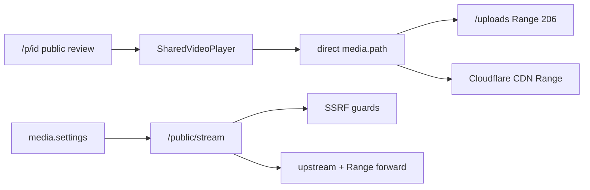

# Review Playback Shared Player - Plan

## Goal Capsule

- **Objective:** Give external reviewers YouTube-like video playback (mute toggle, play/pause, scrub, volume) on the public review link; in-app muted-autoplay embeds adopt the shared player in this delivery only where replacement is a drop-in (per KD5/R6).
- **Product authority:** This plan owns shared video playback behavior and media-serving fixes required so seekable, audible playback holds for the public review must-ship surface. Surrounding review-link areas (comments, approve/reject, expiry, password, white-label) and caption truncation are not active scope.
- **Open blockers:** None. Deferred product questions Q1–Q5 resolved as Planning Contract KTDs below.
- **Product Contract preservation:** unchanged (doc-review edits landed before planning enrichment; no scope change in this enrichment).

---

## Product Contract

### Summary

Ship a shared YouTube-like video player (muted autoplay, unmute, play/pause, scrub, volume), use it on the public review link as the must-ship surface, and fix media delivery when it blocks seek or audio so reviewers can hear and control videos end-to-end.

### Problem Frame

The public review link is how people outside Postiz preview scheduled posts. Videos there autoplay muted with no way to unmute or pause, so reviewers cannot properly judge audio-dependent content. Browser autoplay rules force mute for unattended play; without controls, that mute is a dead end. Caption cut-off was reported earlier but is not confirmed on the current preview page.

### Key Decisions

- KD1. **Shared player over preview-only** — introduce a reusable YouTube-like player, not a one-off on the public page. (session-settled: user-directed — chosen over approach A preview-scoped: investment compounds) Governs R1, R6.
- KD2. **YouTube-like chrome over native controls** — muted autoplay with unmute affordance plus play/pause, scrub, and volume. (session-settled: user-directed — chosen over native-only minimum and over click-to-play immersive: richer review UX) Governs R2, R3, R4, R10–R12.
- KD3. **End-to-end audible review** — success includes media serving when delivery blocks seek or sound, not player UI alone. (session-settled: user-directed — chosen over player-UX-only: audio must actually work) Governs R5, R7.
- KD4. **Caption truncation out of this delivery** — caption redesign/truncation fixes stay out of this plan; if QA confirms clipping, file a defect follow-up outside this delivery (do not expand this plan’s scope). (session-settled: user-directed — chosen over including caption fixes now: not observed as current pain) Governs scope only.
- KD5. **Public review is must-ship; other surfaces are drop-in** — the public review link must use the new player in this delivery. A call site is a drop-in only when it uses the existing muted-autoplay helper with no custom chrome, overlays, or layout constraints; only those sites may migrate in this delivery, and public review alone satisfies R6 if none qualify. Custom-layout surfaces stay on the old helper until a follow-up. (assumption after open call-out on confirm) Governs R1, R6.

### Actors

- A1. **External reviewer** — opens the public review/preview link without a Postiz account; watches scheduled post media.
- A2. **Org sharer** — Postiz user who opens or copies the public review/preview link for a client or teammate.
- A3. **In-app media viewer (optional)** — org member who may encounter the shared player only if a drop-in surface migrates in this delivery; not a must-ship beneficiary.

### Requirements

**Shared player behavior**

- R1. Postiz exposes one shared video player used wherever this plan migrates video playback, including at least the public review/preview link.
- R2. On load, video may autoplay only while muted; the reviewer can unmute (or raise volume from mute) with an obvious control. When the browser blocks autoplay entirely, the player shows a non-playing initial state with an obvious play control; after the reviewer plays, muted-start and unmute behavior from R2–R5 still apply.
- R3. The player provides working play/pause, scrub/seek, and volume (including mute toggle) in a YouTube-like control pattern (bottom bar and/or clear unmute affordance — exact chrome is planning’s choice within this shape). Play/pause, unmute/mute, volume, and scrub must be usable on touch viewports with adequate hit targets.
- R4. The player does not depend on autoplay-with-sound; browsers may block that, and product behavior must remain usable without it (including the blocked-autoplay path in R2).
- R5. After the reviewer unmutes or plays with sound available, audio from the media file is audible when the file has an audio track and delivery supports playback.
- R10. The player defines these interaction states: (1) loading/buffering — controls remain visible; play/pause and scrub show busy/disabled until playback can proceed; (2) media/load error — a non-dead error affordance so the player is not a blank frame; (3) seek in progress — scrub commits a target time and shows wait until resume near that point (align AE2); (4) ended — replay or play-from-start available after natural end.
- R11. Every play/pause, unmute/mute, volume, and scrub control is reachable and operable by keyboard; the focused control has a visible focus indicator; assistive tech can determine name and pressed/muted/playing state for mute and play/pause. Exact key bindings and markup are planning’s choice.
- R12. Unmute/volume controls stay available on clips with no audio track; after unmute, UI may show unmuted/volume state and no audible output is required (consistent with R5 when the file has an audio track).

**Surfaces and delivery**

- R6. The public review/preview link is the must-ship surface for R1–R5 and R10–R12. Other in-app muted-autoplay video embeds migrate in this delivery only when they meet KD5’s drop-in rule (existing muted-autoplay helper, no custom chrome/overlays/layout constraints). Public review alone satisfies this requirement if no drop-ins qualify.
- R7. If media URLs used by the player cannot be seeked or played with audio because of how Postiz serves or proxies media (including missing or incorrect HTTP Range behavior where required), this work fixes delivery on those paths far enough that R5 holds for the must-ship public review surface. If planning finds that must-ship path cannot achieve seek plus audible playback within this plan’s serving-fix identity, treat that path as a release blocker for claiming R5/success — do not ship player-chrome-only as meeting this contract. Any media proxy or Range/partial-content fix for that path must (1) preserve HTTPS-only URL allowlisting, private-IP rejection, and per-redirect revalidation on open fetch/proxy paths, (2) forward only well-formed byte-Range request headers, and (3) prefer correct Range on direct storage/CDN URLs for anonymous review playback when feasible so seek traffic does not have to traverse an unauthenticated URL proxy. If a Postiz proxy is still required, anonymous clients will exercise that proxy and upstream hosts must be allowlisted to configured media storage (not arbitrary third-party URLs) for review playback.

**Non-goals carried as requirements-adjacent**

- R8. Images and non-video media keep their current presentation unless a change is required solely to host the shared video player.
- R9. Post captions on the public review page are not redesigned in this plan; if QA finds truncation, treat it as a defect follow-up outside this delivery (do not expand this plan’s scope).

### Key Flows

- F1. Reviewer watches a video with sound
  - **Trigger:** A1 opens a public review/preview link that includes a video post.
  - **Actors:** A1
  - **Steps:** Page loads; video may start muted, or shows play if autoplay is blocked; A1 uses unmute/volume; A1 plays, pauses, and scrubs; audio is heard when present; loading/error/ended states remain usable per R10.
  - **Outcome:** A1 can judge the scheduled video including sound.
  - **Covered by:** R1–R5, R7, R10–R12

- F2. Sharer sends the same link
  - **Trigger:** A2 shares the existing public review/preview URL with a client.
  - **Actors:** A2, A1
  - **Steps:** A2 copies/opens the public review/preview link as today; A1 experiences F1 without signing in.
  - **Outcome:** No new account or auth step for review playback.
  - **Covered by:** R1, R6

### Acceptance Examples

- AE1. Muted autoplay then unmute
  - **Covers:** R2, R3, R5
  - **Given:** A public review link with a video that has an audio track
  - **When:** The page loads and the reviewer unmutes (or raises volume from mute)
  - **Then:** Playback continues or can be started with audible audio, and play/pause/scrub remain available

- AE2. Seek works end-to-end
  - **Covers:** R3, R7, R10
  - **Given:** A review-link video longer than a few seconds on a storage path Postiz uses in production
  - **When:** The reviewer scrubs to a later point
  - **Then:** Playback resumes near that point without a dead player; if delivery was the blocker, the serving fix is what made this true

- AE3. No sound without a gesture when autoplaying
  - **Covers:** R4
  - **Given:** A cold load of the public review page
  - **When:** Video autoplays without a user gesture
  - **Then:** It remains muted until the reviewer uses an unmute/volume control

- AE4. Autoplay fully blocked
  - **Covers:** R2, R4
  - **Given:** A public review link whose browser blocks even muted autoplay
  - **When:** The page loads
  - **Then:** The player shows a non-playing state with an obvious play control; after play, muted-start and unmute behavior from R2–R5 still apply

### Success Criteria

- An external reviewer can pause, resume, seek, adjust volume/mute, and hear audio on public-review videos without a Postiz login.
- Must-ship success is met when the public review/preview link satisfies the player and delivery criteria above; same-delivery drop-in migrations are optional bonus work and do not gate success.
- Media delivery used by the must-ship public review path supports seekable playback with audio where the file itself has audio. Claiming that success is blocked if that path cannot be fixed within this plan’s serving identity (per R7).

### Scope Boundaries

**In scope**

- Shared YouTube-like video player behavior (muted autoplay, unmute, play/pause, scrub, volume), including defined interaction states, keyboard operability, touch usability, and silent-clip unmute behavior
- Public review/preview link as must-ship surface
- Drop-in migration of other muted-autoplay embeds only when they meet KD5’s drop-in rule (optional; does not gate success)
- Media serving/proxy fixes required so R5 holds for the public review must-ship surface (not serving work needed solely for optional drop-in surfaces)

**Deferred for later**

- Reviewer comments and per-post approve/reject
- Link expiry date and password protection
- White-label / custom branding on the public link
- Caption truncation defect follow-ups if QA later confirms clipping
- Non-drop-in redesigns of specialized in-app video UIs
- Serving fixes needed solely for optional drop-in surfaces

**Outside this plan’s identity**

- Changing how posts are scheduled or which providers receive media
- Replacing the public review link feature with a different collaboration product

<!-- ce-section: work-relationships -->
### How This Work Fits Together

This plan owns **review playback & shared video player** only. The broader public-review improvement request is the current understanding, not a committed roadmap:

- **Reviewer feedback** (comments, approve/reject)
  - Can proceed independently of this plan’s player work
  - Shares the public review link surface
- **Link access controls** (expiry, password)
  - Can proceed independently of this plan
  - Shares the public review link surface
- **White-label branding**
  - Can proceed independently of this plan
  - Shares the public review link surface
- **Caption truncation**
  - Deferred defect follow-up if QA confirms clipping; not active requirements here

### Dependencies / Assumptions

- Assumed: browsers will continue to block unmuted autoplay without a user gesture; product design accepts muted autoplay plus unmute, and a play-first path when even muted autoplay is blocked.
- Assumed: public review remains an unauthenticated share URL (no login for F1).
- Assumed: some deployments serve media in ways that need correct Range/partial-content behavior for reliable seek; planning must verify per storage path rather than assume one root cause.
- Assumed: anonymous review playback should prefer direct storage/CDN URLs with correct Range; proxy use for seek is a constrained exception under R7.
- External: open PR #1784 (`fix/local-uploads-range` @ `ffeed7b9`) adds local uploads Range — not on HEAD; treat as the preferred approach to port for U3, not as merged authority until landed.

### Outstanding Questions

**Resolve Before Planning**

- (none)

**Deferred (non-blocking; defaults in Planning Contract KTDs)**

- Q1 → KTD4: drop-in inventory — none this delivery; public review alone satisfies R6.
- Q2 → KTD5–KTD6: must-ship uses direct `media.path`; local uploads need Range; Cloudflare typically already Ranges; stream proxy Range-forward is separate hardening.
- Q3 → KTD2: chrome default is bottom control bar + persistent unmute chip.
- Q4 → KTD7: operable-controls bar (R11) only; no WCAG level claim in v1.
- Q5 → KTD8: static failure message for media error; retry optional polish.

### Sources / Research

- Public preview muted helper: `libraries/react-shared-libraries/src/helpers/video.or.image.tsx`; wired at `apps/frontend/src/app/(app)/(preview)/p/[id]/page.tsx`
- Other `VideoOrImage` sites are provider compose previews with custom layout (not KD5 drop-ins)
- Closest scrub prototype: `apps/frontend/src/components/launches/helpers/media.settings.component.tsx` (muted video + range input; uses `/public/stream`)
- Local uploads no Range on HEAD: `apps/frontend/src/app/(app)/api/uploads/[[...path]]/route.ts`
- Public stream SSRF + no client Range forward: `apps/backend/src/api/routes/public.controller.ts` (`/public/stream`)
- PR #1784 / commit `ffeed7b9`: local uploads Range→206/`Accept-Ranges`/`Content-Range`
- No existing frontend media/preview Jest tests in-repo; root `pnpm test` is Jest

---

## Planning Contract

### Key Technical Decisions

- KTD1. **New `SharedVideoPlayer` in react-shared** — implement YouTube-like chrome beside `VideoOrImage`; do not bolt controls into every preview call site. `VideoOrImage` stays the muted-loop helper for custom-layout previews. Governs R1, R8.
- KTD2. **Chrome default** — bottom control bar (play/pause, scrub, volume/mute) plus a persistent unmute chip while muted; no hover-only controls. Exact icons/styling follow existing preview dark surface (`bg-[#000000]` layout). Governs R2, R3, Q3.
- KTD3. **Muted autoplay with play-first fallback** — attempt muted autoplay; on `play()` rejection or autoplay-blocked, show non-playing state with centered play. Never attempt unmuted autoplay. Governs R2, R4, AE3, AE4.
- KTD4. **No optional drop-ins this delivery** — inventory found zero KD5 drop-ins (all other `VideoOrImage` sites have provider chrome, fixed heights, sliders, or overlays). Public `/p/[id]` alone satisfies R6; A3 unused this delivery. Governs R6, Q1.
- KTD5. **Must-ship media stays on direct `media.path`** — public review continues using post image URLs directly (local `/uploads/…` or Cloudflare CDN). Do not route anonymous review playback through `/public/stream`. Governs R7.
- KTD6. **Serving fixes** — (a) port local uploads Range handling from `ffeed7b9` / PR #1784 into the uploads route; (b) forward well-formed client `Range` on `/public/stream` while preserving existing SSRF/redirect guards (editor + future proxy use). Cloudflare direct URLs assumed Range-capable. Missing local Range on self-hosted is a release blocker for R5/AE2. Governs R7, Q2.
- KTD7. **A11y bar is R11 only** — keyboard reachability, visible focus, name/pressed/muted/playing exposure; no WCAG conformance claim in v1. Governs R11, Q4.
- KTD8. **Error state is static message** — non-blank error affordance; retry-in-player is optional polish, not required. Governs R10, Q5.
- KTD9. **Loop off for review playback** — shared player on the public link does not loop; ended state shows replay (R10). Provider `VideoOrImage` loop behavior unchanged.

### Technical Design

- `SharedVideoPlayer`: React component in `libraries/react-shared-libraries` next to `video.or.image.tsx`; props at least `src`, `autoplayMuted?`, `className?`; internal HTML5 `<video>` without native `controls`; custom bar + unmute chip.
- Public page swaps `VideoOrImage` for `SharedVideoPlayer` on mp4 paths only; images stay as today (`R8`).
- Scrub UX can borrow range-input patterns from `media.settings.component.tsx` without using `/public/stream` on the review page.
- Uploads route: parse `Range: bytes=start-end`, `createReadStream({ start, end })`, status 206 + `Content-Range` / `Accept-Ranges`, 416 when out of bounds (mirror `ffeed7b9`).
- Stream endpoint: pass `Range` from `req.headers.range` only when it matches a strict bytes pattern; keep hop-by-hop `isSafePublicHttpsUrl` + `ssrfSafeDispatcher`.

### Assumptions

- Cloudflare/R2 public object URLs already honor Range for browser seek.
- Self-hosted local storage is the primary must-ship risk for AE2; shipping U3 with U1–U2 unblocks local review.
- `/public/stream` Range-forward (U4) is required for contract honesty and editor seek, not for the public review happy path when KTD5 holds.
- Jest at repo root is the test runner; new tests live near changed modules.

### Open Questions

**Deferred to implementation**

- Exact transport icon set (inline SVG vs existing icon pack).
- Whether `SharedVideoPlayer` lives as `shared.video.player.tsx` vs `video.player.tsx` naming.
- Whether to cherry-pick `ffeed7b9` wholesale or re-implement the same Range behavior on current HEAD.

### Implementation Units summary

| ID | Unit | Depends on |
|----|------|------------|
| U1 | SharedVideoPlayer (YouTube-like chrome) | — |
| U2 | Wire public review `/p/[id]` | U1 |
| U3 | Local uploads HTTP Range | — |
| U4 | Public stream Range forward + SSRF preserve | — |

Order: (U1 ∥ U3 ∥ U4) → U2; must-ship gate is U1+U2+U3 on local storage (U4 before release if stream is used anywhere in the same PR, else can follow immediately after).

---

## Implementation Units

### U1. SharedVideoPlayer component

- **Goal:** Reusable YouTube-like video player with muted autoplay, unmute, play/pause, scrub, volume, states, keyboard/touch, silent-clip unmute.
- **Requirements:** R1–R5, R10–R12
- **Files:** `libraries/react-shared-libraries/src/helpers/shared.video.player.tsx` (new); export from the package’s helpers barrel if one exists; optional small CSS module/classes using Tailwind tokens already used on preview
- **Approach:** Custom controls over HTML5 video (no native `controls`). Attempt muted autoplay; on failure show play-first. Bottom bar + unmute chip while muted. States per R10; a11y per R11/KTD7; silent clips per R12; no loop (KTD9). Style for dark review surface. Do not change `VideoOrImage` behavior.
- **Test scenarios:**
  - Muted autoplay path exposes unmute and keeps play/pause/scrub
  - When `play()` is rejected, UI shows non-playing play affordance (AE4)
  - Scrub updates `currentTime` toward committed target
  - Keyboard can activate play/pause and mute toggle
  - Clip without audio track: unmute control remains usable; no throw
- **Verification:** Jest + Testing Library around the component (jsdom); manual smoke in browser for autoplay policy quirks

### U2. Wire public review page

- **Goal:** Public `/p/[id]` uses `SharedVideoPlayer` for mp4 media so F1/AE1–AE4 hold on the must-ship surface.
- **Requirements:** R1, R6, R8; F1, F2; AE1–AE4
- **Files:** `apps/frontend/src/app/(app)/(preview)/p/[id]/page.tsx`
- **Approach:** For each media path in the post image JSON, render `SharedVideoPlayer` when extension is mp4 (reuse `hasExtension`); keep image rendering as today. Preserve layout (`max-h-[500px]`, contain). Leave provider previews on `VideoOrImage` (KTD4).
- **Test scenarios:**
  - Page with video post mounts shared player (component/integration smoke)
  - Page with image-only post unchanged
  - Multiple videos on one post each get their own player instance
- **Verification:** Manual smoke on `/p/{id}` with local and (if available) CDN media; lint touched frontend files

### U3. Local uploads HTTP Range

- **Goal:** Local `/uploads` serves ranged GETs with 206 so browser seek works for self-hosted review media (and TikTok chunked upload).
- **Requirements:** R5, R7; AE2
- **Files:** `apps/frontend/src/app/(app)/api/uploads/[[...path]]/route.ts`
- **Approach:** Port behavior from `ffeed7b9` / PR #1784: parse `bytes=start-end`, stream window, `Accept-Ranges`, `Content-Range`, 416 out of bounds; keep path-traversal guard. Plain GET remains full file.
- **Test scenarios:**
  - GET without Range returns 200 and full `Content-Length`
  - GET with `Range: bytes=0-9` returns 206, 10-byte body, matching `Content-Range`
  - Out-of-bounds Range returns 416 with `bytes */size`
  - Path outside `UPLOAD_DIRECTORY` still 404
- **Verification:** Jest tests for the route handler (mock fs streams) or a focused node test; manual curl Range check against local uploads

### U4. Public stream Range forward

- **Goal:** `/public/stream` forwards well-formed client Range to upstream while preserving SSRF/redirect defenses (editor seek + any proxy use).
- **Requirements:** R7
- **Files:** `apps/backend/src/api/routes/public.controller.ts` (`streamFile`)
- **Approach:** If `req.headers.range` matches `^bytes=\d+-\d*$`, include it on upstream `fetch` headers; do not forward arbitrary headers. Keep `OnlyURL` / `isSafePublicHttpsUrl` / `ssrfSafeDispatcher` / redirect revalidation. Continue mapping upstream 206/`Content-Range`. Prefer not expanding URL allowlist beyond current SSRF policy in this unit; review-playback stays on direct URLs (KTD5).
- **Test scenarios:**
  - Upstream fetch receives Range when client sent a well-formed bytes Range
  - Malformed Range is ignored (full GET) rather than forwarded
  - Blocked/private URL still 400 before fetch
  - Redirect hop still re-validated
- **Verification:** Jest with mocked `fetch`/dispatcher; manual seek through media.settings stream URL optional

---

## Verification Contract

| Gate | Command / check | Applies to |
|------|-----------------|------------|
| Unit | `pnpm test` focused on new SharedVideoPlayer + uploads Range + stream Range tests | U1, U3, U4 |
| Lint | Root lint via project standard (`pnpm` from repo root) | All |
| Manual smoke | Open `/p/{id}` with a video that has audio: unmute, pause, scrub, volume; verify AE2 on `STORAGE_PROVIDER=local` | U1–U3 |
| Release blocker | If local review seek/audio fails after U1–U2 without U3, do not claim R5 success | R7 / KTD6 |
| Regression | Provider compose previews still use muted `VideoOrImage` without shared chrome | KTD4 |

Execution direction: land U3 early or in the same PR as U2 for local deployments; smoke-first on the public review page after U1+U2; characterization curl/Range tests before relying on browser alone.

---

## Definition of Done

**Global**

- [ ] Public review videos use `SharedVideoPlayer` with unmute, play/pause, scrub, volume (R1–R5, R10–R12)
- [ ] AE1–AE4 behaviors demonstrated on `/p/{id}`
- [ ] Local uploads honor Range (206) so seek works for self-hosted media (R7)
- [ ] `/public/stream` forwards well-formed Range without weakening SSRF guards
- [ ] No provider-preview migration; `VideoOrImage` unchanged for those sites (KTD4)
- [ ] Player-chrome-only does not ship as success if must-ship local seek/audio still fails (R7 release blocker)

**Per unit**

- [ ] U1: component + tests for controls/states/a11y basics
- [ ] U2: `/p/[id]` wired; image posts unchanged
- [ ] U3: Range tests green; curl smoke on local file
- [ ] U4: mocked fetch asserts Range forward + blocked URL still rejected
