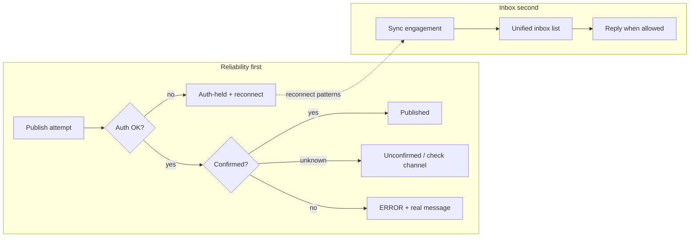
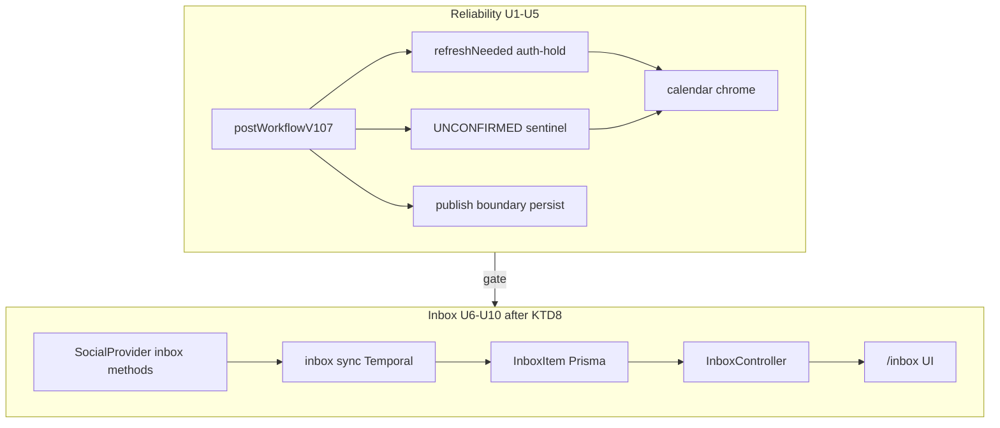

# Publish Reliability and Social Inbox - Plan

## Goal Capsule

- **Objective:** Make connected-channel publishing trustworthy (durable confirmation, real errors, capability-based token refresh/reconnect, auth-held schedules), with Instagram as the sharpest pain case; then ship a unified social inbox so orgs can read and reply to comments, DMs, and mentions without leaving Postiz. For refresh-incapable channels (notably Instagram Facebook-Business), reliability success is confirmation, real errors, and auth-hold with reconnect — not proactive refresh.
- **Product authority:** This plan owns publish-outcome honesty, channel auth recovery UX, and the social inbox product. Surrounding work (analytics depth, automation/auto-replies, full Approach B channel-health product) is not active scope.
- **Open blockers:** None. Deferred product questions mapped to Planning Contract KTDs below.
- **Product Contract preservation:** unchanged (doc-review edits landed before planning enrichment; plan-time forks confirmed without changing R/A/F/AE IDs).

---

## Product Contract

### Summary

Ship cross-channel publish reliability first: confirm publishes so Retry cannot double-post, show real failure reasons, refresh tokens and guide reconnect where APIs allow, and hold scheduled posts when auth is broken instead of treating revoke like a content failure. Then implement a unified social inbox (comments, DMs, mentions + reply) starting from platforms whose APIs actually allow it, with UI/API/worker patterns consistent with Postiz.

### Problem Frame

Self-hosted Postiz users who schedule to Instagram and other channels hit token expiry, revoked grants, and confusing publish failures. Today they reconnect and manually retry. Retries are dangerous when a post may already be live but Postiz still shows ERROR. Error text is often generic. Separately, Postiz is publish-only: there is no way to see or answer engagement, so users leave the app for native inboxes.

### Key Decisions

- KD1. **Extend existing auth/publish patterns over a new channel-health product** — build on refreshNeeded, RefreshToken, pending/finalize, and related PR direction rather than Approach B. (session-settled: user-approved — chosen over first-class channel-health product: lower carrying cost) Governs R1–R8.
- KD2. **Confirmation-first publish outcomes** — never treat an unconfirmed or already-live remote post as a clean miss that Retry may freely re-send. Within the reliability slice, deliver confirmation and safe retry (R1–R3, R9) before capability-based refresh/reconnect and auth-hold (R4–R8). (session-settled: user-approved — chosen over refresh-only focus: attacks false failures/duplicates) Governs R1–R3, R9.
- KD3. **Durable state + real errors are cross-channel** — not Instagram-only. (session-settled: user-directed — chosen over Instagram-only: general reliability) Governs R1–R3, R9.
- KD4. **Refresh + reconnect are capability-based** — every channel where refresh/revoke detection makes sense; Meta Business-style tokens may stay reconnect-led. (session-settled: user-directed — chosen over Instagram-only; user affirmed unequal refresh is OK) Governs R4–R7.
- KD5. **Auth-hold over hard-fail or silent queue** — broken auth holds affected scheduled posts with reconnect guidance; after reconnect, future posts resume and past-due get safe retry. (session-settled: user-approved — chosen over fail-immediately / stay-silently-queued) Governs R6–R8.
- KD6. **Both tracks in one plan; reliability then inbox** — inbox is implemented in this contract, sequenced after reliability. (session-settled: user-directed — chosen over pick-one-only / feasibility-appendix-only: user asked for everything then confirmed implementing inbox) Governs R10–R19.
- KD7. **Proposed inbox MVP channels** — Instagram Facebook-Business and Instagram Standalone (comments; DMs on Facebook-Business / Facebook Pages only when App Review or equivalent is achievable), Facebook Pages (comments + DMs where granted), X (mentions/replies; DMs if scopes allow), YouTube (comments). Meta DM/messaging types ship only after App Review (or equivalent) is achievable for the target deployment; until then recorded MVP defaults to comments/mentions-only for those channels. Other Postiz channels follow the feasibility appendix as later coverage. (assumption — planning may narrow further) Governs R10–R14.

### Actors

- A1. **Org publisher** — schedules and publishes via connected channels; reconnects and retries today when auth/publish fails.
- A2. **Org engagement responder** — authenticated member of the owning Organization who may manage the connected channel (same boundary as channel management unless planning records a narrower inbox role); reads and replies to comments/DMs/mentions (may be the same person as A1).
- A3. **Connected channel** — external network (Instagram, Facebook, X, etc.) that issues tokens and hosts the remote post/engagement.

### Requirements

**Publish confirmation and errors**

- R1. After any irreversible publish step succeeds remotely, Postiz persists enough outcome state that a later crash, timeout, or ERROR path cannot cause a Retry to create a duplicate remote post. When a channel cannot verify remote publish completion after an irreversible step, treat the outcome as permanently unconfirmed (never auto-success from timeout alone), block republish per R9, and document that channel as confirmation-degraded until a verify path exists.
- R2. When Postiz cannot confirm whether a remote publish completed, the user-visible outcome is an unconfirmed/needs-check state with guidance to verify on the channel before posting again — not a silent success and not a generic failure that invites blind Retry. Unconfirmed posts must offer a safe resolution path that either reconciles to published when Postiz can confirm the remote post id/status, or lets A1 explicitly confirm “already live / do not republish” without issuing a new irreversible publish; until resolved, Retry remains blocked per R9.
- R3. When a publish fails for a known reason, the calendar/post UI surfaces the real provider or system message available to Postiz (not only a generic “an error occurred”), after stripping secrets (tokens, authorization material) and obvious PII; use a safe fallback when the only available text is sensitive.
- R9. Manual Retry and any automatic republish path consult persisted publish/confirmation state before issuing a new irreversible publish.

**Channel auth: refresh, reconnect, hold**

- R4. For each connected channel whose provider can refresh access tokens, Postiz refreshes proactively before expiry rather than waiting for the next failed publish.
- R5. When a token is revoked, permissions/page grants are broken, or refresh fails in a way that requires user action, Postiz marks the channel as needing reconnect and guides the user to reconnect (including re-requesting permissions where the OAuth flow supports it). Any surface that depends on that channel (integrations list, channel picker, social inbox) shows the same needs-reconnect state — not only auth-held scheduled posts.
- R6. While a channel needs reconnect, due or soon-due scheduled posts for that channel enter an auth-held state with a clear reconnect reason — not a normal publish ERROR that looks like bad content.
- R7. After the user reconnects successfully, future scheduled posts for that channel resume automatically; past-due auth-held posts become available for a safe one-click retry that respects R1–R2.
- R8. Publish paths that already know the channel needs reconnect do not attempt a doomed publish mutation; they keep or move posts into the auth-held path per R6.

**Social inbox**

- R10. Postiz provides a unified social inbox for the org’s connected accounts that can ingest engagement of types the channel supports among: comments, DMs, and mentions. The inbox has a named, org-scoped entry point in the main app navigation (exact placement is planning’s choice within existing launches/calendar chrome).
- R11. From the inbox, A2 can read an item and send a reply when the channel API allows reply for that item type. The reply composer shows an in-flight state while sending; on success the thread updates inline; on failure the draft is kept, a provider/system error is shown when available, and retry is offered without marking the item as replied.
- R12. Inbox items show channel, account, type, author, preview text, time, and link/context to the related post or thread when available.
- R13. Channels without API support for a given engagement type are omitted or clearly unavailable for that type — the product does not fake coverage. UI distinguishes (1) truly empty inbox/filter results, (2) type/channel unavailable because the API does not support it, and (3) connection/scope gaps with reconnect or enable guidance — each with distinct copy and next action.
- R14. First ship covers at least the MVP set in KD7 (or the narrowed set planning records); additional platforms from the feasibility appendix may follow without redesigning the inbox concept.
- R15. Inbox UI, API layering (DTO → controller → service → repository), and background sync/workers follow existing Postiz patterns (SWR + useFetch on the frontend; Temporal/orchestrator for recurring sync where needed). List/detail show loading or syncing on first open and refresh; sync failure surfaces a recoverable error with retry and must not masquerade as “no engagement” (align R13); last-synced time may be shown so stale data is honest. Inbox list, filters, thread navigation, and reply composer are operable by keyboard with visible focus; selected/read state and reply capability are exposed to assistive tech by name — not color alone (exact markup and shortcuts are planning’s choice).
- R16. Connecting or using inbox features may require additional OAuth scopes; reconnect/re-consent flows reuse R5 patterns rather than a one-off auth path. Additional scopes are limited to those required for the MVP engagement types planning records under KD7/Q1 (e.g. comments-only ships without messaging scopes).
- R17. Inbox list, detail, and reply are available only to authenticated members of the Organization that owns the connected accounts, under the A2 boundary (default: same as managing the connected channel unless planning records a narrower responder role). Replies may only use integrations that Organization owns.
- R18. Inbound engagement content — especially DM bodies and author identifiers — is sensitive org-held data. Access follows R17; routine application logs must not record full DM/comment bodies; retention/deletion is defined in planning or deferred with an explicit planning question.
- R19. Inbound engagement sync (webhook or poll per Q1) must authenticate that payloads originate from the connected provider, associate items only with that Organization’s integrations, and reject cross-tenant or unauthenticated payloads before they appear or become replyable. Author and body fields are untrusted input at the Postiz boundary and must not be treated as safe HTML or trusted instructions when stored or shown.

### Key Flows

- F1. Publish confirms honestly
  - **Trigger:** A scheduled or immediate post enters the publish workflow for A3.
  - **Actors:** A1, A3
  - **Steps:** Pre-publish auth check per R8; if the channel needs reconnect, keep or move posts onto the auth-held path (R6) and do not call an irreversible publish mutation; when auth is OK, perform publish, persist boundary state, and branch to published / unconfirmed (R2) / ERROR with real error text (R3).
  - **Outcome:** A1 can Retry only when it is safe per R1–R2 and R9.
  - **Covered by:** R1–R3, R6, R8–R9

- F2. Token refresh before expiry
  - **Trigger:** A refresh-capable integration approaches token expiry.
  - **Actors:** A3
  - **Steps:** Background refresh runs; on success tokens update quietly; on auth failure path enters R5.
  - **Outcome:** Routine expiry does not first appear as a failed scheduled post on refresh-capable channels.
  - **Covered by:** R4–R5

- F3. Auth break holds the schedule
  - **Trigger:** Refresh fails needing user action, or publish detects revoked/broken grant.
  - **Actors:** A1, A3
  - **Steps:** Channel marked needs reconnect (visible on channel and inbox surfaces per R5); due or soon-due scheduled posts for that channel enter auth-held state per R6; A1 reconnects; future posts resume; past-due offered safe retry.
  - **Outcome:** A1 is not pushed into blind Retry on a revoke.
  - **Covered by:** R5–R8

- F4. Inbox read and reply
  - **Trigger:** A2 opens the social inbox after channels in the recorded MVP set are connected with required scopes.
  - **Actors:** A2, A3
  - **Steps:** Inbox shows syncing/loading as needed; lists normalized items (or honest empty/unavailable/scope-gap states per R13); A2 opens a thread (marks read); when reply is allowed, A2 sends a reply with in-flight/success/failure behavior per R11.
  - **Outcome:** A2 handles engagement without leaving Postiz for that channel/type.
  - **Covered by:** R10–R19

### Acceptance Examples

- AE1. No duplicate after false failure
  - **Covers:** R1, R2, R9
  - **Given:** A multi-step publish where the remote post is already live but Postiz has not finished confirming
  - **When:** The workflow errors or A1 hits Retry
  - **Then:** Postiz does not create a second remote post; UI reflects published or unconfirmed-with-guidance as appropriate; Retry stays blocked until R2 resolution

- AE2. Real error visible
  - **Covers:** R3
  - **Given:** A provider returns a specific publish failure message Postiz can parse
  - **When:** A1 views the failed post on the calendar
  - **Then:** That message (or a faithful provider-facing summary) is visible, not only a generic fallback, without leaking secrets

- AE3. Revoke holds posts
  - **Covers:** R5, R6, R8
  - **Given:** A channel token is revoked while posts remain scheduled
  - **When:** Refresh or pre-publish auth check runs
  - **Then:** Due or soon-due scheduled posts for that channel enter auth-held state per R6 with reconnect guidance; Postiz does not mark them as ordinary content ERROR or silently leave them looking healthy

- AE4. Reconnect then safe retry
  - **Covers:** R7, R1
  - **Given:** Past-due auth-held posts and a successful reconnect
  - **When:** A1 uses one-click retry
  - **Then:** Future posts resume; retry does not duplicate an already-live remote post

- AE5. Inbox reply on supported type
  - **Covers:** R10, R11, R13, R17
  - **Given:** An Instagram business channel with comment scopes and an inbound comment synced; A2 is an authorized org member
  - **When:** A2 replies from the inbox
  - **Then:** The reply appears on Instagram and in the inbox thread; a type/channel without API support is not presented as replyable

### Success Criteria

**Reliability slice (first delivery)** — sufficient to close the first delivery even if inbox App Review/scopes are not ready:

- Confirmation + auth-hold end blind Retry for false failures and revokes across channels (R1–R3, R9, R6–R8). For reconnect-led providers (Instagram Facebook-Business per Dependencies/KD4), reconnect remains the primary expiry recovery, with clearer reconnect guidance rather than a claim that reconnect ceases to be primary.
- Calendar/post error surfaces carry actionable provider/system text when available (R3).
- Auth-held posts are distinguishable from content/publish failures (R6).

**Inbox slice (second delivery):**

- Org responders can read and reply to at least the MVP set in KD7 (or the narrowed set planning records) inside Postiz (R10–R14).
- Unsupported engagement types are honest gaps (R13), not silent empties that look like “no engagement.”

### Scope Boundaries

**In scope**

- Cross-channel publish confirmation, error surfacing, capability-based refresh/reconnect, auth-hold + safe retry
- Social inbox implementation (UI, API, sync/workers) for feasible engagement types, MVP per KD7 (or the narrowed set planning records)
- Aligning with / completing direction of Instagram publish-boundary and Meta page-grant reconnect work where still needed

**Deferred for later**

- Full Approach B first-class channel-health product beyond auth-hold + refreshNeeded-style signals
- Inbox coverage for every Postiz provider (see Appendix A)
- Auto-replies, assignments, SLAs, sentiment, or CRM-style inbox workflows
- TikTok comments (API gap) and LinkedIn DMs (no public DM API) as must-ship

**Outside this product's identity**

- Replacing native network apps for full chat/media features beyond read/reply of supported engagement
- Non-social channels’ internal comments (e.g. Postiz-only post comments) as the “social inbox”

<!-- ce-section: work-relationships -->
### How This Work Fits Together

This plan owns **publish reliability** and **social inbox** as one sequenced Product Contract (reliability first, inbox second). Broader understanding below is current framing, not a committed roadmap.

- Publish reliability (this plan, first delivery slice)
  - **Enables:** Trustworthy scheduling so inbox work is not blocked by broken Instagram/publish trust
  - **Shares:** Reconnect/OAuth consent patterns with inbox scope expansion (R16)
  - **Intra-slice order:** Confirmation and safe retry (R1–R3, R9) before capability-based refresh/reconnect and auth-hold (R4–R8)
- Social inbox (this plan, second delivery slice)
  - **Depends on:** Stable channel auth/reconnect behavior from the reliability slice for usable long-lived connections
  - **Can proceed independently of:** Approach B channel-health product (explicitly out of scope)
- Later platform inbox coverage (contextual candidate)
  - **Depends on:** Inbox data model + UI from this plan
  - **Still to decide:** Order after MVP (Appendix A)

### Dependencies / Assumptions

- Instagram Facebook-Business long-lived tokens may not support true proactive refresh comparable to Instagram Standalone; reconnect remains valid (KD4).
- Page-grant / Graph 190→reconnect classification work exists on `fix/meta-page-grant-v2` (commit `bcefe4ec`) but was not on the brainstorm HEAD; planning must land, rebase, or re-implement equivalent behavior.
- Publish-boundary persistence for Instagram is partially present; remaining gaps (including ambiguous `media_publish` outcomes called out in related PR work) remain in scope for R1–R2.
- No social-inbox product module exists today; some providers already request comment-related scopes (e.g. Instagram) without ingestion UI.
- External API capabilities in Appendix A can change; R13 requires honest product behavior when a platform removes or gates access.
- Rate limits, App Review, and webhook setup for Meta messaging/comments are product gates for Meta DM types (KD7), not only operational checklist items; self-hosted deployments may need polling when a shared Meta callback is unavailable.
- Providers without a post-publish status or idempotent finalize path ship confirmation-degraded under R1 until a verify path exists.

### Outstanding Questions

**Resolve Before Planning**

- None.

**Deferred (non-blocking; defaults in Planning Contract KTDs)**

- Q1 → KTD6 / KTD10: Meta comments/mentions first; DMs after App Review; Temporal poll sync for self-hosted.
- Q2 → KTD1: auth-hold = `QUEUE` + `integration.refreshNeeded` (no new `State` enum).
- Q3 → KTD5: calendar chrome distinguishes auth-held / unconfirmed / ERROR without new Prisma states.
- Q4 → KTD11: single filtered list + detail pane (Appendix candidate promoted).
- Q5 → KTD7: reconnect/re-consent reuses existing OAuth upsert clearing `refreshNeeded`.
- Q6 → KTD12: retain inbox bodies until org disconnects channel or explicit delete; no full-body app logs (R18).

### Sources / Research

- Grounding dossier (session): Instagram Business no-op `refreshToken` vs Standalone `refreshCron` + real refresh; `RefreshToken` / `refreshNeeded` / reconnect tooltip; `postWorkflowV106` mutation `maximumAttempts: 1` and `markUnconfirmed`; PR/commit direction for publish-boundary and page-grant reconnect.
- Related work: PR #1681 (publish boundary / false failures), PR #1719 / branch `fix/meta-page-grant-v2` (page-grant + reconnect).
- External API orientation for Appendix A: Meta Instagram comments + Messaging API; X API v2 mentions/replies/DMs (tier/scopes); YouTube Data API comments; LinkedIn Comments API (org pages); TikTok comment/DM API gaps and regional messaging limits; Bluesky/Mastodon open protocols generally allow reply/mention patterns.

---

## Appendix A — Social inbox platform feasibility (short)

Status is product-planning guidance, not a guarantee of App Review approval. Legend: **Yes** / **Partial** / **No** / **Unclear**.

| Platform (Postiz) | Comments read/reply | DMs read/reply | Mentions | Notes for Postiz |
| --- | --- | --- | --- | --- |
| Instagram (FB Business) | Yes | Yes (Messaging API; windows + App Review) | Partial (@mentions on media) | Comment scopes already requested; messaging scopes may need expand + re-consent |
| Instagram Standalone | Yes (business comment scopes) | Partial/Yes with message scopes | Partial | Prefer aligning capabilities with FB Business path where APIs allow |
| Facebook Pages | Yes | Yes (Messenger) | Partial | Shares Meta patterns with Instagram |
| Threads | Partial | No | Partial | Comment-like engagement; no DM API in common third-party summaries |
| X | Yes (replies as posts) | Yes with `dm.read`/`dm.write` (tier-gated) | Yes | Mentions timeline is a natural MVP slice |
| YouTube | Yes | No | No | Comments API + quota; strong MVP candidate |
| LinkedIn / LinkedIn Page | Partial (org/page comments) | No (public API) | Partial | Page comments only; no DMs |
| TikTok | No / Unclear for third-party comments | Partial (Business Messaging; regional) | No | Do not promise comments in MVP |
| Bluesky | Yes (replies) | No (no IG-style DM) | Yes | AT Proto fits open reply/mention inbox |
| Mastodon / custom | Yes | Partial (DMs as API messages where enabled) | Yes | Federation-friendly |
| Reddit | Yes | Partial | Yes | Nested comment trees |
| Telegram | N/A (chat-native) | Yes (bot/chat APIs) | Partial | Different model: chats vs post comments |
| Discord / Slack | N/A | Yes (channel/DM APIs) | Partial | Workspace chat, not “post comments” |
| Pinterest | No / limited | No | No | Poor inbox fit |
| Others (Medium, Hashnode, WordPress, etc.) | Platform-specific / often No | Often No | Often No | Treat as out of MVP unless a clear comment API exists |

**Rough data model (product shape):** Organization-scoped **Inbox Item** with channel integration id, type (comment | dm | mention), remote ids, author, body, timestamps, read state, link to Postiz post when known, and reply capability flags. Threads group items that share a remote conversation id. Opening a thread marks its items read; the unread filter excludes read items.

**Rough UI shape:** One inbox list (filters: channel, type, unread) → detail pane with thread + reply composer when capability allows → empty / unavailable / scope-gap states per R13 (KTD11). Visual language matches existing launches/calendar chrome (no separate product brand).

---

## Deferred / Open Questions

### From 2026-08-05 review

- **Dual-track falsification gate** — resolved in KTD8 (session-settled at plan confirm): reliability slice must meet its success criteria before inbox implementation units start.

---

## Planning Contract

### Key Technical Decisions

- KTD1. **Auth-hold without new `State` enum** — keep held posts as `QUEUE`; signal via `integration.refreshNeeded`; optional `post.error` prefix `AUTH_HOLD:` for tooltips. In `postWorkflowV107`, on `refreshNeeded` notify and return without `changeState(..., ERROR)`. (session-settled: user-approved — chosen over new AUTH_HOLD state: smallest change) Governs R6–R8, Q2.
- KTD2. **Unconfirmed as `ERROR` + `UNCONFIRMED:` sentinel** — keep `markUnconfirmed` on `ERROR` but store human text with `UNCONFIRMED:` prefix; block Retry in manage modal until user confirms already-live or system reconciles. Governs R2, R9.
- KTD3. **New Temporal `postWorkflowV107`** — copy v106; apply auth-hold, plain-string errors, publish-boundary persist hooks; never mutate v106. Point `posts.service` / `post.activity` callers at v107. Governs R1–R9.
- KTD4. **Publish-boundary persistence** — before irreversible finalize, persist enough pending identity on the Post (settings JSON or releaseId sentinel) so crash/retry cannot re-create containers; Instagram `PUBLISHED` idempotency remains provider-side. Extend pattern to other `postPending` providers over time; confirmation-degraded when no verify API (R1). Governs R1.
- KTD5. **Calendar chrome by composition** — auth-held: `QUEUE` + past-due + `refreshNeeded` → warning (not red ERROR); unconfirmed: `ERROR` + `UNCONFIRMED:` prefix → distinct tooltip/CTA; content ERROR stays red ring. Governs R3, R6, Q3.
- KTD6. **Inbox MVP engagement cut** — first inbox ship: Instagram FB Business + Standalone comments, Facebook Page comments, X mentions/replies, YouTube comments. Meta DMs deferred until App Review (or equivalent) is achievable. (session-settled: user-approved — chosen over full KD7 DMs in first units) Governs R10–R14, Q1.
- KTD7. **Meta page-grant / Graph 190** — land or re-implement `fix/meta-page-grant-v2` behavior (filter ungranted pages; classify 190 as refresh-token; `auth_type=rerequest`) on the reliability slice. Governs R5.
- KTD8. **Reliability before inbox coding** — U1–U5 must meet reliability success criteria before U6–U10 start. (session-settled: user-approved — chosen over parallel start after reconnect patterns only) Governs sequencing.
- KTD9. **Generic provider inbox methods** — extend `SocialProvider` with optional `fetchInboxItems` / `replyToInboxItem` / capability helpers; never `if (instagram)` in generic sync/API code. Governs R10–R11, R15.
- KTD10. **Poll-first sync** — Temporal per-org or per-integration poll workflow for MVP; inbound Meta/X webhooks optional later (self-hosted often lacks shared HTTPS callback). Governs R15, R19, Q1.
- KTD11. **Inbox IA** — single list with channel/type/unread filters + detail pane (promote Appendix candidate; closes Q4). Governs R10, R12, Q4.
- KTD12. **Inbox data retention** — store bodies until channel disconnect/delete or explicit item delete; never log full bodies in routine app logs (R18). Exact purge job can follow. Governs R18, Q6.

### Technical Design

- Reliability: extend `refreshNeeded`, ERROR strings, Instagram pending/finalize; new workflow version only.
- Inbox: greenfield `InboxItem` (+ thread key), DTO→Controller→Service→Repository under org scope; reuse Integration tokens and `IntegrationManager`.
- Do not repurpose Prisma `Comments` or `Mentions` tables.

### Assumptions

- Instagram FB Business remains reconnect-led for token expiry (no `refreshCron`).
- Existing `refreshTokenWorkflow` covers Standalone/Threads; reliability work focuses on gates + UX + Meta reconnect classification.
- `pnpm test` / root lint are available verification commands.
- Org role default for inbox = any authenticated org member who can manage channels (R17); finer roles deferred.

### Open Questions

**Deferred to implementation**

- Exact `AUTH_HOLD:` / `UNCONFIRMED:` string copy and i18n keys.
- Whether publish-boundary lives in `settings` JSON vs dedicated columns.
- Per-provider poll intervals and rate-limit backoff.
- Whether to add `Sections.INBOX` subscription gate later (out of MVP).

### Implementation Units summary

| ID | Unit | Depends on |
|----|------|------------|
| U1 | postWorkflowV107 auth-hold | — |
| U2 | Unconfirmed sentinel + safe retry/resolve | U1 |
| U3 | Instagram publish-boundary persist | U1 |
| U4 | Meta reconnect / page-grant / Graph 190 | — |
| U5 | Calendar + manage-modal chrome | U1, U2 |
| U6 | InboxItem schema + repository/service | U1–U5 done (KTD8) |
| U7 | Provider inbox interface + MVP adapters | U6 |
| U8 | Inbox HTTP API + DTOs + R17/R19 | U6, U7 |
| U9 | Temporal inbox poll sync | U7, U6 |
| U10 | Frontend `/inbox` + nav + a11y/sync UX | U8 |

Order: (U1 ∥ U4) → U2 → U3 → U5 → **reliability gate** → U6 → (U7 ∥ start U6 tests) → U8 ∥ U9 → U10.

---

## Implementation Units

### U1. postWorkflowV107 auth-hold

- **Goal:** When `refreshNeeded`, do not mark posts ERROR; keep QUEUE, notify, skip irreversible publish (R6–R8).
- **Requirements:** R5–R8; F3; AE3
- **Files:** `apps/orchestrator/src/workflows/post-workflows/post.workflow.v1.0.7.ts` (new); `apps/orchestrator/src/workflows/index.ts`; `libraries/nestjs-libraries/src/database/prisma/posts/posts.service.ts`; `apps/orchestrator/src/activities/post.activity.ts`
- **Approach:** Copy v106; replace refreshNeeded ERROR branch with notify + return; optional set `error` to `AUTH_HOLD:…` without changing state from QUEUE. Update start/signal callers to `postWorkflowV107`. Leave v106 untouched.
- **Test scenarios:**
  - refreshNeeded integration: workflow exits without ERROR state change; notification sent
  - healthy integration: existing happy path still publishes
  - Child/repeat starts still target v107
- **Verification:** Unit/workflow-level tests if present pattern exists; otherwise orchestrator smoke + assert DB state

### U2. Unconfirmed sentinel + safe retry/resolve

- **Goal:** Unconfirmed outcomes use `UNCONFIRMED:` errors; Retry blocked until resolve; real bad_body messages stored as plain text (R2, R3, R9).
- **Requirements:** R2, R3, R9; F1; AE1, AE2
- **Files:** `apps/orchestrator/src/workflows/post-workflows/post.workflow.v1.0.7.ts`; `apps/frontend/src/components/new-launch/manage.modal.tsx`; posts service/repository as needed for “confirm already live” action
- **Approach:** Change `markUnconfirmed` to write prefixed human message; extract provider message on bad_body; add UI/API action to mark published without republish or re-check remote when possible.
- **Test scenarios:**
  - markUnconfirmed stores `UNCONFIRMED:` prefix
  - Manage modal blocks republish when prefix present
  - Explicit confirm-already-live clears to PUBLISHED without calling postPending
  - bad_body path stores actionable string, not raw ActivityFailure JSON
- **Verification:** Jest on string helpers + modal guard; manual smoke on false-failure path if available

### U3. Instagram publish-boundary persistence

- **Goal:** Persist pending identity before finalize so crash/retry cannot duplicate (R1).
- **Requirements:** R1; AE1
- **Files:** `libraries/nestjs-libraries/src/integrations/social/instagram.provider.ts`; `apps/orchestrator/src/activities/post.activity.ts`; posts repository
- **Approach:** After containers created / before media_publish, persist boundary blob; on retry read and resume checkPostStatus/finalize; keep PUBLISHED idempotency. Document confirmation-degraded for undetectable media_publish lies.
- **Test scenarios:**
  - Second finalize after persisted PUBLISHED container does not create new media
  - Crash between container create and finalize resumes without new containers
- **Verification:** Provider unit tests with mocked Graph fetch; manual IG sandbox if credentials exist

### U4. Meta reconnect / page-grant / Graph 190

- **Goal:** Broken page grants and code 190 drive reconnect, not opaque bad-body (R5).
- **Requirements:** R5; KD7 notes
- **Files:** `libraries/nestjs-libraries/src/integrations/social/instagram.provider.ts`; `facebook.provider.ts`; OAuth URL generation; picker filtering
- **Approach:** Port or re-implement `fix/meta-page-grant-v2` / `bcefe4ec`: filter pages without tokens; map 190 → refresh-token; `auth_type=rerequest` on OAuth.
- **Test scenarios:**
  - handleErrors maps 190 to refresh-token type
  - Picker omits pages lacking access_token
  - OAuth URL includes rerequest when reconnecting
- **Verification:** Unit tests on handleErrors; manual reconnect smoke

### U5. Calendar + manage-modal chrome

- **Goal:** Distinguish auth-held, unconfirmed, and content ERROR in UI (R3, R6).
- **Requirements:** R3, R6; F3; AE2, AE3
- **Files:** `apps/frontend/src/components/launches/calendar.tsx`; `apps/frontend/src/components/new-launch/manage.modal.tsx`; optionally `launches.component.tsx` for inbox/channel surfaces already showing refreshNeeded
- **Approach:** Warning chrome for QUEUE+refreshNeeded+due; distinct unconfirmed tooltip/CTA; keep ERROR red for other failures; ensure reconnect CTA visible from calendar context.
- **Test scenarios:**
  - Auth-held post does not use red ERROR ring
  - Unconfirmed shows check-before-retry guidance
  - Content ERROR still red with provider message
- **Verification:** Component tests or Story/manual visual smoke

### U6. InboxItem schema + repository/service

- **Goal:** Org-scoped inbox persistence (R10, R12, R17, R18).
- **Requirements:** R10, R12, R17, R18
- **Files:** `libraries/nestjs-libraries/src/database/prisma/schema.prisma` (+ migration); `libraries/nestjs-libraries/src/database/prisma/inbox/*` (new)
- **Approach:** `InboxItem` with organizationId, integrationId, type, remoteId, threadKey, author, body, readAt, replyCapable, timestamps; unique (integrationId, type, remoteId). Service enforces org tenancy. No reuse of Comments/Mentions models.
- **Test scenarios:**
  - Upsert is idempotent on remote key
  - Queries never cross organizations
  - Mark read sets readAt
- **Verification:** Repository Jest with test DB or prisma mock per repo norms

### U7. Provider inbox interface + MVP adapters

- **Goal:** Generic inbox fetch/reply on SocialProvider; implement MVP channels (KTD6, KTD9).
- **Requirements:** R10, R11, R13, R14
- **Files:** `libraries/nestjs-libraries/src/integrations/social/social.integrations.interface.ts`; `social.abstract.ts`; `instagram.provider.ts`; `instagram.standalone.provider.ts`; `facebook.provider.ts`; `x.provider.ts`; `youtube.provider.ts`
- **Approach:** Add optional methods; Instagram/Facebook comments, X mentions, YouTube comments; capability flags drive R13. Reply uses platform comment/reply APIs. No provider-specific branches in sync service.
- **Test scenarios:**
  - Unsupported type reports none/unavailable
  - Fetch maps remote payload to InboxItem shape
  - Reply calls provider and returns remote id
- **Verification:** Mocked HTTP unit tests per provider adapter

### U8. Inbox HTTP API + DTOs

- **Goal:** Authenticated org-scoped list/detail/read/reply; inbound sync authenticity when webhooks added later (R17, R19).
- **Requirements:** R10–R13, R15–R19; F4; AE5
- **Files:** `apps/backend/src/api/routes/inbox.controller.ts` (new); DTOs under `libraries/nestjs-libraries/src/dtos/inbox/`; register in `api.module.ts`
- **Approach:** Mirror media controller: `@GetOrgFromRequest`, list with filters, reply delegates to service→provider. R17: same org membership as channel management. Strip secrets from errors. Poll sync trigger optional endpoint.
- **Test scenarios:**
  - List scoped to org
  - Reply forbidden for other org’s item id
  - Reply on non-capable item 400
- **Verification:** Controller/service tests with mocked service

### U9. Temporal inbox poll sync

- **Goal:** Background sync that upserts items and surfaces failures honestly (R15, R19).
- **Requirements:** R15, R19
- **Files:** `apps/orchestrator/src/workflows/inbox.sync.workflow.ts` (new); `apps/orchestrator/src/activities/inbox.activity.ts` (new); infinite register if needed
- **Approach:** New workflow (do not mutate existing); activity loads integrations, calls provider fetch, upserts; handle RefreshToken like posts. Prefer poll; document webhook as follow-up.
- **Test scenarios:**
  - Sync upserts new comments
  - RefreshToken marks channel refreshNeeded without poisoning other orgs
  - Failure sets sync error visible to API status
- **Verification:** Activity unit tests; manual sync trigger

### U10. Frontend `/inbox` + nav + UX

- **Goal:** Unified social inbox UI with sync/empty/reply/a11y (R10–R13, R15).
- **Requirements:** R10–R13, R15; F4; AE5
- **Files:** `apps/frontend/src/app/(app)/(site)/inbox/page.tsx`; `apps/frontend/src/components/inbox/*`; `apps/frontend/src/components/layout/top.menu.tsx`; `use.inbox.hooks.ts`
- **Approach:** Media-style SWR hooks; list+detail; filters; open marks read; reply composer states; empty vs unavailable vs scope-gap; keyboard focus; add nav item `/inbox`. Show refreshNeeded banner per R5.
- **Test scenarios:**
  - Hook builds correct query key/params
  - Unavailable type not shown as replyable
  - Failed reply keeps draft
- **Verification:** Jest + Testing Library; manual smoke on `/inbox`

---

## Verification Contract

| Gate | Command / check | Applies to |
|------|-----------------|------------|
| Unit | `pnpm test` focused on workflow helpers, providers, inbox repo/API, frontend hooks | U1–U10 |
| Lint | Root lint via `pnpm` from repo root | All |
| Reliability smoke | Schedule to refreshNeeded channel → auth-hold (not ERROR); reconnect → resume; IG pending crash/retry no duplicate | U1–U5 |
| Inbox smoke | Sync comments on MVP channel; reply; empty/unavailable honesty; reconnect banner | U6–U10 |
| Workflow safety | Confirm v106 file unchanged; only v107 registered for new starts | U1 |
| Release gate | Do not start U6 until reliability success criteria hold (KTD8) | Sequencing |

Execution direction: characterization of current ERROR-on-refreshNeeded and markUnconfirmed before v107; smoke-first on Instagram Business path for reliability; comments-only Meta before any DM scope expansion.

---

## Definition of Done

**Global**

- [ ] New posts use `postWorkflowV107`; v106 untouched
- [ ] Auth-held posts stay QUEUE with reconnect guidance (R6–R8); calendar distinguishes them from content ERROR
- [ ] Unconfirmed uses `UNCONFIRMED:` + blocked Retry until resolve (R2, R9)
- [ ] Real provider errors shown without secret leakage (R3)
- [ ] Instagram publish-boundary persistence prevents duplicate finalize when state exists (R1)
- [ ] Meta page-grant / 190 reconnect behavior present (R5)
- [ ] Reliability success criteria met before inbox units merge
- [ ] `/inbox` lists/replies MVP comment/mention types with org scoping (R10–R14, R17)
- [ ] Sync failures and unsupported types are honest (R13, R15)
- [ ] No full DM/comment bodies in routine logs (R18); inbound sync authenticates provider origin when webhooks exist (R19)

**Per unit**

- [ ] U1: v107 auth-hold behavior + callers updated
- [ ] U2: sentinel + modal guard + resolve path
- [ ] U3: boundary persist + idempotent resume
- [ ] U4: handleErrors/OAuth/picker tests
- [ ] U5: calendar chrome for three outcomes
- [ ] U6: migration + repo tenancy tests
- [ ] U7: MVP adapters + capability flags
- [ ] U8: API org isolation tests
- [ ] U9: sync workflow/activity tests
- [ ] U10: nav + list/reply UX smoke
