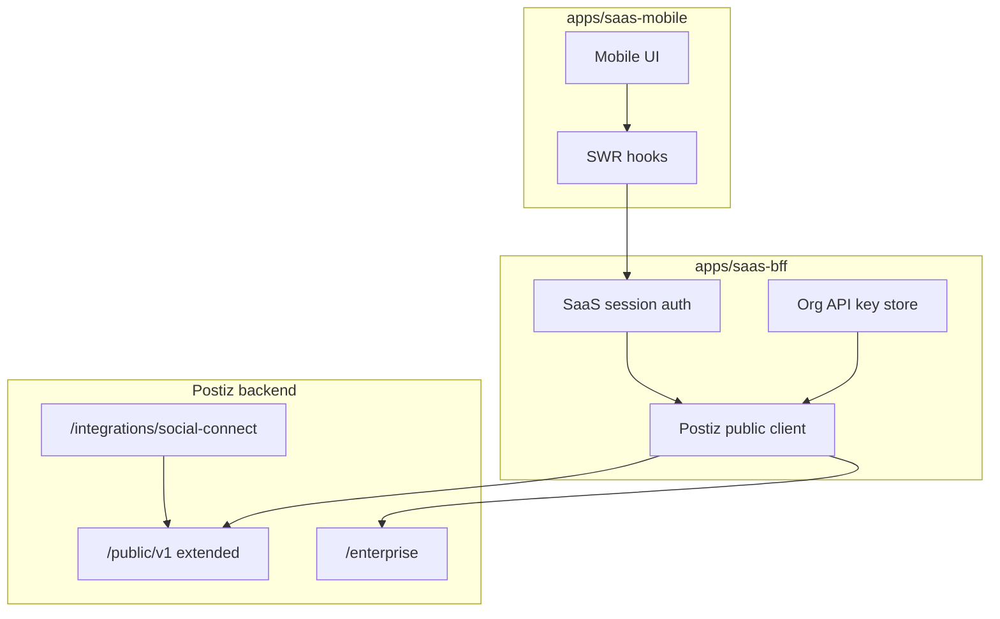

# Mobile SaaS Headless Frontend - Plan

## Goal Capsule

- **Objective:** Deliver a mobile-first frontend for a Postiz-backed SaaS that covers scheduling, composition, previews, channel connection, media library, social inbox, and analytics — with Postiz as the headless backend and no dependency on upstream Postiz UI responsiveness.
- **Product authority:** This plan owns the mobile SaaS product surface (`apps/saas-mobile`, `apps/saas-bff`) and Postiz `/public/v1` extensions required for headless parity. Upstream Postiz desktop UI responsiveness (#1008) and PWA installability (#740) are not active scope.
- **Open blockers:** None.
- **Product Contract preservation:** unchanged (no R/A/F/AE ID or scope changes; planning adds HOW sections only).

---

## Product Contract

### Summary

Build a separate mobile-first frontend that talks to Postiz through `/public/v1`, `/enterprise`, and a thin SaaS-owned backend proxy for capabilities not yet on the public API. v1 includes composer, calendar, per-channel preview, channel connect, media library, social inbox, and analytics — not a phased subset.

### Problem Frame

Postiz’s web UI is desktop-first: the composer uses a fixed side-by-side layout with a 580px preview column, the calendar uses an eight-column week grid with drag-and-drop, and modals target widths up to 1400px. For a SaaS built on Postiz, shipping mobile UX by making the upstream UI responsive would couple product velocity to a fast-moving monorepo and prevent independent branding. A PWA wrapper alone adds installability without fixing layout. The SaaS needs a mobile-native experience while Postiz continues to handle scheduling, publishing, integrations, and background jobs.

### Key Decisions

- KD1. **Headless mobile-first frontend over upstream responsive UI or PWA-only** (session-settled: user-directed — chosen over making Postiz UI responsive (#1008) or PWA wrapper alone (#740): keeps SaaS code separate from upstream UI churn and actually fixes mobile layout). Governs R1.
- KD2. **Full v1 feature set, not composer-only MVP** (session-settled: user-directed — chosen over deferring inbox, media library, or analytics: user confirmed “everything” for day-one mobile scope). Governs R2–R8, R11–R15.
- KD3. **SaaS-owned auth and billing; Postiz org API keys per customer** — end users never hold Postiz session cookies. Provisioning uses enterprise endpoints; runtime calls use org-scoped API keys or OAuth tokens. Governs R9.
- KD4. **Close public API gaps through a SaaS backend proxy first, upstream public API second** — ship mobile flows without forking Postiz UI; contribute missing endpoints upstream when the proxy cost becomes carrying debt. Governs R10.

### Requirements

**Architecture and integration**

- R1. The mobile product is a separate frontend codebase from Postiz’s existing web app; Postiz is used as a headless backend only.
- R9. The SaaS owns user authentication, subscription/billing UX, and mapping each customer to one Postiz organization with its own API key.
- R10. When a mobile flow needs data or actions not exposed on `/public/v1`, the SaaS backend proxies the corresponding internal Postiz route server-side rather than embedding Postiz UI or requiring end-user Postiz login.

**Composer**

- R2. Users can select one or more connected channels, compose text and media, configure per-channel settings, and schedule, publish now, or save as draft from a mobile layout designed for small touchscreens.
- R3. Multi-channel and multi-post (thread/carousel) composition works on mobile via stepped or tabbed navigation, not a side-by-side desktop split.

**Calendar and scheduling**

- R4. Users can view upcoming and past posts on mobile in an agenda or day-list default view, with optional compact week navigation.
- R5. Users can open a post from the calendar, edit it, and reschedule via an explicit date/time control — not drag-and-drop.

**Preview**

- R6. Users can preview how a post will look per channel before publishing, with full-width mobile previews and swipe between channels when multiple are selected.
- R7. Shareable public review links remain usable on mobile viewports for external reviewers.

**Channels**

- R8. Users can connect and disconnect social channels from mobile, including multi-step OAuth flows (page/account selection after initial OAuth) and return to the SaaS app via redirect or deep link.

**Media library**

- R11. Users can browse, upload, and attach existing media from the organization’s library on mobile, including folder navigation where the backend exposes it.
- R12. Users can upload new media from the device camera roll or files and attach it to a post without leaving the composer flow.

**Social inbox**

- R13. Users can read engagement items (comments, DMs, mentions where supported) in a unified inbox on mobile.
- R14. Users can mark items read and reply where the connected channel allows reply.

**Analytics**

- R15. Users can view channel-level and post-level analytics on mobile for connected integrations that Postiz already supports.

### Actors

- A1. **SaaS end user** — schedules posts, manages media, reads inbox, views analytics on mobile.
- A2. **SaaS platform** — authenticates users, provisions Postiz orgs, holds API keys, proxies gap endpoints.
- A3. **Postiz backend** — stores posts, runs publish workflows, syncs inbox, serves public and enterprise APIs.
- A4. **External reviewer** — opens public review links on mobile without SaaS login.

### Key Flows

- F1. **Provision customer**
  - **Trigger:** New SaaS signup completes payment or trial start.
  - **Actors:** A2, A3
  - **Steps:** SaaS calls enterprise user creation; stores returned org API key; associates key with SaaS user record.
  - **Outcome:** Customer can use mobile app without Postiz dashboard login.
  - **Covered by:** R9

- F2. **Connect channel on mobile**
  - **Trigger:** User taps “Connect channel” and picks a provider.
  - **Actors:** A1, A2, A3
  - **Steps:** SaaS requests OAuth URL (public or enterprise flow); user completes OAuth in system browser; Postiz completes connect; SaaS receives webhook or redirect; if multi-step, user picks page/account; channel appears in integration list.
  - **Outcome:** Channel available in composer and calendar.
  - **Covered by:** R8

- F3. **Compose and schedule**
  - **Trigger:** User creates or edits a post from calendar FAB or composer entry.
  - **Actors:** A1, A2, A3
  - **Steps:** Select channels → compose content → configure settings (schema from integration-settings) → preview → pick date/time → submit via public posts API with validation errors surfaced readably.
  - **Outcome:** Post appears on calendar in correct state (draft, queued, published).
  - **Covered by:** R2, R3, R5, R6

- F4. **Media attach from library**
  - **Trigger:** User opens media picker in composer or media tab.
  - **Actors:** A1, A2, A3
  - **Steps:** List media via proxy or public endpoint; user selects asset or uploads new file via public upload; attachment references returned media path/id in post payload.
  - **Outcome:** Post includes chosen media; upload-only path works even before list API exists upstream.
  - **Covered by:** R11, R12, R10

- F5. **Inbox read and reply**
  - **Trigger:** User opens inbox tab.
  - **Actors:** A1, A2, A3
  - **Steps:** List inbox items via proxy; open thread detail; mark read; compose reply where allowed; sync status visible when sync is in progress.
  - **Outcome:** Engagement handled without desktop app.
  - **Covered by:** R13, R14, R10

- F6. **View analytics**
  - **Trigger:** User opens analytics for a channel or post.
  - **Actors:** A1, A3
  - **Steps:** Fetch analytics via public API endpoints; render mobile-friendly charts or summary cards.
  - **Outcome:** User sees performance data aligned with Postiz dashboard metrics for supported integrations.
  - **Covered by:** R15

### Acceptance Examples

- AE1. **Mobile composer — single channel schedule**
  - **Covers:** R2, R6
  - **Given:** User has one Instagram channel connected
  - **When:** User writes caption, attaches one image, previews, picks tomorrow 9am, taps Schedule
  - **Then:** Post appears on calendar for that slot; public API returns success; preview showed mobile-full-width card before submit

- AE2. **Calendar reschedule without drag**
  - **Covers:** R4, R5
  - **Given:** A queued post exists for Monday 10am
  - **When:** User opens post, taps Reschedule, picks Wednesday 2pm, confirms
  - **Then:** Calendar shows post on Wednesday 2pm only; no drag gesture required

- AE3. **Media library pick**
  - **Covers:** R11, R12
  - **Given:** Organization has ten images in a folder
  - **When:** User opens media picker in composer and selects an existing image
  - **Then:** Image attaches to draft; post payload references the library asset path/id

- AE4. **Inbox reply**
  - **Covers:** R13, R14
  - **Given:** A replyable comment exists for a connected Facebook page
  - **When:** User opens inbox, reads thread, sends a reply
  - **Then:** Item shows as read; reply succeeds or surfaces channel-specific error

- AE5. **Channel connect with page selection**
  - **Covers:** R8
  - **Given:** User connects Facebook (multi-step provider)
  - **When:** OAuth completes and Postiz returns page list
  - **Then:** User selects one page on mobile; channel appears in integration list within the SaaS app

- AE6. **Public review on phone**
  - **Covers:** R7
  - **Given:** A public review link exists for a scheduled video post
  - **When:** Reviewer opens link on a 375px-wide browser
  - **Then:** Content is readable; video plays with review controls where supported

### Success Criteria

- All core flows (F2–F6) completable on a 375px-wide touchscreen without horizontal scrolling in primary navigation or composer steps.
- No requirement for users to log into Postiz’s desktop web app for v1 features listed in R2–R15.
- SaaS frontend remains buildable and deployable independently of Postiz frontend releases.

### Scope Boundaries

**Deferred for later**

- Pixel-perfect per-channel preview mocks matching every Postiz provider component (v1 may use simplified previews for long-tail channels).
- Native iOS/Android shell apps (v1 target is mobile web or cross-platform web app; deep links supported where Postiz already exposes mobile OAuth callback).
- Contributing upstream Postiz responsive UI (#1008) or PWA (#740).

**Outside this product's identity**

- Forking or maintaining Postiz’s desktop frontend as the SaaS mobile surface.
- Reimplementing Postiz publish workflows, Temporal jobs, or provider integrations inside the SaaS frontend.

### Dependencies / Assumptions

- Postiz `/public/v1` continues to support post CRUD, upload, integrations, analytics, notifications, and integration-settings.
- Enterprise endpoints remain available for SaaS provisioning and OAuth redirect/webhook flows.
- Internal Postiz routes (`/inbox`, `/media`, `PUT /posts/:id/date`, `GET /posts/group/:group`) are cookie-authenticated today; headless mobile cannot call them directly with org API keys — this plan adds `/public/v1` mirrors (KTD2) rather than cookie-session proxying.
- SaaS handles its own billing; Postiz org subscription state must remain valid for API access when Stripe is enabled on the Postiz instance.
- Inbox backend may be in progress on the current branch (`inbox.controller.ts`, inbox workflows); public API mirror follows the same service layer.

### Outstanding Questions

**Deferred to implementation**

- Exact SaaS auth provider (email/password, magic link, OAuth) — BFF exposes generic session; provider choice is SaaS product config.
- Whether `apps/saas-mobile` ships as installable PWA in v1 (manifest + icons) — optional polish after core flows.
- Priority order for pixel-perfect vs simplified previews by channel usage (default: Instagram, Facebook, X, LinkedIn, TikTok first).

### Sources / Research

- Public API surface: `apps/backend/src/public-api/routes/v1/public.integrations.controller.ts`
- Enterprise SaaS helpers: `apps/backend/src/api/routes/enterprise.controller.ts`
- Internal routes to mirror: `apps/backend/src/api/routes/inbox.controller.ts`, `apps/backend/src/api/routes/media.controller.ts`, `apps/backend/src/api/routes/posts.controller.ts`
- Desktop layout constraints: `apps/frontend/src/components/new-launch/manage.modal.tsx`, `apps/frontend/src/components/launches/calendar.tsx`
- Mobile OAuth deep link: `apps/backend/src/api/routes/auth.controller.ts` (`oauth-mobile-callback`)
- OAuth completion (no session): `apps/backend/src/api/routes/no.auth.integrations.controller.ts`

---

## Output Structure

```text
apps/
  saas-bff/                 # NestJS: SaaS auth, org provisioning, Postiz API client
    src/
      auth/
      postiz/               # Typed client for /public/v1 + /enterprise
      proxy/                # Thin passthrough until public API lands (optional)
  saas-mobile/              # Vite React mobile-first SPA
    src/
      app/                  # Routes / layout
      components/
        composer/
        calendar/
        preview/
        media/
        inbox/
        analytics/
        channels/
      hooks/                # One SWR hook per resource (rules-of-hooks)
libraries/
  saas-shared/              # Optional: shared types, CreatePostDto shapes (if extracted)
apps/backend/src/public-api/routes/v1/
  public.integrations.controller.ts   # Extended endpoints (U1–U3)
```

---

## Planning Contract

### Key Technical Decisions

- KTD1. **Monorepo SaaS apps** — `apps/saas-bff` and `apps/saas-mobile` as separate deployables from `apps/frontend`; reuse `libraries/nestjs-libraries` DTOs and `libraries/helpers` fetch patterns where useful. (session-settled: user-approved — chosen over separate repo for v1: faster iteration in one workspace) Governs R1, R9.
- KTD2. **Extend `/public/v1` for headless gaps** — add org-API-key-authenticated endpoints mirroring internal media, inbox, post-group, reschedule, and optional `/posts/valid` rather than proxying cookie-auth internal routes from BFF. Governs R10–R15, KD4.
- KTD3. **BFF holds Postiz credentials** — mobile app talks only to BFF; BFF stores org API key per SaaS user and calls Postiz `/public/v1` + `/enterprise`; never embed API keys in the mobile client. Governs R9.
- KTD4. **Mobile composer as stepped wizard** — tabs/steps: Channels → Compose → Settings → Preview → Schedule; no side-by-side 580px preview panel. Governs R2, R3, R6.
- KTD5. **Calendar default: agenda/day list** — no react-dnd grid on mobile; reschedule via datetime sheet calling public reschedule endpoint. Governs R4, R5.
- KTD6. **Simplified channel previews in v1** — card layout (avatar, text, media thumbnail, aspect ratio) for all channels; pixel-faithful mocks only for top five providers by usage when time allows. Governs R6; defers pixel-perfect long tail.
- KTD7. **Channel OAuth via enterprise URL flow** — BFF calls `POST /enterprise/url` with signed JWT params (`redirectUrl`, `webhookUrl`, `apiKey`, `provider`); mobile opens system browser; webhook notifies BFF; multi-step page pick uses existing `POST /integrations/public/provider/:id/connect` exposed through BFF wrapper. Governs R8, F2.
- KTD8. **Postiz public API extensions before dependent mobile screens** — U1–U3 merge before U7–U12 ship features that need list/reschedule/inbox APIs. Governs sequencing.
- KTD9. **SWR hook discipline** — each data resource gets its own hook file in `apps/saas-mobile/src/hooks/`; no nested hook factories; mirror `use.inbox.hooks.ts` / `use.media.hooks.ts` patterns from Postiz frontend. Governs all mobile data fetching.

### Technical Design



- BFF provisions org via `POST /enterprise/create-user`; persists `apiKey` encrypted at rest.
- All Postiz mutations from mobile go BFF → `/public/v1` with `Authorization: <apiKey>`.
- Public API additions delegate to existing services (`MediaService`, `InboxService`, `PostsService`) — same DTO → controller → service → repository layers as internal routes.

### Assumptions

- SaaS operator runs Postiz backend reachable from BFF (same cluster or known URL).
- `pnpm` monorepo root scripts can register new apps in workspace config.
- Postiz inbox module exists or lands on branch before U3; if absent, U3 blocks on inbox service availability.

### Open Questions

**Deferred to implementation**

- BFF persistence for SaaS users (Postgres vs existing Postiz DB vs separate DB).
- Rate limiting on new public endpoints for API-key auth.

### Implementation Units summary

| ID | Unit | Depends on |
|----|------|------------|
| U1 | Public API: media list + folders | — |
| U2 | Public API: post group, reschedule, valid | — |
| U3 | Public API: inbox mirror | inbox service |
| U4 | SaaS BFF skeleton + provisioning | — |
| U5 | SaaS mobile shell + auth + nav | U4 |
| U6 | Channel connect + OAuth return | U4, U5 |
| U7 | Mobile composer wizard | U5, U2 |
| U8 | Mobile calendar agenda | U5, U2 |
| U9 | Mobile previews + public review polish | U7 |
| U10 | Mobile media library | U5, U1 |
| U11 | Mobile analytics | U5 |
| U12 | Mobile inbox | U5, U3 |

Order: (U1 ∥ U2 ∥ U4) → U3 → U5 → U6 → (U7 ∥ U8 ∥ U10 ∥ U11) → U9 → U12.

**KTD8 gate:** U7, U8, U10, U12 must not ship against stubbed APIs — U1–U3 merged first.

---

## Implementation Units

### U1. Public API: media list + folders

- **Goal:** Headless clients can browse and navigate the media library with org API key auth (R11).
- **Requirements:** R11, R12, R10; AE3
- **Dependencies:** —
- **Files:** `apps/backend/src/public-api/routes/v1/public.integrations.controller.ts`; reuse `MediaService` methods from `apps/backend/src/api/routes/media.controller.ts`; DTOs under `libraries/nestjs-libraries/src/dtos/media/`
- **Approach:**
  1. Add `GET /public/v1/media` (paginated list, folder filter) mirroring internal `GET /media`.
  2. Add `GET /public/v1/media/folders` mirroring internal folder routes.
  3. Apply `PublicAuthMiddleware` + existing upload endpoints unchanged.
  4. Document allowed MIME and upload flow in SDK comment block.
- **Patterns to follow:** Existing public upload handlers in `public.integrations.controller.ts`; internal `media.controller.ts` query params.
- **Test scenarios:**
  - List returns only org-owned media
  - Invalid API key → 401
  - Folder filter returns nested contents
  - Upload + list round-trip shows new asset
- **Verification:** Controller/service tests with mocked org; manual curl with API key

### U2. Public API: post group, reschedule, valid

- **Goal:** Mobile edit and reschedule flows work without cookie session (R5, R2).
- **Requirements:** R2, R5, R10; AE2
- **Dependencies:** —
- **Files:** `apps/backend/src/public-api/routes/v1/public.integrations.controller.ts`; `libraries/nestjs-libraries/src/dtos/posts/`; delegate to `PostsService`
- **Approach:**
  1. Add `GET /public/v1/posts/group/:group` mirroring internal group fetch for edit payloads.
  2. Add `PUT /public/v1/posts/:id/date` mirroring internal reschedule.
  3. Add `POST /public/v1/posts/valid` mirroring internal validation (same body as create).
  4. Keep create/update on existing `POST /public/v1/posts` with `type: 'update'`.
- **Patterns to follow:** `PostValidationException` filter on public create; internal `posts.controller.ts`.
- **Test scenarios:**
  - Reschedule changes only publishAt for org-owned post
  - Group fetch returns full multi-channel payload
  - Valid returns per-channel errors readable on mobile
  - Cross-org group id → 404
- **Verification:** Service-level tests; public API integration smoke

### U3. Public API: inbox mirror

- **Goal:** Headless inbox read/reply/sync with org API key (R13, R14).
- **Requirements:** R13, R14, R10; AE4
- **Dependencies:** Inbox service from branch (`libraries/nestjs-libraries/src/database/prisma/inbox/`)
- **Files:** `apps/backend/src/public-api/routes/v1/public.integrations.controller.ts`; mirror `apps/backend/src/api/routes/inbox.controller.ts`; inbox DTOs
- **Approach:**
  1. Add public routes: list, get, mark read, reply, sync, sync-status, capabilities, delete — same shapes as internal inbox controller.
  2. Reuse `InboxService` — no duplicate business logic.
  3. Strip secrets from provider errors in responses.
- **Patterns to follow:** Internal inbox controller; public API metrics/Sentry pattern on other routes.
- **Test scenarios:**
  - List scoped to org integrations
  - Reply on non-replyable item → 400 with clear message
  - Sync trigger returns status handle
  - Mark read idempotent
- **Verification:** Controller tests with mocked InboxService

### U4. SaaS BFF skeleton + provisioning

- **Goal:** SaaS users map to Postiz orgs; BFF holds API keys (R9, F1).
- **Requirements:** R9, F1; KD3
- **Dependencies:** —
- **Files:** `apps/saas-bff/` (new app module); config for `POSTIZ_BACKEND_URL`; enterprise client wrapper
- **Approach:**
  1. Scaffold NestJS app in monorepo.
  2. SaaS user register/login endpoints (minimal email/password or stub for v1 dev).
  3. On signup, call `POST /enterprise/create-user` with signed JWT params; store returned org id + apiKey encrypted.
  4. Session middleware attaches `postizApiKey` to request for downstream handlers.
  5. Health check + Postiz connectivity probe.
- **Patterns to follow:** `apps/backend` module layout; `enterprise.controller.ts` JWT param pattern.
- **Test scenarios:**
  - Signup creates org and persists key
  - Session request resolves correct org key
  - Missing Postiz URL fails fast at boot
- **Verification:** BFF e2e or unit tests on provisioning path

### U5. SaaS mobile shell + auth + nav

- **Goal:** Mobile-first app frame with bottom navigation for Calendar, Compose, Inbox, Media, Analytics (R1).
- **Requirements:** R1, R4; success criteria viewport
- **Dependencies:** U4
- **Files:** `apps/saas-mobile/`; `apps/frontend/tailwind.config.js` and `apps/frontend/src/app/colors.scss` as design reference; `apps/frontend/src/app/global.scss`
- **Approach:**
  1. Vite + React + Tailwind 3 mobile viewport meta, safe-area padding.
  2. Bottom tab nav; no horizontal scroll on nav.
  3. Login screen → BFF auth → store session token.
  4. `useFetch` from `libraries/helpers` pointed at BFF base URL.
  5. Placeholder routes for each tab.
- **Patterns to follow:** Postiz frontend routing under `apps/frontend/src/app`; native components only (no new npm UI kits).
- **Test scenarios:**
  - Unauthenticated user redirected to login
  - Tab nav fits 375px width without overflow
  - Session persists across refresh
- **Verification:** Manual mobile viewport smoke; lint from repo root

### U6. Channel connect + OAuth return

- **Goal:** Connect/disconnect channels from mobile with multi-step OAuth (R8, F2, AE5).
- **Requirements:** R8, F2; AE5
- **Dependencies:** U4, U5
- **Files:** `apps/saas-bff/src/postiz/` connect handlers; `apps/saas-mobile/src/components/channels/`; deep link handler page
- **Approach:**
  1. BFF: start connect via `POST /enterprise/url` or `GET /public/v1/social/:integration`.
  2. Open OAuth URL in system browser / in-app browser tab.
  3. Handle redirect to SaaS URL or webhook callback; refresh integration list.
  4. If connect response includes `pages`, show mobile picker; BFF forwards to `POST /integrations/public/provider/:id/connect`.
  5. Disconnect via `DELETE /public/v1/integrations/:id`.
  6. Optional: register custom URL scheme aligned with `auth/oauth-mobile-callback` pattern.
- **Patterns to follow:** `enterprise.controller.ts`; `continue.integration.tsx` flow concepts without porting UI.
- **Test scenarios:**
  - Single-step provider appears in list after OAuth
  - Multi-step provider requires page selection before list update
  - Disconnect removes channel from composer picker
  - User cancel OAuth returns gracefully
- **Verification:** Manual OAuth smoke with test Meta app; mocked connect in unit tests

### U7. Mobile composer wizard

- **Goal:** Full compose → settings → preview → schedule flow on mobile (R2, R3, R6, F3, AE1).
- **Requirements:** R2, R3, R6, F3; AE1
- **Dependencies:** U5, U2 (valid + group for edit)
- **Patterns to follow:** `CreatePostDto` from `libraries/nestjs-libraries/src/dtos/posts/create.post.dto.ts`; `manage.modal.tsx` payload shape (not layout); `getProviderSettingsMeta` pattern for settings schemas via `GET /public/v1/integration-settings/:id`
- **Files:** `apps/saas-mobile/src/components/composer/`; hooks `use.integrations.ts`, `use.compose.post.ts`
- **Approach:**
  1. Step 1: channel multi-select (horizontal scroll chips).
  2. Step 2: TipTap or lightweight textarea + media attach (camera/upload via public upload).
  3. Step 3: Dynamic settings form from integration-settings JSON schema; `POST /public/v1/integration-trigger/:id` for tool actions.
  4. Step 4: Preview step (feeds U9 components).
  5. Step 5: Date/time + draft/schedule/now; call `POST /public/v1/posts` and `POST /public/v1/posts/valid` before submit.
  6. Edit flow loads `GET /public/v1/posts/group/:group`.
- **Test scenarios:**
  - Validation errors show per-channel readable messages
  - Multi-channel post creates one group
  - Draft saves without schedule validation failure
  - Media attach from upload appears in payload
- **Verification:** Hook unit tests; manual compose smoke on 375px

### U8. Mobile calendar agenda

- **Goal:** Day-list calendar with edit/reschedule entry points (R4, R5, AE2).
- **Requirements:** R4, R5; AE2
- **Dependencies:** U5, U2
- **Files:** `apps/saas-mobile/src/components/calendar/`; `use.posts.list.ts`
- **Approach:**
  1. Fetch posts via `GET /public/v1/posts` with date range for visible week/agenda.
  2. Group by day; card shows channel avatars, state, time, snippet.
  3. Tap → bottom sheet: Edit, Reschedule, Delete.
  4. Reschedule opens native datetime picker → `PUT /public/v1/posts/:id/date`.
  5. FAB opens composer at selected day.
  6. Optional compact week strip above agenda (not grid+dnd).
- **Patterns to follow:** Post list minify helpers in `libraries/helpers/src/utils/posts.list.minify.ts` if useful.
- **Test scenarios:**
  - Agenda groups posts by local day
  - Reschedule updates list without duplicate entries
  - Delete removes card after API success
  - Empty day shows intentional empty state
- **Verification:** Hook tests with mocked SWR; manual calendar smoke

### U9. Mobile previews + public review polish

- **Goal:** Swipeable per-channel previews and mobile-friendly public review pages (R6, R7, AE6).
- **Requirements:** R6, R7; AE6
- **Dependencies:** U7
- **Files:** `apps/saas-mobile/src/components/preview/`; optionally adjust `apps/frontend/src/app/(app)/(preview)/p/[id]/page.tsx` for responsive max-width
- **Approach:**
  1. Simplified preview cards per channel (KTD6).
  2. Swipe between channels when multi-selected.
  3. For public review links (`/p/[id]`), add responsive styles: single column, `max-w-full`, touch-friendly video via `SharedVideoPlayer` from `libraries/react-shared-libraries`.
  4. Do not port all 28 provider preview components in v1.
- **Test scenarios:**
  - Preview shows media aspect ratio correctly on narrow screen
  - Swipe changes active channel preview
  - Public review page readable at 375px without horizontal scroll
  - Video review controls usable on touch
- **Verification:** Visual smoke; preview page manual test

### U10. Mobile media library

- **Goal:** Browse folders, upload, pick for composer (R11, R12, F4, AE3).
- **Requirements:** R11, R12, F4; AE3
- **Dependencies:** U5, U1
- **Files:** `apps/saas-mobile/src/components/media/`; `use.media.library.ts`
- **Approach:**
  1. Folder breadcrumb navigation via public media/folders endpoints.
  2. Grid thumbnails with lazy load.
  3. Upload from file input / camera → public upload → refresh list.
  4. Select mode returns asset to composer via router state or store.
  5. Mirror Postiz media box patterns conceptually (`media.box.tsx`) without desktop grid density.
- **Patterns to follow:** `apps/frontend/src/components/media/use.media.hooks.ts`, `media.component.tsx`
- **Test scenarios:**
  - Folder navigation preserves org scope
  - Upload adds item to current folder view
  - Select returns id/path to composer
  - Large video upload shows progress/error
- **Verification:** Manual upload smoke; hook tests

### U11. Mobile analytics

- **Goal:** Channel and post analytics on mobile (R15, F6).
- **Requirements:** R15, F6
- **Dependencies:** U5
- **Files:** `apps/saas-mobile/src/components/analytics/`; `use.analytics.ts`
- **Approach:**
  1. Channel picker → `GET /public/v1/analytics/:integration?date=`.
  2. Post detail from calendar → `GET /public/v1/analytics/post/:postId?date=`.
  3. Render summary cards (impressions, engagement, etc. as returned by API) — simple bar/number layout, no heavy chart library required v1.
  4. Empty state when integration lacks analytics.
- **Test scenarios:**
  - Analytics load for connected integration
  - Unknown integration shows error not crash
  - Post analytics links from calendar post sheet
- **Verification:** Manual smoke with connected test channel

### U12. Mobile inbox

- **Goal:** Unified inbox list, detail, read, reply (R13, R14, F5, AE4).
- **Requirements:** R13, R14, F5; AE4
- **Dependencies:** U5, U3
- **Files:** `apps/saas-mobile/src/components/inbox/`; `use.inbox.list.ts`, `use.inbox.thread.ts`
- **Approach:**
  1. List with filters (channel, unread) via public inbox list endpoint.
  2. Pull/sync button triggers public inbox sync; show sync-status.
  3. Thread detail marks read on open.
  4. Reply composer when `replyCapable`; handle in-flight/success/error per AE4.
  5. Distinguish empty vs unsupported type vs sync error (honest states).
- **Patterns to follow:** `apps/frontend/src/components/inbox/inbox.component.tsx`, `use.inbox.hooks.ts`
- **Test scenarios:**
  - Covers AE4: reply success updates thread; failure keeps draft
  - Mark read on open
  - Sync error shows retry not empty inbox
  - Non-replyable item hides composer
- **Verification:** Manual inbox smoke; hook tests

---

## Verification Contract

| Gate | Command / check | Applies to |
|------|-----------------|------------|
| Lint | `pnpm` lint from repo root | All units |
| Backend unit | Focused tests on new public API handlers + inbox/media/post services | U1–U3 |
| BFF unit | Auth + provisioning tests | U4 |
| Mobile smoke | 375px viewport: login → connect channel → compose → schedule → calendar → media pick → analytics → inbox read/reply | U5–U12 |
| API key security | Mobile bundle contains no Postiz org API keys (inspect env + network) | U4, U5 |
| Sequencing gate | U1–U3 merged before U7/U8/U10/U12 feature-complete | KTD8 |
| Public review | `/p/[id]` readable on phone; video scrubs | U9 |

Execution direction: implement public API extensions with controller tests first; mobile screens against real BFF + Postiz dev stack; smoke-first on OAuth and compose paths before inbox polish.

---

## Definition of Done

**Global**

- [ ] `apps/saas-mobile` and `apps/saas-bff` run independently of `apps/frontend` deploy
- [ ] All v1 requirements R2–R15 satisfiable without Postiz dashboard login
- [ ] `/public/v1` exposes media list, post group, reschedule, valid, and inbox operations with org API key auth (U1–U3)
- [ ] BFF provisions org via enterprise and never leaks API keys to client (U4)
- [ ] Core flows pass 375px smoke without horizontal scroll in primary chrome
- [ ] Session-settled decisions preserved: headless separate frontend (KD1), full feature v1 (KD2)

**Per-area**

- [ ] Composer wizard schedules and drafts (AE1)
- [ ] Calendar agenda reschedules without drag (AE2)
- [ ] Media library pick + upload (AE3)
- [ ] Inbox read + reply (AE4)
- [ ] OAuth multi-step connect (AE5)
- [ ] Public review mobile usable (AE6)

---

## Risk Analysis & Mitigation

| Risk | Mitigation |
|------|------------|
| Inbox backend not on main yet | U3 depends on inbox service; gate U12 on U3 merge |
| OAuth App Review for Meta DMs | Inbox v1 uses same API as Postiz inbox; defer DM scopes if blocked — comments-only still satisfies R13 partially |
| Public API drift vs internal | Delegate to same services; single validation path for posts |
| Large composer settings matrix | Generic schema renderer + simplified previews (KTD6) |
| API key exposure | KTD3 BFF-only keys; mobile uses session |

---

## Phased Delivery

Despite full v1 scope, recommended merge order for reviewability:

1. **API layer** (U1–U3) — upstream-friendly, unblocks all mobile data
2. **Platform** (U4–U6) — auth + channels
3. **Core product** (U7–U8) — compose + calendar
4. **Library & insights** (U10–U11) — media + analytics
5. **Engagement** (U12) + **Preview polish** (U9)

Parallel after U5: U7, U8, U10, U11 can proceed in parallel once U1–U2 land.
