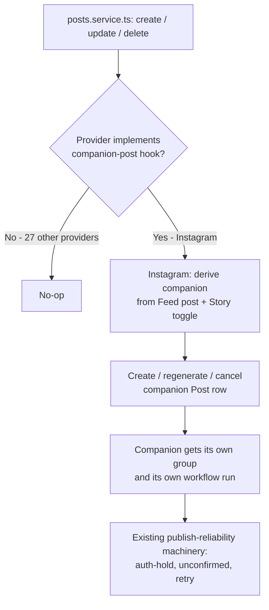
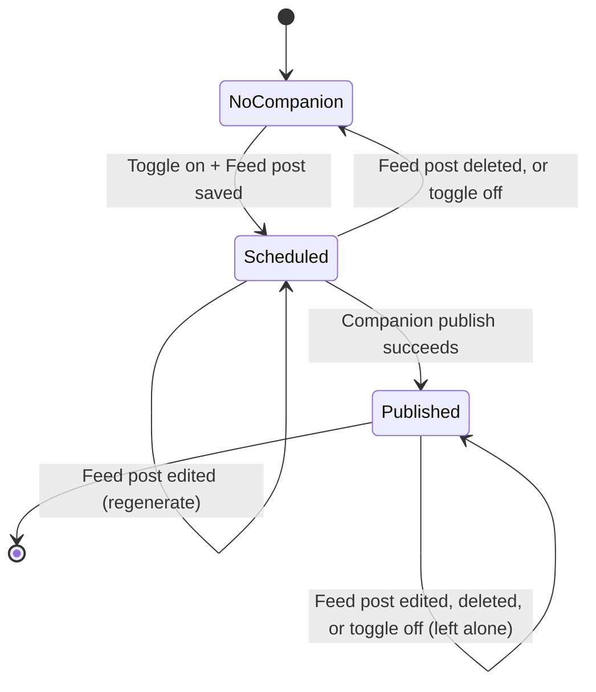

# Instagram Modernization - Plan

## Goal Capsule

- **Objective:** Postiz users can publish Instagram content using the post-type-specific controls the current Graph API actually supports — an explicit Feed / Reel / Story choice, native Stories, a Story-republish option on Feed posts, and the newer Reels controls (`share_to_feed`, custom cover, Trial Reels) — without regressing any existing Instagram publishing, and ahead of Meta's `v20.0` Graph API sunset (September 24, 2026).
- **Authority:** This plan's Requirements and Key Decisions are binding on product behavior; Key Technical Decisions and Implementation Units are the implementer's authority within those constraints.
- **Stop conditions:** Do not merge if the manual verification checklist (Verification Contract) finds a regression on any existing, unmodified Instagram publish path (OAuth reconnect, Feed image, carousel).
- **Execution profile:** `code` — NestJS backend/orchestrator, React frontend, one Prisma schema change (`db push`, no migration files in this repo).
- **Tail ownership:** Standard PR/CI flow after implementation; this plan does not commit to autonomous shipping.

## Product Contract

**Product Contract preservation:** changed — added R15 (Story Companion Post cascade lifecycle) and R16 (quota counting), and their Key Decisions, both resolved during planning dialogue since the brainstorm's R6 didn't specify parent-edit/delete/toggle-off behavior or quota treatment. R1-R14 unchanged.

### Summary

Give Postiz's Instagram composer an explicit Feed / Reel / Story choice, native Story publishing, a Story-republish toggle on Feed posts, and the newer Reels controls (`share_to_feed`, custom cover, Trial Reels), plus a live view of the account's daily publishing cap — all built on top of Postiz's existing two-step container/publish flow for Instagram, and on a Graph API version moved off the soon-to-sunset `v20.0`.

### Problem Frame

Instagram's Graph API has moved past what Postiz's Instagram composer exposes. Today, `post_type` is a binary `post` / `story` choice: a single video attached to a `post` is silently auto-converted to a Reel, there is no way to request `share_to_feed` or a custom Reel cover, and there's no way to also push a Feed post to Stories. Two capabilities the composer doesn't surface — Trial Reels and the Feed/Reel distinction — already have partial backend support, which this work also has to reconcile rather than duplicate. The provider's core publish calls (container create, `media_publish`) are also still pinned to `v20.0`, which sunsets September 24, 2026 — after which Meta silently reroutes calls to an unpredictable version rather than erroring, so the fix is time-boxed, not discretionary.

### Key Decisions

- **Story companion is a separate, purpose-built link, not the existing thread mechanism.** (session-settled: user-directed — chosen over reusing `parentPostId`: that relation is already special-cased elsewhere as "thread child"; overloading it risks entangling Story republishing with thread-specific logic.) Governs R6.
- **Story republishing renders as a separate, trackable post, not a silent side effect.** (session-settled: user-directed — chosen over an invisible side-effect: lets a failed Story publish be visible on its own instead of hiding inside the Feed post's status.) Governs R5, R6.
- **Carousel limit stays at 10; nothing changes there.** (session-settled: user-directed — chosen over raising the limit: Meta's Graph API itself caps carousels at 10 regardless of Instagram's 20-item in-app limit, and Postiz's current validation already matches it, so there was nothing to raise.)
- **Trial Reels need no new backend or UI design.** The DTO fields (`is_trial_reel`, `graduation_strategy`), the provider's `trial_params` call, and a composer checkbox/dropdown already exist end-to-end. The open item is whether they actually take effect given the API-version pinning below, not building the feature. Governs R10, R13.
- **Story Companion Post lifecycle cascades from the parent Feed post.** (session-settled: user-directed — chosen over full independence once created: prevents an orphaned Story continuing to publish after the operator deletes or edits the Feed post, or turns the toggle off. An already-published companion is left alone since a live Story can't be pulled back.) Governs R15.
- **The Story companion counts against the organization's monthly post quota, and the composer discloses that.** (session-settled: user-directed — chosen over exempting it: the companion is a real scheduled post like any other, and a hidden quota cost would surprise operators on a metered plan.) Governs R16.

### Requirements

**Post Type & Story Publishing**
- R1. The Instagram composer offers an explicit Feed / Reel / Story choice, replacing today's implicit media-based detection, and shows only the settings relevant to the selected type.
- R2. Already-queued Instagram posts, persisted with today's `post_type: 'post'` value, keep publishing with their current behavior after this ships — no backfill or migration of in-flight posts.
- R3. Selecting Story publishes through the same two-step container-create-then-publish flow Postiz already uses for other Instagram post types, using `media_type=STORIES`.
- R4. Story media is validated against Story-specific specs in the composer before publish, distinct from Feed/Reel media validation.

**Also Share to Story**
- R5. A per-post toggle on Feed posts lets the user also publish the same media as a Story.
- R6. The Story companion publishes as its own separate, trackable post — its own publish status and its own analytics entry — linked to the originating Feed post via a link dedicated to this purpose (see Key Decisions).
- R7. The toggle's UI copy states plainly that this republishes the same media as a Story; it is not Instagram's native "share to Story" reshare sticker, which the API cannot produce.
- R15. When the Feed post is edited, the Story companion is regenerated to match. When the Feed post is deleted, or the toggle is turned off, before the companion has published, the companion is canceled. A companion that has already published, or whose publish is already irreversibly in flight with Instagram, is left alone and is never recreated.
- R16. The Story companion consumes one unit of the organization's monthly post quota, the same as any other scheduled post, and the composer discloses this when the toggle is enabled. If the organization is already at its monthly cap, companion creation is blocked the same way creating a normal post at cap already is, and the composer disables the toggle with copy explaining why.

**Reels Options**
- R8. The composer exposes `share_to_feed` for Reels, controlling whether the Reel also appears in the Feed/Reels tab.
- R9. The composer exposes a custom Reel cover (`cover_url`) as an alternative to the existing thumbnail-offset behavior, selected through Postiz's existing media library/uploader rather than a raw URL field.
- R10. Trial Reels (`is_trial_reel` + `graduation_strategy`) are verified to actually take effect once R13 lands; no new composer or DTO surface is needed beyond that verification.
- R11. Postiz does not attempt trial-reel graduation itself — Meta exposes no API for it. A `graduation_strategy: MANUAL` selection is labeled in-product as "graduate this from inside Instagram."

**Publishing Limits & Reliability**
- R12. The composer shows the Instagram account's current daily publishing usage against its cap, sourced live from Meta rather than a hardcoded number.
- R13. The Instagram provider's Graph API calls move off the pinned `v20.0` to a version that supports `share_to_feed`, `cover_url`, and `trial_params`, applied across every call site in the file — not only the publish path — so no endpoint is left on a version sunsetting September 24, 2026.
- R14. The existing container-processing wait explicitly checks for the Graph API's `FINISHED` status rather than relying on implicit fallthrough, so an unexpected status code is never silently treated as ready.

### Actors

- **Operator** — the Postiz user composing and scheduling the Instagram post.
- **Instagram Graph API** — the external system that creates media containers, reports their processing status, and publishes them.
- **Postiz publish workflow** — the existing orchestrator flow that creates containers, polls their status, and finalizes publish for Instagram (and other async-processing providers).

### Key Flows

- F1. Selecting a post type in the composer
  - **Trigger:** Operator opens Instagram settings on a queued post.
  - **Steps:** Operator picks Feed, Reel, or Story; the composer shows only the fields valid for that type; on publish, the provider sends the matching `media_type`.
  - **Covers:** R1, R4.
- F2. Publishing a Feed post with "also share to Story" on
  - **Trigger:** Operator enables the toggle on a Feed post; the post reaches publish time.
  - **Steps:** The Feed post publishes normally; a linked Story companion post is created and published separately from the same media; both outcomes are tracked independently.
  - **Covers:** R5, R6, R7.
- F3. Publishing a Trial Reel
  - **Trigger:** Operator selects Reel, enables Trial Reel, and picks a graduation strategy.
  - **Steps:** Provider sends `trial_params` on the version-appropriate endpoint; the container is polled until `FINISHED`; publish proceeds; a MANUAL strategy is labeled as requiring the Instagram app to graduate.
  - **Covers:** R10, R11, R13, R14.
- F4. Story companion follows the parent Feed post
  - **Trigger:** Operator edits or deletes a Feed post, or turns the Story toggle off, after a companion already exists.
  - **Steps:** If the companion hasn't published and isn't already irreversibly in flight with Instagram, an edit regenerates it and a delete/untoggle cancels it. If the companion has already published, or is in flight, it is left untouched and is not recreated.
  - **Covers:** R15.

### Acceptance Examples

- AE1. **Covers R1.** Given a queued Instagram post with post type Feed and a single video attached, when the operator saves it, then the composer publishes it as a Reel (Instagram no longer meaningfully supports a standalone Feed video post) and tells the operator that substitution is happening before they schedule it — not only as a Graph API error at publish time.
- AE2. **Covers R5, R6, R7.** Given a Feed post with "also share to Story" enabled, when the Feed post publishes successfully but the Story companion publish fails, then the Feed post's success is unaffected and the Story failure is visible on its own linked post.
- AE3. **Covers R10, R11.** Given a Reel published as a Trial Reel with `graduation_strategy: MANUAL`, when the operator looks for a way to graduate it from Postiz, then the product tells them this happens inside the Instagram app, not in Postiz.
- AE4. **Covers R3, R4.** Given a Story whose media doesn't meet Story-specific specs, when the operator tries to schedule it, then the composer disables scheduling and flags the issue before publish, rather than letting the Graph API reject it at publish time.
- AE5. **Covers R15.** Given a Feed post whose Story companion has already published, when the operator deletes the Feed post, then the Feed post is removed, the live Story is left alone, and no new companion is created.
- AE6. **Covers R15.** Given a Feed post with a scheduled (not yet published) Story companion, when the operator changes the Feed post's media before publish, then the companion is regenerated to match the new media before either one publishes.
- AE7. **Covers R15.** Given a Feed post whose Story companion's Instagram container is already irreversibly in flight (created but not yet confirmed published) when the operator deletes the Feed post, then the companion is not silently deleted — it is left visible for the same unconfirmed-publish reconciliation Postiz already uses elsewhere, rather than risking a live Story with no matching record.
- AE8. **Covers R16.** Given an organization at its monthly post quota, when the operator opens the Story toggle, then the toggle is disabled with copy explaining that the organization is out of post credits, rather than allowing the companion to be created over the cap.

### Scope Boundaries

**Deferred for later**
- Raising Instagram's carousel item limit — not possible; Meta's Graph API itself caps carousels at 10 regardless of the in-app 20-item limit. Postiz's existing validation already matches this ceiling and needs no change.
- Automating trial-reel graduation from within Postiz — Meta exposes no API for it.

**Outside this feature's identity**
- Reproducing Instagram's native "share post to Story" reshare sticker, with its visual link back to the original post — not achievable via the Graph API. The Story toggle is a plain republish (R7).

**Deferred to Follow-Up Work**
- A repo-wide test harness/mocking convention for social providers in general — this plan adds only the tests scoped to the code it touches (see U1, U3-U6), not a generic harness for all 28+ providers.
- A feature-flag or staged-rollout mechanism for the Instagram provider — none exists today; out of scope to build one just for this version bump. The OAuth/reconnect-path bump ships as a single verified change instead (see Risks & Dependencies).
- Visually linking a companion Story's calendar tile back to its originating Feed tile — the companion is independently trackable (R6) but the calendar UI change to show the link is not required by any requirement here.

### Dependencies / Assumptions

- Depends on moving the Instagram provider's Graph API calls off the pinned `v20.0` to a version supporting `share_to_feed`, `cover_url`, and `trial_params`. This touches every existing Instagram publish and connect path, not only the new features, and needs regression coverage on a production system with existing users. Governs R13.
- Assumes Meta's live publishing-usage data is available per Instagram Business Account at a cadence the composer can query without tripping Instagram's own API rate limits. Governs R12.
- Assumes already-queued posts' serialized `settings` (carrying today's `post_type: 'post'`) continue to read and publish correctly once the DTO's valid `post_type` values change. Governs R2.
- `libraries/nestjs-libraries/src/integrations/social/instagram.provider.ts` carries pre-existing local changes unrelated to this feature (publish-workflow progress-callback wiring, an inbox-comments capability, OAuth token-refresh handling). Implementation units build on top of that working-tree state as the baseline.
- Meta's documentation states no explicit default for `share_to_feed`; the provider passes it explicitly on every Reel publish rather than relying on an undocumented default.
- `cover_url` silently overrides `thumb_offset` when both are sent on the same request; the provider sends only one per publish to avoid ambiguous behavior.

## Planning Contract

### Key Technical Decisions

- KTD1. **Introduce a shared Graph API version constant, targeting `v22.0`, and use it at every call site in `instagram.provider.ts` and `instagram.standalone.provider.ts`'s Instagram-specific calls.** (session-settled: user-directed — chosen over bumping only the publish-path calls: covers every endpoint before the `v20.0` sunset, not only the new-feature ones. `v22.0` chosen over the newest `v25.0`/`v26.0` for stability/runway — it's already used elsewhere in the same file for `ig_audio`, giving it a track record in this codebase, and has runway to May 2027.) Governs R13.
- KTD2. **Add a new optional provider-interface hook for deriving companion posts** (parallel to the existing `checkValidity`/`inboxCapabilities` hooks), called once from the generic post create/update/delete path in `posts.service.ts`. It no-ops for every provider except Instagram, so no provider-specific branching lands in generic code. The delete path's existing `deletePost(orgId, group)` has no provider/settings context today, so wiring the hook there needs an added lookup, not a free ride on the existing signature. The new companion-link column carries a database-level uniqueness constraint (one companion per Feed post), so the hook's "does a companion already exist" step is a single atomic upsert on that key — mirroring `createOrUpdatePost`'s existing upsert-on-id pattern — rather than a separate find-then-insert that could race under a rapid double-save. Governs R6, R15.
- KTD3. **The Story companion publishes as a full top-level `Post` row, with its own `group` and its own Temporal workflow run — the same existing workflow version, invoked a second time — not as a side effect inside the Feed post's own publish activity.** This mirrors the existing pattern for posting the same content to multiple integrations, so the companion inherits the existing auth-hold / unconfirmed-publish / retry machinery for free, and no Temporal workflow definition changes. Because the companion has its own `group`, the Feed post's existing delete/edit operations (group-scoped soft-delete, `postId`-scoped workflow termination) never reach it by side effect — cancellation must independently soft-delete the companion row and terminate the companion's own running workflow, mirroring both halves of the existing delete pattern but scoped to the companion's own id. The new FK's `onDelete` behavior matches the existing `parentPostId` relation's default (`SET NULL`) for consistency, though no code path in this repo hard-deletes a `Post` row today. Governs R6, R15.
- KTD4. **`post_type`'s valid values expand to `feed` / `reel` / `story`; `post` stays permanently valid as a legacy alias**, normalized to `feed` or `reel` (by existing media-type detection) at read time in the provider, not rewritten in stored data. Mirrors the existing normalize-at-read-time precedent used elsewhere in this provider layer for a comparable settings-shape change. Governs R1, R2.
- KTD5. **The daily-publishing-cap read is exposed through the existing generic provider-dispatch endpoint pattern** (the same one used for other "ask the provider live" calls), not a new dedicated route or an added Manager/Service layer. Governs R12.
- KTD6. **Add an explicit `FINISHED` branch to the existing container-status if/else chain**, preserving today's `IN_PROGRESS` / `PUBLISHED` / `ERROR` / `EXPIRED` handling exactly. Governs R14.
- KTD7. **Cancellation gates on three signals, not just `state`/`releaseId`: `state !== 'PUBLISHED'`, `releaseId == null`, and no live Redis in-flight marker for the companion's id.** A companion with an in-flight marker set (container created, publish not yet confirmed) is not silently canceled — it routes through the existing `UNCONFIRMED:` reconciliation path (the same pattern regular posts already use for this exact ambiguity), rather than a new bespoke cancellation heuristic. Governs R15; enforces AE7.

### High-Level Technical Design

**Companion-post derivation stays generic; only the Instagram implementation is provider-specific.**

**Story companion lifecycle** (governs R15, F4):

### System-Wide Impact

- **Generic post-lifecycle path (all 28+ providers).** KTD2's companion-derivation hook is a no-op for every non-Instagram provider, but it is still a new call inserted into the shared `posts.service.ts` create/update/delete path every provider goes through. The delete path's existing `deletePost(orgId, group)` signature carries no provider/settings context, so wiring the hook there is an added lookup on every delete, not a free extension point — size this cost into U3, not just Instagram's own code.
- **Auth boundary (all connected Instagram accounts).** The version bump's real OAuth/reconnect exposure isn't `state`/`redirect_uri` (both are Postiz-owned and round-tripped unchanged by Meta) — it's `checkScopes` validating the bumped version's `/me/permissions` response against Postiz's hardcoded `scopes` array. If Meta renamed or split any permission string between `v20.0` and the target version, every reconnect throws `NotEnoughScopes`, a hard block. Diff Meta's target-version permission names against the provider's `scopes` array before merging, as its own pre-merge check, separate from "the URLs still 200."
- **Billing/quota (org-wide).** Companion posts are created server-side by the hook, not through the normal `POST /posts` endpoint the org's monthly quota check already guards. Per R16, the companion counts against quota and the composer discloses it — implement the quota increment and the disclosure copy together, since neither alone satisfies R16.
- **Shared `Post` table (schema change).** The new column's `@@index` and FK are additive and non-destructive (confirmed via a generated-DDL check: `ADD COLUMN`/`ADD CONSTRAINT`, never a drop or narrowing), so `prisma-db-push --accept-data-loss` carries no real data-loss risk here despite the flag's name. The DDL itself is still a non-concurrent index/constraint build on a live, continuously-written table — schedule the `db push` for low-traffic hours rather than treating it as a routine additive-column push.
- **Response-shape exposure.** `getPostById`/`getPostsByGroup` use Prisma `include`, so the new column/relation flows into those API responses automatically with no code change; `getPosts` (calendar view) explicitly `select`s fields and will not leak it. This is existing, inconsistent-by-design behavior in this repo, not something this plan needs to fix — just don't assume the new field is hidden everywhere.

### Risks & Dependencies

- **Sunset deadline.** `v20.0` sunsets September 24, 2026 (~5 weeks from this plan's date). Meta does not hard-error on an expired version — it silently reroutes to an unpredictable version — so there is no error signal to catch a missed deadline. Sequence KTD1 first.
- **OAuth/reconnect blast radius.** Bumping the OAuth, token-exchange, and page-discovery call sites (part of KTD1's whole-file scope) affects every existing connected user's reconnect flow, not only new publishes. No feature-flag mechanism exists in this provider for a staged rollout (see Scope Boundaries). Mitigate with the manual verification checklist in Verification Contract before merge.
- **No existing test harness for any social provider.** This plan introduces the first tests for `instagram.provider.ts`. Scope test investment to the branches this plan actually changes rather than retrofitting full coverage.
- **Trial Reels eligibility.** Meta may gate Trial Reels behind an account-level threshold (unconfirmed exact figure). Already handled: the provider's `handleErrors` already maps Graph API error code `2207081` ("This account doesn't support Trial Reels") to a readable message — no new work needed for this case, just confirm it still fires after KTD1.
- **OAuth permission-name drift.** Bumping the version changes what `/me/permissions` returns to `checkScopes`. Diff the target version's permission names against the provider's `scopes` array as an explicit pre-merge check (System-Wide Impact), not something the general manual-verification pass would reliably catch.
- **No test infrastructure exists yet for this package.** Confirmed: zero `*.spec.ts`/`*.test.ts` files exist anywhere in the repo, and the root `jest.config.ts` is an Nx aggregator (`getJestProjects()`) with no per-project Jest config or Nx project graph currently wired up, and no `@nx/jest` package installed — so the root `pnpm test` command cannot discover a new per-project config no matter what U1 adds. Jest, `ts-jest`, and `@nestjs/testing` are installed and ready. U1 adds a minimal per-project Jest config for `libraries/nestjs-libraries` scoped only to running this plan's own new spec files, invoked directly (see Verification Contract) rather than through the root command — not a repo-wide harness for all 28+ providers (that stays in Deferred to Follow-Up Work).

## Implementation Units

### U1. Normalize the Graph API version across the Instagram provider

- **Goal:** Move every Instagram-specific Graph API call off the pinned `v20.0` to `v22.0`, via a shared version constant, ahead of the September 24, 2026 sunset.
- **Requirements:** R13. KTD1.
- **Dependencies:** None — sequence first.
- **Files:**
  - `libraries/nestjs-libraries/src/integrations/social/instagram.provider.ts` (all ~20 hardcoded `v20.0` call sites, plus the already-drifted `v22.0`/`v21.0` sites reviewed for consistency)
  - `libraries/nestjs-libraries/src/integrations/social/instagram.standalone.provider.ts` (its own `v21.0`-pinned OAuth calls — confirm whether to align to `v22.0` or leave, since they're not yet at risk of sunset; document the choice inline)
  - `libraries/nestjs-libraries/jest.config.ts` (new — minimal per-project Jest config so `*.spec.ts` files in this package are discovered; this repo has none today, see Risks & Dependencies. The repo's root `pnpm test` command routes through an Nx project-graph aggregator this repo doesn't have configured, so it cannot discover this new config — run the new tests directly against this config, e.g. `npx jest --config libraries/nestjs-libraries/jest.config.ts`, rather than through the root command)
  - Test: `libraries/nestjs-libraries/src/integrations/social/instagram.provider.spec.ts` (new)
- **Approach:**
  - Introduce one shared version constant used by every Instagram Graph API URL built in the file, replacing the per-call literal strings.
  - Do not change request shapes — this is a version-string change only, per KTD1's rationale.
  - Add the minimal Jest project config first — this plan's new spec files across U1/U3/U5/U6 all depend on it existing.
  - Diff Meta's `v22.0` permission names against the `scopes` array before merging (System-Wide Impact / Risks & Dependencies).
- **Patterns to follow:** The file's own existing `v21.0`/`v22.0` call sites (insights, `ig_audio`) show the version already varies per call today; unifying to one constant is a smaller, more consistent diff than leaving the mix.
- **Test scenarios:**
  - Happy path: container-create request URL uses the new version constant for image, video, Reel, carousel, and Story `media_type` values.
  - Happy path: `media_publish`, `igContainerStatus`, and `igPermalink` requests use the new version.
  - Integration: OAuth dialog URL, token exchange, and page-discovery calls (`pages`, `fetchPageInformation`) use the new version and still parse Meta's existing response shape.
  - Error path: `handleErrors`' existing string/code matching (e.g., error code `2207042`, `2207081`, `190`) still fires correctly against unmodified response bodies — version bump must not change error-parsing logic.
- **Verification:** All Instagram Graph API URLs in the file use one shared version constant; `handleErrors` test cases pass unchanged; manual checklist (Verification Contract) passes against a real connected account.

### U2. Explicit `FINISHED` status handling in container polling

- **Goal:** Make the container-processing wait require an exact `FINISHED` match instead of falling through on "anything not `IN_PROGRESS`/`ERROR`/`EXPIRED`."
- **Requirements:** R14. KTD6.
- **Dependencies:** U1 (touches the same `instagram.provider.ts` status-check code U1 rewrites for the version bump).
- **Files:**
  - `libraries/nestjs-libraries/src/integrations/social/instagram.provider.ts` (`igContainerStatus`, `checkPostStatus`)
  - Test: `libraries/nestjs-libraries/src/integrations/social/instagram.provider.spec.ts`
- **Approach:**
  - Add an explicit `FINISHED` branch to the existing if/else chain in `checkPostStatus`, alongside its current `IN_PROGRESS` and `PUBLISHED` branches.
  - Preserve `igContainerStatus`'s existing `ERROR`/`EXPIRED` throw behavior exactly.
- **Test scenarios:**
  - Happy path: `status_code: 'FINISHED'` resolves to ready-to-publish.
  - Edge case: `status_code: 'IN_PROGRESS'` still resolves to pending, unchanged.
  - Edge case: an unrecognized status code (neither `FINISHED`, `IN_PROGRESS`, `PUBLISHED`, `ERROR`, nor `EXPIRED`) does not silently resolve to ready — this is the regression this unit exists to prevent.
  - Error path: `ERROR`/`EXPIRED` still throw exactly as today.
- **Verification:** Container polling only proceeds to publish on an exact `FINISHED` (or already-`PUBLISHED`) status; existing `IN_PROGRESS`/`ERROR`/`EXPIRED` behavior is unchanged by test comparison.

### U3. Story Companion Post data model and generic derivation hook

- **Goal:** Add the Story Companion Post relation to the `Post` model and a generic, provider-agnostic hook that lets a provider derive companion posts on create/update/delete, and update `CONCEPTS.md`'s Story Companion Post entry to match the shipped behavior.
- **Requirements:** R6, R15, R16. KTD2, KTD3, KTD4 (schema/interface half), KTD7.
- **Dependencies:** None.
- **Files:**
  - `libraries/nestjs-libraries/src/database/prisma/schema.prisma` (new nullable self-relation on `Post`, its own `@relation` name, `@@index`, and a `@@unique` constraint on the link column so one Feed post has at most one companion; `onDelete: SetNull`, matching `parentPostId`'s existing default — distinct relation, same shape)
  - `libraries/nestjs-libraries/src/integrations/social/social.integrations.interface.ts` (new optional hook on `SocialProvider`, no-op default)
  - `libraries/nestjs-libraries/src/database/prisma/posts/posts.service.ts` (call the hook once from the generic create/update/delete path; the delete path's current `deletePost(orgId, group)` has no provider/settings context, so this needs an added lookup, not a free extension)
  - `libraries/nestjs-libraries/src/database/prisma/posts/posts.repository.ts` (persist a companion via an atomic upsert keyed on the new unique link column — mirroring `createOrUpdatePost`'s existing upsert-on-id pattern — rather than a separate find-then-insert; ensure companion rows are excluded from the `parentPostId: null` dispatch filters the way top-level posts already are, since they are top-level posts themselves with their own `group`)
  - The file owning the organization's `POSTS_PER_MONTH` policy check (reused, not duplicated, by the hook's pre-creation gate)
  - `CONCEPTS.md` (update the Story Companion Post entry to match shipped behavior, per Definition of Done)
  - Test: `libraries/nestjs-libraries/src/database/prisma/posts/posts.service.spec.ts` (new)
- **Approach:**
  1. Add the new relation to `Post`, run `pnpm run prisma-generate` and `pnpm run prisma-db-push` (schedule for low-traffic hours per System-Wide Impact).
  2. Add the hook to the provider interface with a no-op default so the other 27 providers are unaffected.
  3. Wire `posts.service.ts`'s create/update/delete path to call the hook and act on its result (create, regenerate, or cancel a companion), per KTD2's dispatch shape.
  4. Before creating or regenerating a companion, run the same `POSTS_PER_MONTH` cap check that already gates normal post creation; if the organization is at cap, do not create the companion (R16).
  5. Verify the companion satisfies R16's counting half without new tracking code: `countPostsFromDay`/`POSTS_PER_MONTH` already counts live over queued/published `Post` rows, so a companion created as a normal `QUEUE`-state row is already counted the moment it exists.
- **Technical design:** See the High-Level Technical Design flowchart above (companion-post derivation).
- **Patterns to follow:** `checkValidity`'s existing per-provider-optional-hook shape; `createOrUpdatePost`'s existing upsert-on-id pattern for spawning a linked post row.
- **Test scenarios:**
  - Happy path: creating a Feed post with the Story toggle on calls the hook and persists a companion `Post` row with its own `group`.
  - Happy path: the hook is a no-op for a non-Instagram provider's post — no companion row is created.
  - Happy path: `Covers R16.` Creating a companion is reflected in the org's live quota count (`countPostsFromDay`) the same way a normal post would be, with no separate increment step involved.
  - Error path: `Covers R16.` An organization already at its monthly cap does not get a companion created when the toggle is on; the Feed post itself still saves normally.
  - Integration: `Covers AE6.` Editing the Feed post's media before the companion publishes updates the companion to match.
  - Integration: `Covers AE5, AE6.` Deleting the Feed post, or turning the toggle off, before the companion publishes removes/cancels the companion; after the companion has published, the same actions leave it untouched.
  - Edge case: two near-simultaneous "regenerate companion" calls for the same Feed post (e.g., rapid double-save) result in exactly one companion row, not two, via the unique-constraint-backed upsert.
  - Edge case: a companion row is never matched by the existing `parentPostId: null` dispatch/queue filters in a way that would prevent its own independent publish.
- **Verification:** Schema change applied via `prisma-db-push`; hook fires only for Instagram; companion rows dispatch independently; concurrent-regenerate scenario produces one row; AE5/AE6 and quota scenarios pass.

### U4. Instagram provider: companion-post hook implementation

- **Goal:** Implement the companion-post hook for Instagram, so enabling "also share to Story" produces the linked, independently-published companion described in R5-R7, R15, and cancels it safely.
- **Requirements:** R5, R6, R7, R15. KTD2, KTD3, KTD7.
- **Dependencies:** U3, U1 (implements R3's two-step publish flow, which U1 rewrites for the version bump).
- **Files:**
  - `libraries/nestjs-libraries/src/integrations/social/instagram.provider.ts` (hook implementation)
  - `libraries/nestjs-libraries/src/database/prisma/posts/posts.service.ts` (the cancel path — mirror the existing delete flow's two halves, scoped to the companion's own id)
  - `apps/orchestrator/src/activities/post.activity.ts` (confirm the companion's `startWorkflow` call follows the existing per-integration pattern — no new activity or workflow version needed, per KTD3)
  - Test: `libraries/nestjs-libraries/src/integrations/social/instagram.provider.spec.ts`
- **Approach:**
  - On Feed-post create/update with the toggle on, derive a companion post using the same media, `media_type=STORIES`, following R3's existing two-step flow.
  - On Feed-post delete or toggle-off, check the companion's cancellation gate (KTD7: `state !== 'PUBLISHED'`, `releaseId == null`, no live in-flight marker). If clear, cancel by both soft-deleting the companion row and terminating the companion's own running workflow — mirroring the existing delete flow's two halves (`posts.service.ts`'s existing soft-delete-by-group plus workflow-terminate-by-postId), scoped to the companion's own `id`, not inherited from the Feed post's own delete call.
  - If the gate finds a live in-flight marker, do not cancel — route the companion through the existing unconfirmed-publish reconciliation path instead of new bespoke logic (KTD7, AE7).
  - Do not modify `postWorkflowV107` — the companion runs through the same, already-shipped workflow version a second time, per KTD3 and this repo's Workflow Versioning rule.
- **Test scenarios:**
  - Happy path: `Covers F2.` Feed post with toggle on publishes; companion publishes separately as a Story; both statuses are independently visible.
  - Error path: `Covers AE2.` Companion publish fails after the Feed post already succeeded — Feed post status is unaffected; companion's own post shows the failure.
  - Integration: `Covers AE5.` Deleting a Feed post whose companion has already published soft-deletes the Feed post only; the companion row and its live Story are untouched.
  - Integration: `Covers AE7.` Deleting a Feed post whose companion has a live in-flight marker (container created, not yet confirmed) does not cancel the companion — it is left in the same unconfirmed-reconciliation state a regular post would be.
  - Integration: deleting a Feed post whose companion is genuinely still queued (no in-flight marker) both soft-deletes the companion row and terminates its running workflow — a workflow-status assertion, not just a row-flag check.
  - Edge case: `Covers R11.` A Trial Reel with `graduation_strategy: MANUAL` never attempts an API-level graduation call.
- **Verification:** AE2, AE5, AE7, F2 scenarios pass against a real connected account; no `postWorkflowV107` diff; a canceled companion's workflow shows terminated, not merely soft-deleted.

### U5. `post_type` restructure, `share_to_feed`, `cover_url`, and Story media validation

- **Goal:** Add the explicit Feed/Reel/Story `post_type` values (with `post` kept as a legacy alias), and the new `share_to_feed`/`cover_url` Reel params, at the DTO and provider layer. Add Story-specific media validation.
- **Requirements:** R1, R2, R3, R4, R8, R9. KTD4.
- **Dependencies:** U1 (send new params on the current API version, not `v20.0`).
- **Files:**
  - `libraries/nestjs-libraries/src/dtos/posts/providers-settings/instagram.dto.ts` (`post_type: 'feed' | 'reel' | 'story' | 'post'`, new optional `share_to_feed`/`cover_url` fields, `@IsOptional()` per the `InstagramAudio` precedent)
  - `libraries/nestjs-libraries/src/integrations/social/instagram.provider.ts` (`checkValidity` for Story media specs; `postPending`'s `media_type` branch normalizes legacy `post` to `feed`/`reel`, and sends `share_to_feed`/`cover_url` on Reel publishes)
  - Test: `libraries/nestjs-libraries/src/dtos/posts/providers-settings/instagram.dto.spec.ts` (new), `libraries/nestjs-libraries/src/integrations/social/instagram.provider.spec.ts`
- **Approach:**
  1. Widen `@IsIn` to accept `feed`/`reel`/`story`/`post`, per KTD4 — never remove `post`.
  2. In the provider, normalize `post` to `feed` or `reel` using the existing media-type detection (single video → Reel), matching today's implicit behavior for legacy data (satisfies R2, AE1).
  3. Always pass `share_to_feed` explicitly on Reel publishes (per the Dependencies note — no reliance on an undocumented default); send `cover_url` only when set, never alongside `thumb_offset`.
  4. Add Story-specific media checks to `checkValidity`, separate from the existing Feed/Reel checks (R4).
- **Test scenarios:**
  - Happy path: `post_type: 'feed'` with a single image publishes as a plain Feed post.
  - Happy path: `post_type: 'reel'` publishes with `media_type=REELS`, honoring `share_to_feed` and `cover_url` when set.
  - Happy path: `Covers AE1.` `post_type: 'feed'` with a single video still publishes as a Reel, and the composer is told this happens (frontend half in U7).
  - Edge case: `Covers R2.` A legacy `post_type: 'post'` value still validates and publishes with today's behavior.
  - Edge case: `cover_url` and `thumb_offset` both set — only `cover_url` is sent, per the Dependencies note.
  - Error path: `Covers AE4.` Story media that fails Story-specific specs is rejected by `checkValidity` before publish.
- **Verification:** DTO accepts all four `post_type` values; provider sends the correct `media_type` and Reel params per case; AE1, AE4 scenarios pass.

### U6. Trial Reels verification and daily publishing-cap endpoint

- **Goal:** Confirm Trial Reels work end-to-end once U1 lands, and add a live daily-publishing-cap read.
- **Requirements:** R10, R11, R12. KTD5.
- **Dependencies:** U1.
- **Files:**
  - `libraries/nestjs-libraries/src/integrations/social/instagram.provider.ts` (new method reading Meta's `content_publishing_limit`, dispatched through the existing generic pattern)
  - `apps/backend/src/api/routes/integrations.controller.ts` (confirm the existing generic dispatch route covers this call; add a dedicated route only if the generic one can't, per KTD5)
  - Test: `libraries/nestjs-libraries/src/integrations/social/instagram.provider.spec.ts`
- **Approach:**
  - Add a provider method that calls `GET /<ig-user-id>/content_publishing_limit` and returns `quota_usage`/`config.quota_total`/`config.quota_duration` verbatim — never hardcode a cap number, since Meta has changed it before.
  - Manually verify a Trial Reel publishes and actually applies `trial_params` once U1's version bump is live (this is the verification KTD5's Key Decision refers to, not new feature work).
- **Test scenarios:**
  - Happy path: the cap-read method returns Meta's live `quota_usage`/`quota_total`/`quota_duration` without transformation.
  - Error path: the cap-read call fails gracefully (e.g., missing permission) without blocking scheduling elsewhere in the composer.
  - Manual: `Covers R10.` A Trial Reel published post-U1 actually enters trial state on Instagram (verified against a real account, not mockable).
- **Verification:** Cap endpoint returns live Meta data; Trial Reel manually confirmed functional after the version bump.

### U7. Composer: Feed/Reel/Story selector and new Reels/Story fields

- **Goal:** Expose the new post-type selector, the new Reels fields, the Story toggle, and the daily-cap display in the Instagram composer.
- **Requirements:** R1, R4, R5, R7, R8, R9, R12, R16. AE1-AE4, AE8.
- **Dependencies:** U4, U5, U6.
- **Files:**
  - `apps/frontend/src/components/new-launch/providers/instagram/instagram.provider.tsx` (new settings-root component, promoted from `instagram.collaborators.tsx`, following the existing TikTok/YouTube `<provider>.provider.tsx` pattern)
  - `apps/frontend/src/components/new-launch/providers/instagram/instagram.collaborators.tsx`, `instagram.tags.tsx`, `instagram.audio.tsx` (kept as sub-components composed by the new settings root)
- **Approach:**
  1. Promote the settings root to `instagram.provider.tsx`, mirroring `tiktok.provider.tsx`'s `useSettings()` + `watch`/`register` shape.
  2. Add the Feed/Reel/Story `<Select>`, replacing the current implicit `post` value's dual meaning; conditionally render `share_to_feed`, `cover_url`, and the existing Trial Reel/collaborators/audio fields only for Reel; Story-specific fields only for Story. `cover_url` is picked via Postiz's existing media library/uploader, not typed in as a raw URL.
  3. Add the "also share to Story" toggle, shown only when `post_type === 'feed'` (R5 is Feed-only by its own wording), with copy disclosing it uses one additional post credit (R16). Disable the toggle with copy explaining why when the organization is at its monthly quota cap.
  4. Add the AE1 substitution notice as a persistent inline banner near the post-type control (not a dismiss-once toast) when Feed + a single video are both selected, so the operator can't miss it before scheduling.
  5. Add the daily-cap display, fetched once per settings-panel mount from U6's endpoint, informational only, never blocking scheduling.
- **Patterns to follow:** `tiktok.provider.tsx`'s mode-driven conditional-field pattern, including its "mounted but hidden" approach for fields that must survive a mode switch.
- **Test scenarios:**
  - Happy path: selecting each of Feed, Reel, Story shows only that type's fields.
  - Happy path: `Covers AE1.` Feed + single video shows the substitution notice as a persistent inline banner near the post-type control before save, not a dismissible toast.
  - Happy path: the Story toggle is visible only when `post_type === 'feed'`.
  - Happy path: `Covers AE8.` Enabling the toggle shows the quota-credit disclosure copy when the organization has quota remaining.
  - Edge case: `Covers AE8.` The Story toggle is disabled, with explanatory copy, when the organization is at its monthly quota cap.
  - Edge case: `Covers AE4.` Story media failing spec checks disables scheduling (not just a dismissible warning) until the media is fixed.
  - Integration: the daily-cap display renders U6's live values and does not block scheduling if the cap read fails.
  - Happy path: `Covers R9.` The Reel cover control opens Postiz's existing media picker and sets `cover_url` from the selection, not a typed URL.
- **Verification:** All four AE scenarios (AE1, AE4, plus AE2/AE3 via backend behavior already covered in U4/U6) visible and correct in the composer; manual smoke test in the running app per this project's UI-change convention.

## Verification Contract

| Command | Applies to | Notes |
|---|---|---|
| `npx jest --config libraries/nestjs-libraries/jest.config.ts` | U1, U2, U3, U5, U6 | New `.spec.ts` files added by this plan. This repo has zero existing test files anywhere and no per-project Jest config yet — U1 adds the minimal `libraries/nestjs-libraries/jest.config.ts` needed to run them. The root `pnpm test` command routes through an Nx project-graph aggregator this repo doesn't have configured, so it cannot discover the new config — invoke Jest directly against it instead. |
| `pnpm run prisma-generate` then `pnpm run prisma-db-push` | U3 | Applies the new `Post` relation; this repo uses `db push`, not versioned migration files. |
| Root-level lint (per this repo's convention: run from the repo root) | All units | |
| Manual verification against a real connected Instagram Business account: OAuth reconnect, Feed image post, single-video Reel, carousel, Story, Trial Reel, `share_to_feed` toggle, custom cover, comment reply/inbox fetch, `content_publishing_limit` read | U1 (required before merge), U4, U6, U7 | No automated harness reaches live Graph API behavior; this is the primary regression gate for the version bump's OAuth/reconnect blast radius. |

## Definition of Done

- All Implementation Units' test scenarios pass, including the new `instagram.provider.spec.ts`, `instagram.dto.spec.ts`, and `posts.service.spec.ts`.
- The manual verification checklist above passes against a real connected account with no regression on any existing (pre-plan) publish path.
- `postWorkflowV107` has no diff — the companion post publishes through the existing workflow version, never a new one.
- No `v20.0` Graph API call remains in `instagram.provider.ts` or its Instagram-specific calls in `instagram.standalone.provider.ts`; the target-version permission-name diff (System-Wide Impact) has been checked against the `scopes` array.
- A canceled companion is verified terminated at the workflow level, not just soft-deleted at the row level (KTD7, AE7).
- Companion-post creation is verified to increment the org's monthly quota usage, and the composer's disclosure copy is present (R16, AE8).
- `CONCEPTS.md`'s Story Companion Post entry matches the shipped relation's actual lifecycle behavior (cascade-from-parent, quota-counted).
- No dead-end or experimental code from approaches not taken remains in the diff.

## Sources / Research

- `libraries/nestjs-libraries/src/integrations/social/instagram.provider.ts` — carousel cap, post-type/media-type logic, `trial_params`, container polling, ~20 `v20.0` call sites, and pre-existing uncommitted local changes on this branch unrelated to this feature.
- `libraries/nestjs-libraries/src/dtos/posts/providers-settings/instagram.dto.ts` — current `InstagramDto`.
- `apps/frontend/src/components/new-launch/providers/instagram/instagram.collaborators.tsx` and `apps/frontend/src/components/new-launch/providers/tiktok/tiktok.provider.tsx` — current Instagram settings UI and the settings-root pattern to follow.
- `libraries/nestjs-libraries/src/database/prisma/schema.prisma` — `Post` model; `parentPostId`/`childrenPost` confirmed thread-specific via `posts.repository.ts`'s `parentPostId: null` dispatch/queue filters and `posts.service.ts`'s `getPostsRecursively`.
- `libraries/nestjs-libraries/src/database/prisma/posts/posts.service.ts`'s `createPost` — the existing one-Post-row-per-integration pattern the companion-post mechanism mirrors.
- `libraries/nestjs-libraries/src/database/prisma/posts/posts.service.ts`'s `deletePost` and `posts.repository.ts`'s `deletePost`/`countPostsFromDay` — the existing group-scoped soft-delete + workflow-terminate pattern the companion's own cancellation must independently replicate, and the quota-counting query R16 extends.
- `docs/solutions/architecture-patterns/publish-reliability-auth-hold-unconfirmed-workflow.md`'s Redis `post:inflight:{id}` marker — the existing signal KTD7 gates companion cancellation on, and the existing `UNCONFIRMED:` reconciliation path AE7 reuses.
- `apps/backend/src/api/routes/integrations.controller.ts`'s `functionIntegration` — the existing generic provider-dispatch pattern for the daily-cap read.
- `apps/orchestrator/src/workflows/post-workflows/post.workflow.v1.0.7.ts` — the current, already-shipped workflow version; mutation activities at `maximumAttempts: 1`.
- `docs/solutions/architecture-patterns/publish-reliability-auth-hold-unconfirmed-workflow.md` — the publish-boundary/pending-finalize pattern the companion post inherits by using its own top-level workflow run.
- Meta, [Publish Content using the Instagram Platform](https://developers.facebook.com/docs/instagram-platform/content-publishing/) — carousel cap, Stories support, container status codes, crop-to-first-image behavior.
- Meta, [Graph API changelog](https://developers.facebook.com/docs/graph-api/changelog/) and [versioning guide](https://developers.facebook.com/docs/graph-api/guides/versioning) — `v20.0` sunsets September 24, 2026; expired-version calls silently downgrade rather than error.
- Meta, [`content_publishing_limit` reference](https://developers.facebook.com/docs/instagram-platform/instagram-graph-api/reference/ig-user/content_publishing_limit/) — `quota_usage`/`config.quota_total`/`config.quota_duration` response shape.
