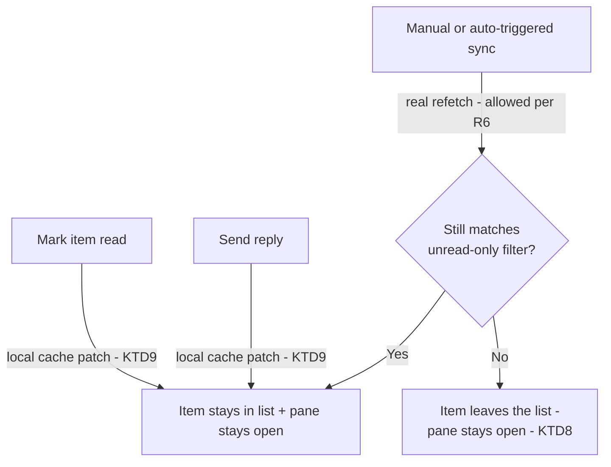

# Inbox Embedded Posts and Sync Fixes - Plan

## Goal Capsule

- **Objective:** From the Inbox tab, a user can see and react to the original post without leaving Postiz, keep moving through unread items without losing their place, and see up-to-date engagement without remembering to click sync.
- **Authority:** This plan's Requirements and Key Decisions are binding on product behavior; Key Technical Decisions and Implementation Units are the implementer's authority within those constraints.
- **Stop conditions:** Do not merge if the manual verification checklist (Verification Contract) finds a regression on any existing, unmodified Inbox behavior (list/detail navigation, reply sending, capability-gated reply availability).
- **Execution profile:** `code` — Next.js (App Router) frontend, NestJS backend/libraries, no schema change.
- **Tail ownership:** Standard PR/CI flow after implementation; this plan does not commit to autonomous shipping.

---

## Product Contract

**Product Contract preservation:** unchanged — R1-R8, KD1-KD3, and AE1-AE6 carry forward from the brainstorm as written; this planning pass added no new Requirements or Key Decisions, only the Planning Contract below.

### Summary

Three focused changes to the existing Inbox tab: render each platform's own native embed widget for the original post in the detail pane instead of an external link, stop the "unread only" filter from dropping the item a user just opened out of view, and trigger the existing sync flow automatically whenever the tab is opened.

### Problem Frame

The Inbox tab already lets an org member read and reply to comments, DMs, and mentions from connected channels. Today the detail pane only offers an external "Open" link to the original post's `remoteUrl`, so reacting to the post itself still means leaving Postiz. Separately, opening an item while "unread only" is checked marks it read and refetches the filtered list; because the detail pane looks up its content in that same list, the item disappears and the reply pane the user was just using closes with it. And "Sync now" only runs on a manual click, so an item opened right after connecting a channel, or after time away, can be stale until the user thinks to click it.

### Key Decisions

- **KD1. Native platform embed over a first-party post card** — render each channel's own embed widget (e.g. Instagram/Facebook SDK, X widgets.js, YouTube iframe) from the existing `remoteUrl` rather than fetching and storing post media/captions ourselves. (session-settled: user-approved — chosen over a first-party post card: richer result with no new data to fetch or store, at the cost of only covering public, permalink-bearing posts) Governs R1, R3.
- **KD2. Keep the external link as fallback, never a blank state** — when no native embed is possible or a qualifying embed fails at runtime, preserve today's "Open" link (or its current absence) rather than showing nothing new. (session-settled: user-approved — chosen over dropping the link whenever an embed doesn't render: keeps embed strictly additive) Governs R2, R4.
- **KD3. Sync on every tab open, no cooldown** — auto-sync fires every time the Inbox tab opens, matching the existing manual button, rather than gating on a last-synced cooldown window. (session-settled: user-approved — chosen over a cooldown-gated version: favors always-fresh data and simplicity over reduced call volume) Governs R7.

### Requirements

**Embedded post preview**

- R1. When an inbox item has a `remoteUrl` for a channel/type Postiz can embed natively (Instagram, Facebook, X, YouTube today), the detail pane renders that platform's own embed widget for the original post in place of the current external "Open" link.
- R2. When an item has no `remoteUrl`, or its channel/type has no native embed available (including DMs, which have no public permalink), the detail pane keeps today's behavior unchanged: the external "Open" link when `remoteUrl` exists, or no link when it doesn't.
- R3. The embed renders using the existing `remoteUrl` only; no new post content (media, caption, thumbnail) is fetched or stored to support it.
- R4. If a native embed widget fails to render for an item that otherwise qualifies under R1 (script error, or the platform reports the post unavailable/private/deleted), the detail pane falls back to the external "Open" link when `remoteUrl` exists, consistent with R2.

**Unread-only list behavior**

- R5. Marking an inbox item read by opening it does not remove it from the currently displayed list, even when "unread only" is checked. The item stays visible and selected, and its detail/reply pane stays open.
- R6. An item marked read while "unread only" is checked is excluded from that filtered list only on the next explicit list refresh: toggling the "unread only" filter, changing another filter, or a sync.

**Automatic sync**

- R7. Opening the Inbox tab automatically triggers the same sync flow as clicking "Sync now," so items and read state reflect the latest server data without a manual click. The manual "Sync now" button remains available and behaves as it does today.
- R8. Automatic sync on open follows the same in-progress and error handling already in place for manual sync (loading state, partial-error toast, last-sync-error banner) — it is not a silent background action.

### Acceptance Examples

- AE1. **Covers R1.** Given an Instagram comment item with a `remoteUrl` pointing to a public post, when the user selects it in the Inbox, then the detail pane renders Instagram's native embed of that post instead of an "Open" link.
- AE2. **Covers R2.** Given a DM item with no `remoteUrl`, when the user selects it, then the detail pane shows the message text with no post link or embed, same as today.
- AE3. **Covers R2.** Given a comment item that has a `remoteUrl` but whose channel/type has no native embed support, when the user selects it, then the detail pane shows today's external "Open" link instead of an embed.
- AE4. **Covers R4.** Given an item with a `remoteUrl` for an Instagram post that has since been deleted, when the user selects it, then the embed widget fails to load and the detail pane falls back to the "Open" link instead of a broken or empty embed.
- AE5. **Covers R5, R6.** Given "unread only" is checked and the list shows 5 unread items, when the user clicks item #3, then all 5 items including #3 remain visible and item #3 stays selected with its reply pane open; item #3 only disappears after the user toggles "unread only" off and on again (or the list otherwise refreshes).
- AE6. **Covers R7.** Given the user has not visited the Inbox tab in a while, when they navigate to it, then a sync runs automatically without the user clicking "Sync now," and the list reflects the result once it completes.

### Scope Boundaries

- Fetching, storing, or proxying post media, captions, or thumbnails ourselves (the first-party post-card alternative) — not pursued given KD1.
- An unread-count badge or indicator outside the Inbox tab (e.g. in the top navigation) — not requested, and no existing surface to extend.
- Any change to which channels or engagement types support inbox sync or reply (Instagram, Facebook, X, YouTube coverage) — unchanged.
- A cooldown or throttle on automatic sync — not pursued given KD3.

### Dependencies / Assumptions

- Native embed coverage follows today's inbox-capable providers (Instagram, Facebook, X, YouTube); each embed widget requires loading that platform's own embed script client-side.
- Whether a given post is actually embeddable (public, not deleted, permissions intact) is only known when the embed widget itself tries to render — Postiz has no way to check this ahead of time, which is why R4's runtime fallback exists.
- The repo's `apps/frontend` is Next.js 16 (App Router), not the Vite React app CLAUDE.md's top-level description names — confirmed via `apps/frontend/package.json` (`"next": "16.2.6"`, `next dev`/`next build` scripts) and the existing `(app)`/`(site)` route-group layout. This plan builds against the actual Next.js app; CLAUDE.md's frontend description is stale and outside this plan's scope to fix.

---

## Planning Contract

### Key Technical Decisions

- KTD1. **Embeddability is a channel-level capability flag reusing the existing `inboxCapabilities()` mechanism — no schema change.** Add `embeddable: boolean` to the `InboxCapabilities` type (`social.integrations.interface.ts`) and to each inbox-capable provider's existing `inboxCapabilities()` override (Instagram, Facebook, X, YouTube; `instagram.standalone.provider.ts` inherits it for free since its override already delegates to `instagramProvider.inboxCapabilities()`). This flows through `inbox.service.ts`'s `listChannelCapabilities()` unchanged, since it already spreads the full `caps` object — but `capabilitiesForProvider()`'s own fallback literal for an unregistered `providerIdentifier` (`{ comments: false, mentions: false, dms: false }`, used when `getSocialIntegration()` finds no matching provider) also needs `embeddable: false` added, or that response silently omits the key instead of stating it false. The frontend gates a per-item embed render on `capabilities[providerIdentifier].embeddable && item.remoteUrl`; it never hardcodes a provider whitelist. This is the how-level implementation of KD1: the provider layer decides whether its channel is embeddable at all; a new Prisma field/migration (considered and rejected — capability is channel-level, not item-level data) was unnecessary. Governs R1, R2, R3.
- KTD2. **Frontend embed rendering is a per-provider component registry, not inline conditionals.** A small lookup keyed by `providerIdentifier` maps to a dedicated widget component per platform (Instagram, Facebook, X, YouTube), each owning its own script-loading and re-render logic; `inbox.component.tsx` calls the registry generically instead of branching on provider name. This is not a new pattern: `apps/frontend/src/components/new-launch/providers/show.all.providers.tsx` already dispatches `{identifier, component}` this way for post-composer provider settings, with no `if(identifier === ...)` branching at the call site — CLAUDE.md's anti-conditional rule targets inline provider branching in generic files, not a data-driven map to per-provider components, and this existing file confirms the distinction. Governs R1.
- KTD3. **Each platform's SDK loads via `next/script`, following the app's existing third-party-script pattern** (`apps/frontend/src/components/layout/facebook.component.tsx` and `gtm.component.tsx` both use `next/script`; `chatbase.component.tsx` imports `Script` but actually hand-rolls a `document.createElement('script')` load, so it is not a `next/script` precedent despite the import). `next/script` dedupes by `id`, so no custom shared script-loader singleton is needed. Instagram (`www.instagram.com/embed.js`) and X (`platform.twitter.com/widgets.js`) load with no credential. Facebook's SDK (`connect.facebook.net/en_US/sdk.js`) requires `FB.init({ appId, xfbml: true, version: 'v22.0' })` — reuses the existing `FACEBOOK_APP_ID` env var already used server-side for Facebook OAuth (`facebook.provider.ts`), which is a public OAuth client id, not the paired secret, so exposing it client-side introduces no new credential risk. YouTube needs no SDK, just an `<iframe>`. Governs R1.
- KTD4. **Facebook's App ID reaches the client through the existing `VariableContext` pattern, as an optional field.** The same mechanism already used for `facebookPixel`, `neynarClientId`, and other server-env-to-client values (`apps/frontend/src/app/(app)/layout.tsx` → `VariableContextComponent`, `libraries/react-shared-libraries/src/helpers/variable.context.tsx`). Add `facebookAppId?: string` sourced from `process.env.FACEBOOK_APP_ID`, declared optional like the existing `mcpUrl?`/`googleAdsId?` fields — `VariableContextInterface`'s fields are otherwise required, and two other route-group layouts (`(provider)`, `(extension)`) instantiate the same context without an Inbox surface to source this value from; a required field would break their build. Governs R1.
- KTD5. **Only YouTube gets a real error callback; Instagram, Facebook, and X get a shared timeout-based fallback.** Current official docs (2026) confirm none of the three guarantee a catchable JS error for a private/deleted/unavailable post — Instagram and Facebook document no error event at all, and X's `createTweet()` Promise contract ("resolves `undefined` on failure") is reported unreliable in developer-community reports through 2026. YouTube's IFrame Player API has a documented `onError` callback (codes `100`/`101`/`150`/`153`/`2`/`5`), so its widget uses that directly instead of a timeout. The shared fallback: if no rendered embed child appears within a fixed window after calling the platform's re-render function, swap to the existing "Open" link. Governs R4.
- KTD6. **YouTube's `<iframe>` sets `referrerpolicy="strict-origin-when-cross-origin"` and uses `youtube-nocookie.com`.** Late-2025 YouTube changes added error code `153` for embeds with a missing/stripped `Referer`; setting `referrerpolicy` explicitly avoids this for a client app that may run under a stricter default policy. `youtube-nocookie.com` is YouTube's own documented privacy-enhanced embed domain, still current in 2026. Governs R1, R4.
- KTD7. **Each embed widget guards against a stale async result after rapid item switching, via both a selection-ref check and a keyed container.** A widget instance tracks whether it is still the current selection (an id captured in a ref, checked before an async script callback/timeout applies its result) — but the ref check alone only gates which conclusion the JS code applies, not what the platform SDK itself does to a DOM node it already holds a handle to (some SDKs, e.g. Instagram's unscoped `Embeds.process()`, operate broadly rather than on one container). Each widget's outer element is therefore also keyed by item id (`key={item.id}`), forcing React to unmount and discard the previous item's container the moment the user switches, rather than letting a slow-resolving call keep writing into a container that now belongs to a different item. The fallback-timeout hook clears its timer in an effect-cleanup on unmount/re-run to avoid accumulating stale timers. This is a planning-time addition, not named in the origin Product Contract — it exists because none of R1-R8 anticipated the multi-click race, and the fix is required for R1/R4 to actually hold once the widgets are asynchronous. Governs R1, R4.
- KTD8. **Detail/reply pane state decouples from the live filtered list.** `selected` becomes its own state (`selectedItem`) captured at click time, instead of `items.find(item => item.id === selectedId)`. An effect refreshes `selectedItem` from `items` whenever `items` changes for the same id — including a KTD9 local patch, not only a post-sync refetch — so a locally-patched field (e.g. `readAt`) can never diverge between the list cache and the open pane; it never clears `selectedItem` just because the id is absent from the current `items`. This is what lets R5's "stays visible and selected... pane stays open" hold even across a legitimate R6-permitted refresh (filter toggle or sync) that drops the item from the left-hand list — the *list* can lose the item per R6, but the open pane never closes just because of that. (session-settled: user-approved — proposed as a plan-time call-out and confirmed at Phase 5.1.5; chosen over closing the pane whenever the item drops out of the list, which would let an auto-triggered sync under R7 silently interrupt an in-progress reply) Governs R5, R6.
- KTD9. **List-mutating actions patch the local SWR cache with SWR's functional updater, instead of forcing a refetch, except a real sync.** The mark-read effect and `sendReply`'s success path both call `mutate(currentData => patch(currentData), false)` — the functional-updater form, not a closure-snapshot object — so two concurrent writers (e.g. mark-read and a reply sent moments later, both in flight) each patch from the latest cache state rather than racing to overwrite each other with a stale base snapshot. `apps/frontend/src/components/settings/shortlink-preference.component.tsx`'s `mutate({ shortlink: newValue })` is cited only for the "pass data instead of bare `mutate()`" idea — it uses the snapshot form safely because it has exactly one writer for one scalar value, which does not hold here with two concurrent writers on a shared list. Only `syncNow`'s `mutate()` (manual or auto-triggered per R7) performs a real revalidating refetch — that is the "sync" R6 names as a legitimate eviction trigger. Governs R5, R6, R7.
- KTD10. **Auto-sync reuses the existing `syncNow` handler unchanged**, invoked from a mount-only `useEffect` (`useEffect(() => { syncNow(); }, [])`), matching this app's existing "run this action once on mount" convention (`apps/frontend/src/components/layout/check.payment.tsx`'s `checkSubscription` effect). R8's loading/error/toast/banner handling is inherited for free since no new sync path is introduced; no Temporal workflow change is needed or made. (session-settled: user-approved — the how-level implementation of KD3, which chose sync-on-every-open over a cooldown-gated version) Governs R7, R8.
- KTD11. **This plan adds the first test infrastructure for `apps/frontend`.** No `jest.config.ts` exists for this package today, and the root `jest.config.ts`'s `getJestProjects()` Nx aggregation does not discover it (the same situation `libraries/nestjs-libraries/jest.config.ts` already documents and works around for that package — see its own comment). A new minimal `apps/frontend/jest.config.ts`, run directly rather than through the root command, is added for this plan's new component tests. React Testing Library, `jest-environment-jsdom`, `babel-jest`, and `ts-jest` are already root devDependencies; none need adding. Governs R1, R4, R5, R6, R7 (their frontend test scenarios).

### High-Level Technical Design

**Embed rendering dispatch stays generic; only the per-platform widget is provider-specific.**

```mermaid
flowchart TB
    A[inbox.component.tsx: detail pane] --> B{capabilities embeddable\nfor this providerIdentifier\nAND item.remoteUrl?}
    B -->|No| C[Existing "Open" link, or nothing\nR2]
    B -->|Yes| D[embed.providers.ts: providerIdentifier\nto widget component\nKTD2]
    D --> E[Widget loads its own SDK via next/script\nKTD3]
    E --> F{Rendered within timeout\nor YouTube onError?}
    F -->|Failure - KTD5| C
    F -->|Success| G[Native embed shown]
```

**List-mutation paths, and which ones are allowed to evict an item from an active "unread only" view:**



### System-Wide Impact

- **Provider interface surface (5 inbox-capable providers only).** `InboxCapabilities` gains a field; the other ~23 providers that never override `inboxCapabilities()` are unaffected by the abstract default (`{ comments: false, mentions: false, dms: false }`, gaining `embeddable: false`).
- **Shared `VariableContext`/root layout.** `facebookAppId` is a new prop on a context already threading ~20 env-derived values to every authenticated page. Low risk (additive, string-typed, mirrors existing props), but it is shared surface — verify no existing prop name collision.
- **No CSP to update.** Confirmed no Content-Security-Policy header is set anywhere in `apps/frontend` (no CSP in `next.config.js`, no middleware) — the new script/frame hosts (`instagram.com`, `connect.facebook.net`, `facebook.com`, `platform.twitter.com`, `twitframe.com`, `youtube-nocookie.com`) load without any config change.
- **No schema/migration.** KTD1 avoids a Prisma change entirely — nothing to run in a low-traffic window, unlike a typical additive-column change.

### Risks & Dependencies

- **Instagram/Facebook/X give no reliable "this post can't be embedded" signal.** KTD5's timeout fallback is a heuristic (a fixed wait, not a real error), so a very slow-loading legitimate embed could occasionally show the fallback link instead of the real embed. Keep the timeout generous enough (several seconds) to bias toward the real embed.
- **X embeds are the least reliable of the four per current (2026) developer-community reports** — intermittent failures independent of whether the tweet exists, likely from client-side syndication-endpoint issues rather than the oEmbed call itself. No mitigation beyond KTD5's fallback exists; this is an X-side reliability issue, not something Postiz's integration can fix.
- **No existing frontend test harness (KTD11).** This plan establishes it. Scope the new Jest config and its coverage to this plan's own units, not a retrofit of the rest of `apps/frontend`.
- **`FACEBOOK_APP_ID` must actually be set in every deployment for the Facebook embed to work.** It already is for OAuth today (required for Facebook/Instagram-Business connection to work at all), so this is a reuse of an existing operational requirement, not a new one — but self-hosted instances that somehow connected Facebook without it (should not be possible today) would see Facebook embeds silently fall back to the link (KTD5's path handles this gracefully; document it in Verification Contract).

---

## Implementation Units

### U1. Frontend test infrastructure

- **Goal:** Add the minimal Jest configuration needed to run component tests for `apps/frontend`, since none exists today.
- **Requirements:** KTD11.
- **Dependencies:** None — sequence first.
- **Files:**
  - `apps/frontend/jest.config.ts` (new — `testEnvironment: 'jsdom'`, `testMatch` for `*.test.tsx`/`*.test.ts` under `apps/frontend/src`, `moduleNameMapper` for the `@gitroom/*` aliases from `tsconfig.base.json`, `ts-jest` transform with `jsx: 'react-jsx'`, mirroring `libraries/nestjs-libraries/jest.config.ts`'s shape and its "run directly, not via root `pnpm test`" documentation comment)
- **Approach:**
  1. Copy the structure of `libraries/nestjs-libraries/jest.config.ts` (`displayName`, `rootDir`, `moduleFileExtensions`, `ts-jest` transform with `isolatedModules: true`), swapping `testEnvironment: 'node'` for `'jsdom'` and adding `jsx: 'react-jsx'` to the `ts-jest` tsconfig override.
  2. Add `moduleNameMapper` entries for `@gitroom/frontend/*`, `@gitroom/helpers/*`, `@gitroom/react/*` pointing at their `tsconfig.base.json` targets, since frontend components import across these aliases.
  3. Document in the file's own comment (matching the nestjs-libraries precedent) that the root `pnpm test` will not discover this config, and how to invoke it directly.
- **Patterns to follow:** `libraries/nestjs-libraries/jest.config.ts` end to end — same rationale, same "first test file in this package" situation.
- **Test scenarios:** Test expectation: none -- pure tooling/config; verified indirectly by U3/U4/U5's new component tests actually running against it.
- **Verification:** `npx jest --config apps/frontend/jest.config.ts` runs (even with zero test files initially) without a config error.

### U2. `embeddable` inbox capability

- **Goal:** Let each inbox-capable provider declare whether its channel supports a native embed, surfaced through the existing capability channel with no schema change.
- **Requirements:** R1, R2, R3. KTD1.
- **Dependencies:** None.
- **Files:**
  - `libraries/nestjs-libraries/src/integrations/social/social.integrations.interface.ts` (`InboxCapabilities` type: add `embeddable: boolean`)
  - `libraries/nestjs-libraries/src/integrations/social.abstract.ts` (`inboxCapabilities()` default: add `embeddable: false`)
  - `libraries/nestjs-libraries/src/integrations/social/instagram.provider.ts` (`inboxCapabilities()` override: add `embeddable: true`)
  - `libraries/nestjs-libraries/src/integrations/social/facebook.provider.ts` (same)
  - `libraries/nestjs-libraries/src/integrations/social/x.provider.ts` (same)
  - `libraries/nestjs-libraries/src/integrations/social/youtube.provider.ts` (same)
  - `libraries/nestjs-libraries/src/database/prisma/inbox/inbox.service.ts` (`capabilitiesForProvider()`'s no-provider-found fallback literal: add `embeddable: false`)
  - `apps/frontend/src/components/inbox/use.inbox.hooks.ts` (type the `useInboxCapabilities()` response to include `embeddable: boolean` per channel, replacing its current implicit `any`)
  - Test: `libraries/nestjs-libraries/src/database/prisma/inbox/inbox.service.spec.ts` (new)
- **Approach:**
  1. Widen `InboxCapabilities` and the abstract default first, so every provider stays type-correct.
  2. Set `embeddable: true` on Instagram, Facebook, X, and YouTube's overrides only — `instagram.standalone.provider.ts` needs no edit since it already delegates to `instagramProvider.inboxCapabilities()`.
  3. Add `embeddable: false` to `capabilitiesForProvider()`'s fallback literal (used when `getSocialIntegration()` finds no matching provider) so an unregistered `providerIdentifier` states the field false rather than omitting it. `listChannelCapabilities()` needs no separate edit — it already spreads `capabilitiesForProvider()`'s full return value.
- **Patterns to follow:** The existing `comments`/`mentions`/`dms` fields on the same type and their per-provider overrides — `embeddable` is a fourth field of the same shape.
- **Test scenarios:**
  - Happy path: `capabilitiesForProvider('instagram')` returns `embeddable: true` alongside existing fields.
  - Happy path: a provider with no `inboxCapabilities()` override (e.g. TikTok) returns `embeddable: false` via the abstract default.
  - Edge case: `capabilitiesForProvider()` for a `providerIdentifier` with no matching registered provider returns `embeddable: false` (not `undefined`) via the fallback literal.
  - Integration: `listChannelCapabilities()` for an org with an Instagram and a TikTok integration returns `embeddable: true` for Instagram and `false` for TikTok, unchanged shape otherwise.
- **Verification:** `GET /inbox/capabilities` response includes `embeddable` per channel, matching each provider's override.

### U3. Embed widget registry and per-platform components

- **Goal:** Render each platform's native embed widget in the detail pane, replacing the "Open" link for embeddable items with a permalink; fall back to the link otherwise.
- **Requirements:** R1, R2, R3, R4. KTD2, KTD3, KTD4, KTD5, KTD6, KTD7.
- **Dependencies:** U1 (test runner), U2 (`embeddable` capability data).
- **Files:**
  - `apps/frontend/src/components/inbox/embeds/instagram.embed.component.tsx` (new)
  - `apps/frontend/src/components/inbox/embeds/facebook.embed.component.tsx` (new)
  - `apps/frontend/src/components/inbox/embeds/x.embed.component.tsx` (new)
  - `apps/frontend/src/components/inbox/embeds/youtube.embed.component.tsx` (new)
  - `apps/frontend/src/components/inbox/embeds/embed.providers.ts` (new — `providerIdentifier` to component map, named after the existing `show.all.providers.tsx` precedent)
  - `apps/frontend/src/components/inbox/embeds/embed.fallback.timeout.hook.ts` (new — shared timeout+DOM-check hook for KTD5's Instagram/Facebook/X path)
  - `apps/frontend/src/components/inbox/inbox.component.tsx` (replace the "Open"-link block with the registry dispatch, gated on `embeddable && remoteUrl`)
  - `apps/frontend/src/app/(app)/layout.tsx` (add `facebookAppId={process.env.FACEBOOK_APP_ID!}` to `VariableContextComponent`, per KTD4)
  - `libraries/react-shared-libraries/src/helpers/variable.context.tsx` (add `facebookAppId` to the context type/provider props)
  - Test: `apps/frontend/src/components/inbox/embeds/embed.providers.test.tsx` (new)
- **Approach:**
  1. Add `facebookAppId` to `VariableContext` first (KTD4) — the Facebook widget depends on reading it.
  2. Build `embed.fallback.timeout.hook.ts`, structurally mirroring `apps/frontend/src/components/ui/is.scroll.hook.tsx`'s ref-plus-cleanup shape: given a container ref and a "start" callback (the platform's process/parse/load call), resolves to success if a child node appears before a fixed timeout, failure otherwise, and clears its timer on an effect-cleanup (unmount or re-run). Each widget instance also holds a ref to its own item id so a result that resolves after the user has already selected a different item is discarded (KTD7).
  3. Key each widget's outer wrapper element by `item.id` (`key={item.id}`) so switching items forces React to unmount the previous item's container rather than reuse it — required for KTD7 to hold against SDKs (e.g. Instagram's unscoped `Embeds.process()`) that can act on more than the container they were last given.
  4. Instagram widget: render the `blockquote.instagram-media` markup with `data-instgrm-permalink`, load `embed.js` via `next/script` (`id="instagram-embed-sdk"`), call `window.instgrm.Embeds.process()` on mount and on `remoteUrl` change, wrapped by the fallback-timeout hook.
  5. Facebook widget: ensure a single `#fb-root` div exists, load `connect.facebook.net/en_US/sdk.js` via `next/script`, `FB.init({ appId: facebookAppId, xfbml: true, version: 'v22.0' })` in the SDK's `fbAsyncInit`, render `div.fb-post[data-href]`, call `FB.XFBML.parse(container)` on mount/change, wrapped by the fallback-timeout hook.
  6. X widget: render `blockquote.twitter-tweet`, load `platform.twitter.com/widgets.js` via `next/script`, call `window.twttr.widgets.load(container)` (or `createTweet`) on mount/change, wrapped by the fallback-timeout hook (not trusting the Promise's resolved value alone, per KTD5's rationale).
  7. YouTube widget: use the IFrame Player API, not a plain `<iframe>` — load `https://www.youtube.com/iframe_api` via `next/script` and instantiate `new YT.Player(...)` (embedding `youtube-nocookie.com`, `referrerpolicy="strict-origin-when-cross-origin"` per KTD6) with an `onError` handler that swaps to the fallback link on codes `100`/`101`/`150`/`153`/`2`/`5`. Wiring `onError` is required, not optional: KTD5 commits YouTube to this real error signal instead of the timeout the other three platforms need, so a plain unwrapped `<iframe>` would leave YouTube with no fallback at all for a deleted or private video, undermining R4 for the one platform this plan claims has the most reliable signal.
  8. Extract the video/post id from `remoteUrl` per platform (URL parsing, not stored separately — satisfies R3).
  9. Wire `embed.providers.ts`: `{ instagram: InstagramEmbed, 'instagram-standalone': InstagramEmbed, facebook: FacebookEmbed, x: XEmbed, youtube: YoutubeEmbed }`, keyed by `providerIdentifier`; `inbox.component.tsx` looks up `providers[item.integration.providerIdentifier]` and renders it only when `capabilities` says `embeddable` for that provider and `item.remoteUrl` exists (R1), otherwise falls through to the existing link/no-link behavior (R2). `instagram-standalone` reuses the same `InstagramEmbed` component (same public `embed.js` markup) since KTD1 already grants it `embeddable: true` via its delegation to `instagramProvider.inboxCapabilities()` — omitting it here would leave that provider's items falling back to the link despite the capability layer saying they're embeddable.
- **Technical design:** See the High-Level Technical Design flowchart above (embed rendering dispatch).
- **Patterns to follow:** `apps/frontend/src/components/new-launch/providers/show.all.providers.tsx` for the identifier-to-component dispatch shape; `apps/frontend/src/components/layout/facebook.component.tsx` and `gtm.component.tsx` for the `next/script` third-party-script shape; `apps/frontend/src/components/ui/is.scroll.hook.tsx` for the fallback-timeout hook's ref-plus-cleanup shape.
- **Test scenarios:**
  - Happy path: an Instagram item with `embeddable: true` and a `remoteUrl` renders the Instagram widget component, not the link.
  - Happy path: an `instagram-standalone` item (same `embeddable: true` via delegation) renders the same Instagram widget component.
  - Happy path: a YouTube comment item renders the iframe with `youtube-nocookie.com` and `referrerpolicy` set.
  - Edge case: `Covers AE2.` An item with no `remoteUrl` renders no embed and no link (unchanged from today).
  - Edge case: `Covers AE3.` An item with a `remoteUrl` but `embeddable: false` (e.g. a channel not yet in the four) renders the existing "Open" link.
  - Error path: `Covers AE4.` The fallback-timeout hook resolves to failure (simulated: the "start" callback never inserts a child node) and the component swaps to the "Open" link, not a blank or broken embed.
  - Integration: `Covers R4.` The YouTube widget's `onError` handler with code `100` swaps to the fallback link without waiting for the generic timeout.
  - Integration: selecting item A, then item B before A's embed resolves, does not apply A's late result to B's pane (KTD7) — assert via the stale-selection guard, not timing.
- **Verification:** All four platforms render their native widget for a real public post URL in a manual smoke test; DM and unsupported-channel items still show today's link-or-nothing behavior; a deliberately-invalid post URL falls back to the link within the timeout window.

### U4. Fix unread-only list eviction

- **Goal:** Stop marking an item read (or replying to it) from evicting it out of an active "unread only" view or closing its detail/reply pane.
- **Requirements:** R5, R6. KTD8, KTD9.
- **Dependencies:** U1 (test runner).
- **Files:**
  - `apps/frontend/src/components/inbox/inbox.component.tsx` (introduce `selectedItem` state; change the mark-read effect and `sendReply`'s success path from bare `mutate()` to a local cache patch)
  - Test: `apps/frontend/src/components/inbox/inbox.component.test.tsx` (new)
- **Approach:**
  1. Replace `selected = items.find(item => item.id === selectedId)` with a `selectedItem` state set directly on item click; add an effect that refreshes `selectedItem` from `items` on every `items` change where the same id is still present (both a real refetch and a KTD9 local patch), so a patched field like `readAt` never diverges between the list and the open pane — but never clears `selectedItem` just because the id is absent from the current `items`.
  2. Change the mark-read effect's `.then(() => mutate())` to a local patch using SWR's functional-updater form — `mutate(currentData => patch(currentData, itemId, { readAt }), false)` — not a closure-snapshot object, so a concurrent second writer (step 3) patches from the latest state instead of racing to overwrite it.
  3. Apply the same functional-updater local-patch approach to `sendReply`'s post-success `mutate()`.
  4. Leave `syncNow`'s `mutate()`/`mutateSync()` as a real refetch — unchanged, this is the "sync" R6 permits as a legitimate eviction trigger.
- **Patterns to follow:** `apps/frontend/src/components/settings/shortlink-preference.component.tsx` for the "pass data into `mutate()` instead of a bare revalidating call" idea — cited for that idea only; its single-writer scalar case does not need the functional-updater form this unit's two concurrent writers require (KTD9).
- **Test scenarios:**
  - Happy path: `Covers AE5.` With "unread only" checked and 5 unread items, clicking item #3 keeps all 5 visible, item #3 selected, and its pane open.
  - Happy path: `Covers R6.` Toggling "unread only" off and back on removes the now-read item from the list.
  - Edge case: sending a reply to the selected item does not remove it from an active "unread only" view.
  - Edge case: `Covers KTD9.` Marking an item read and sending a reply to it in quick succession (both patches in flight concurrently) results in both patches applied to the cached item — neither writer's patch is lost to the other.
  - Integration: `Covers KTD8.` A sync (simulated) that no longer includes the currently-selected item in its filtered response leaves the item's `selectedItem` data and open pane intact — only the left-hand list loses the row.
- **Verification:** AE5 passes; a background sync during an open reply draft never clears the draft or closes the pane.

### U5. Auto-sync on Inbox tab open

- **Goal:** Trigger the existing sync flow automatically when the Inbox tab mounts, in addition to the manual button.
- **Requirements:** R7, R8. KTD10.
- **Dependencies:** U4 (reuses its non-evicting update path so the initial auto-sync doesn't reintroduce the eviction bug through a different call site).
- **Files:**
  - `apps/frontend/src/components/inbox/inbox.component.tsx` (mount-only `useEffect` calling `syncNow`)
  - Test: `apps/frontend/src/components/inbox/inbox.component.test.tsx`
- **Approach:**
  1. Add `useEffect(() => { syncNow(); }, []);` near the component's existing effects.
  2. No change to `syncNow` itself — its existing loading state, partial-error toast, and last-sync-error banner apply automatically (R8).
- **Patterns to follow:** `apps/frontend/src/components/layout/check.payment.tsx`'s `useCallback` + mount-only `useEffect` shape for `checkSubscription`.
- **Test scenarios:**
  - Happy path: `Covers AE6.` Mounting the component fires one `POST /inbox/sync` call without user interaction.
  - Happy path: the manual "Sync now" button still works independently of the mount effect.
  - Error path: a failed auto-triggered sync shows the same partial-error toast / last-sync-error banner the manual path already shows.
- **Verification:** AE6 passes; manually reloading the Inbox tab shows a sync firing (network tab or the existing sync-status banner) with no click.

---

## Verification Contract

| Command | Applies to | Notes |
|---|---|---|
| `npx jest --config libraries/nestjs-libraries/jest.config.ts` | U2 | Existing per-project config; new spec file added by U2. |
| `npx jest --config apps/frontend/jest.config.ts` | U1, U3, U4, U5 | New per-project config added by U1; not discovered by root `pnpm test` (Nx aggregator has no project wired for `apps/frontend` either — same situation as `libraries/nestjs-libraries`). |
| Root-level lint (per this repo's convention: run from the repo root) | All units | |
| Manual verification against real connected accounts: open the Inbox tab and confirm an Instagram, Facebook, X, and YouTube item each render their native embed; a DM item and a deliberately-broken permalink show the fallback link; toggling "unread only" and clicking through unread items keeps them visible until an explicit refresh; reloading/reopening the Inbox tab fires a sync without clicking "Sync now"; with `FACEBOOK_APP_ID` unset, Facebook items fall back to the "Open" link rather than failing silently (Risks & Dependencies) | U3, U4, U5 | No automated harness reaches live platform embed behavior; this is the primary regression gate. |

## Definition of Done

- All Implementation Units' test scenarios pass, including the new `inbox.service.spec.ts`, `embed.providers.test.tsx`, and `inbox.component.test.tsx`.
- The manual verification checklist above passes with no regression on existing Inbox behavior (list navigation, reply sending, capability-gated reply availability, sync status banner).
- AE1-AE6 all verified (AE1, AE3, AE4 via U3; AE2 unchanged behavior confirmed; AE5 via U4; AE6 via U5).
- No `if (providerIdentifier === '...')`-style branching was introduced in `inbox.component.tsx` or `inbox.service.ts` — embed selection goes through the registry (KTD2) and capability data (KTD1) only.
- No dead-end or experimental code from approaches not taken (e.g. an abandoned first-party post-card attempt) remains in the diff.

## Sources / Research

- `apps/frontend/src/components/inbox/inbox.component.tsx` — current "Open" link, "unread only" checkbox, mark-read effect (bare `mutate()`), `syncNow`, `sendReply`, and the `selected = items.find(...)` derivation this plan changes.
- `apps/frontend/src/components/inbox/use.inbox.hooks.ts` — `InboxItem` type, `useInboxList`, `useInboxCapabilities`, `useInboxSyncStatus`.
- `libraries/nestjs-libraries/src/integrations/social/social.integrations.interface.ts`, `social.abstract.ts` — `InboxCapabilities`/`FetchedInboxItem` types and the abstract default this plan extends.
- `libraries/nestjs-libraries/src/integrations/social/{instagram,instagram.standalone,facebook,x,youtube}.provider.ts` — existing `inboxCapabilities()` overrides (`comments`/`mentions`/`dms`) this plan adds `embeddable` alongside.
- `libraries/nestjs-libraries/src/database/prisma/inbox/inbox.service.ts` — `capabilitiesForProvider()`/`listChannelCapabilities()`, confirmed to already spread the full capability object with no edit needed.
- `libraries/nestjs-libraries/jest.config.ts` — the existing "first spec file in this package" precedent this plan's U1 mirrors for `apps/frontend`, including its documented root-`pnpm test`-does-not-discover-this caveat.
- `apps/frontend/src/components/settings/shortlink-preference.component.tsx` — the existing `mutate(newData)` local-cache-update convention U4 reuses (data-instead-of-bare-`mutate()` idea only; its single-writer snapshot form is not reused, per KTD9).
- `apps/frontend/src/components/new-launch/providers/show.all.providers.tsx` — the existing `{identifier, component}` dispatch this plan's `embed.providers.ts` (KTD2) mirrors, including its file-naming convention.
- `apps/frontend/src/components/ui/is.scroll.hook.tsx` — the existing ref-plus-cleanup hook shape `embed.fallback.timeout.hook.ts` follows.
- `apps/frontend/src/components/layout/facebook.component.tsx`, `gtm.component.tsx` — existing `next/script` third-party-script patterns U3 follows.
- `apps/frontend/src/components/layout/check.payment.tsx` — the existing mount-only `useEffect` action-trigger pattern U5 follows.
- `apps/frontend/src/app/(app)/layout.tsx`, `libraries/react-shared-libraries/src/helpers/variable.context.tsx` — `VariableContextComponent`'s existing env-to-client prop pattern (`facebookPixel`, `neynarClientId`, etc.) U3 extends with `facebookAppId`.
- `apps/frontend/package.json` — confirms the app is Next.js 16 (`"next": "16.2.6"`), not the Vite app CLAUDE.md's top-level description names.
- Meta, [Instagram oEmbed](https://developers.facebook.com/docs/instagram-platform/oembed/) and [Embedded Posts](https://developers.facebook.com/docs/plugins/embedded-posts/) — `embed.js`/XFBML markup and re-render calls; Instagram's June 2026 tokenless-oEmbed reversal; Facebook's `appId` requirement.
- X, [oEmbed API](https://docs.x.com/x-for-websites/oembed-api) and [X for websites](https://docs.x.com/x-for-websites) — `widgets.js`, `createTweet`, and the reported-unreliable deleted-tweet detection.
- Google, [YouTube IFrame Player API Reference](https://developers.google.com/youtube/iframe_api_reference) — `onError` codes and the `youtube-nocookie.com` embed domain.
- `docs/plans/2026-08-05-002-feat-publish-reliability-social-inbox-plan.md` — the original Social Inbox Product Contract (R10-R19) this plan extends.
