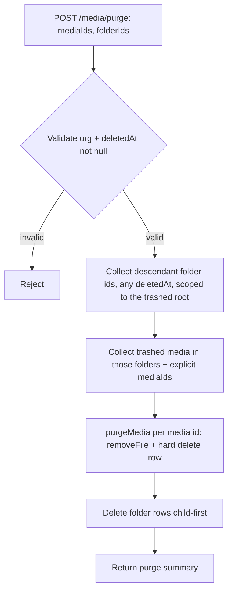

# Media, Calendar & Trash Improvements - Plan

## Goal Capsule

- **Objective:** Media Library users can bulk-select and drag-and-drop to organize their files and folders; a scheduled post's review comments are reachable from the calendar tile that already shows them; and Trash gives users a correct way back, a way to permanently remove items, and a restore path that never silently drops media out of its folder.
- **Product authority:** Owned end to end by this plan — the user chose to keep Media, Calendar, and Trash together as one work unit rather than splitting them, even though each is independently shippable.
- **Open blockers:** None. All product decisions below were resolved in dialogue.

**Product Contract preservation:** unchanged, except one factual correction — Scope Boundaries originally named `/media/bulk` as the existing move endpoint; research found the actual endpoint is `POST /media/move` (`MoveMediaDto`). Corrected in place below; no scope change.

---

## Product Contract

### Summary

Add a Select-All control and drag-and-drop (move-into-folder, reorder-folders) to the Media Library; wire up the dead comment-count icon on calendar post tiles so it opens the post's review page; and give the Trash view a correct back icon and a permanent-delete action, with restore falling back to unfiled/root — never erroring — when an item's original folder is gone for any reason.

### Problem Frame

The Media Library's bulk toolbar already supports multi-select and a move-to-folder dropdown (`apps/frontend/src/components/media/media.box.tsx`), but there's no fast way to select everything at once, and moving/reordering both require menu-driven actions instead of direct manipulation.

The reported "calendar doesn't open in the main view" bug does not describe an existing code path: `Calendar` renders unconditionally inside the main `/launches` route (`apps/frontend/src/components/launches/launches.component.tsx`), never inside the notification center. The actual friction is narrower: comment notifications correctly link to a post's review page (`/p/{postId}`) because they render a plain `<a>` tag, but the equivalent comment-count icon shown on the same post's calendar tile (`CommentCountBadge` in `apps/frontend/src/components/launches/comment.count.badge.tsx`) has no click handler at all — it's decorative.

Trash reuses the Media Library's `TrashIcon` for both entering trash and returning from it, so "Back to Library" looks like another trash action. Restore already exists server-side (`MediaService.restore`); when a media item's original folder is gone, `MediaRepository.restoreMedia` (`libraries/nestjs-libraries/src/database/prisma/media/media.repository.ts:378-391`) already clears `folderId` to `null`, landing the item unfiled at root rather than erroring — this plan confirms that behavior is the correct one to keep once permanent delete exists, rather than building new folder-recreation logic (see the Key Decision governing R11). There is also no permanent-delete path anywhere in the media backend today — only soft-delete and restore exist.

### Key Decisions

- **Select All is scoped to the current view, not global** (session-settled: user-directed — chosen over selecting every item across all folders: matches how the existing per-tile bulk selection already scopes to the visible grid). Governs R1.
- **Drag-and-drop into a folder replaces the move-to-folder dropdown** (session-settled: user-directed — chosen over keeping both: the dropdown becomes redundant once direct manipulation exists). Governs R3.
- **Dragging a selected tile moves the whole current selection** (session-settled: user-directed — chosen over moving only the dragged tile: matches common bulk-drag conventions such as Finder or Google Drive). Governs R4.
- **Folder order is persisted, not session-only** (session-settled: user-directed — chosen over a session-only visual reorder: a custom arrangement should survive reloads and be shared across the team). Governs R5. This requires a new field on `MediaFolder` (`libraries/nestjs-libraries/src/database/prisma/schema.prisma:241-257` has no order column today), which is a schema/migration change, not UI-only.
- **The calendar comment icon opens the review page in a new tab** (session-settled: user-directed — chosen over same-tab navigation: mirrors the notification bell's existing `<a target="_blank">` behavior exactly). Governs R6.
- **Permanent delete requires a confirmation step** (session-settled: user-directed — chosen over deleting immediately: it is irreversible, unlike the existing soft-delete-to-trash flow). Governs R8.
- **Permanently deleting a trashed folder cascades to its remaining contents** (session-settled: user-directed — chosen over blocking deletion until the folder is empty: matches how the existing soft-delete-to-trash flow already cascades). Governs R9.
- **Permanent delete is genuinely irreversible; restore never recreates a permanently-deleted folder** (session-settled: user-directed — chosen over recreating the folder by name: doc review found that recreating an original name/hierarchy requires retaining metadata past the point of "permanent" deletion, which contradicts the point of the feature). Governs R11. An item whose original folder was permanently deleted restores to unfiled/root — the same place it already lands today when the folder is merely still sitting in trash. No new backend behavior is needed for this case; it was already correct.

### Requirements

**Media Library**

- R1. A "Select All" control selects every media item currently visible under the active folder/filter (library or trash view), enabling one-action bulk delete on top of the existing per-tile toggle selection.
- R2. Media tiles can be dragged onto a folder in the folder tree to move them into that folder.
- R3. The drag-and-drop move in R2 replaces the existing move-to-folder dropdown in the bulk-selection toolbar.
- R4. When multiple tiles are selected and the user drags one of the selected tiles onto a folder, the entire selection moves into that folder.
- R5. Folders in the folder tree can be reordered via drag-and-drop, and the resulting order persists across reloads.

**Calendar**

- R6. The comment-count icon shown on a scheduled post's calendar tile is clickable and opens that post's review page (`/p/{postId}`) in a new tab.

**Trash**

- R7. The "Back to Library" control in the Trash view shows a back/arrow icon instead of the trash-can icon it currently shares with the "view trash" entry point.
- R8. Selected items in the Trash view (media, folders, or both) can be permanently deleted, gated by a confirmation step that warns the action is irreversible.
- R9. Permanently deleting a trashed folder also permanently deletes any media still inside it.
- R10. Restoring a trashed media item or folder returns it to its original folder when that folder still exists (live or still in trash); when it does not, the item lands in unfiled/root, matching existing behavior.
- R11. If the original folder — or any ancestor folder in its path — no longer exists because it was permanently deleted, the item restores to unfiled/root rather than being blocked or erroring. Permanent delete is irreversible by design: no folder name or hierarchy is reconstructed.

### Key Flows

- F1. **Drag a multi-selection into a folder**
  - **Trigger:** User has several media tiles selected (via R1 or manual multi-select) and drags one of them onto a folder in the tree.
  - **Steps:** Drop target highlights on drag-over; on drop, every selected item's `folderId` updates to the target folder in one action.
  - **Outcome:** All previously selected items now live in the target folder; selection state clears or persists per normal post-action behavior.
  - **Covers:** R2, R3, R4

- F2. **Restore an item whose original folder no longer exists**
  - **Trigger:** User restores a trashed media item (or folder) whose original folder was permanently deleted.
  - **Steps:** Restore resolves the referenced folder id; when it does not resolve to any row, the item is attached as unfiled (`folderId: null`) instead of erroring — the same resolution already used when the folder is merely still in trash.
  - **Outcome:** The item is restored and reachable in the library; the user can re-file it manually. No folder is recreated.
  - **Covers:** R10, R11

- F3. **Permanently delete a trashed folder**
  - **Trigger:** User selects a trashed folder and confirms permanent delete.
  - **Steps:** Confirmation dialog warns the action is irreversible; on confirm, the folder and any media still inside it are permanently removed.
  - **Outcome:** Folder and its remaining contents no longer exist, in trash or otherwise.
  - **Covers:** R8, R9

### Acceptance Examples

- AE1. **Given** a user has 5 media tiles selected across a folder view, **when** they drag one selected tile onto folder "Campaigns", **then** all 5 items move into "Campaigns", not just the dragged tile. Covers R4.
- AE2. **Given** a media item whose original folder "Q1 Assets" was permanently deleted, **when** the user restores that item from Trash, **then** the item is restored to unfiled/root (not blocked, not erroring, and "Q1 Assets" is not recreated) — the same outcome as restoring an item whose folder is still sitting in trash. Covers R11.
- AE3. **Given** a trashed folder still containing 3 media items, **when** the user permanently deletes that folder, **then** all 3 media items are also permanently deleted, without a separate confirmation for each. Covers R9.
- AE4. **Given** a post with existing review comments shown on the calendar, **when** the user clicks the comment-count icon on that post's calendar tile, **then** the post's review page opens in a new tab, the same destination the notification bell link already opens. Covers R6.

### Scope Boundaries

- The originally reported "calendar fails to open in the main view" issue does not apply to any code path found in this repo — no separate fix is scoped for it beyond R6's icon wiring.
- No auto-sorting or algorithmic folder ordering — R5 covers only user-initiated drag reordering.
- **Known limitation, accepted:** removing the move-to-folder dropdown (R3) leaves drag-and-drop as the only way to move media or reorder folders, with no keyboard-operable alternative. This was a deliberate trade-off in scoping (R3's Key Decision), not an oversight; a keyboard-accessible fallback is deferred to follow-up work rather than blocking this plan.
- The existing move-to-folder dropdown's underlying mutation (`POST /media/move`) is reused; this plan does not introduce a new move endpoint, only a new interaction path onto it.
- This plan does not change the automatic Temporal trash-purge workflow (`mediaTrashPurgeWorkflow`) or its activity. That workflow's existing folder purge orphans a folder's media (sets `folderId: null`) rather than deleting it. This plan's new user-triggered permanent-delete behaves differently (it does cascade-delete a folder's contents) but both paths agree that once a folder is truly gone, restore never reconstructs it — only where its former contents land differs, and both land those contents somewhere reachable rather than erroring.
- No folder-recreation logic is introduced anywhere. Restore's existing "folder not found → unfiled" resolution already covers both "folder still in trash" and "folder permanently deleted" — this plan changes no restore code path.

### Dependencies / Assumptions

- R5 (persisted folder order) requires a schema change adding an `order` field to `MediaFolder`. This repo has no Prisma migrations directory — schema changes apply via `prisma db push` — so the field must default safely for existing rows (`Int @default(0)`) rather than relying on a migration-time backfill step.
- R8/R9 (permanent delete) require new backend capability — no user-triggered permanent-delete method exists today in `MediaService`/`MediaRepository`. `MediaService.purgeMedia` (`libraries/nestjs-libraries/src/database/prisma/media/media.service.ts:35-44`) already implements the per-media mechanics (storage removal + hard delete) for the existing automatic retention-purge workflow; this plan's new endpoint calls that same method rather than duplicating its logic.
- The frontend already depends on `react-dnd` + `react-dnd-html5-backend` (used by the calendar's own drag-and-drop via `DNDProvider`, with a concrete `useDrag`/`useDrop` example in `apps/frontend/src/components/launches/launches.component.tsx:147-165` and `:238-247`), which is the natural fit to reuse for R2/R5 rather than introducing a second drag-and-drop library.

---

## Planning Contract

### Key Technical Decisions

- KTD1. **Permanent delete calls the existing `MediaService.purgeMedia` per media item, and recurses the folder tree using new deletedAt-aware queries rather than reusing `hardDeleteFolder` or the live-only `getDescendantFolderIds`/`getMediaIdsInFolders`** (session-settled: user-directed — chosen over blocking deletion until a folder is empty: matches how soft-delete-to-trash already cascades; instantiated here because today's `hardDeleteFolder` orphans media instead of deleting it, and the existing descendant/media-lookup helpers filter to `deletedAt: null` — the opposite of what a trashed-subtree walk needs). Governs R8, R9. New service method collects the folder subtree with a query scoped to descendants of the trashed root regardless of their own `deletedAt` (mirroring `restoreFolders`' unfiltered folder scan, `media.repository.ts:405-` onward, not `getDescendantFolderIds`'s live-only scan), gathers only the trashed media within them (`deletedAt` not null — explicitly-passed media ids are validated trashed the same way), purges each media id, then deletes folder rows child-first.
- KTD2. **`MediaFolder.order` is a non-nullable `Int` defaulting to `0`**, not nullable. Existing folders receive `0` on `db push` with no separate backfill step; the frontend orders by `order` then falls back to name/createdAt for ties.
- KTD3. **Folder-move and folder-reorder drag-and-drop mirror the existing `react-dnd` `useDrag`/`useDrop` pair already used for calendar drag-and-drop** (`launches.component.tsx:147-165` drop target, `:238-247` drag source), using distinct `accept`/`type` tags (e.g. `'media-tile'` for move, `'media-folder'` for reorder) so the two drag interactions don't collide with each other or with the calendar's own `'menu'` type. The calendar's `DndProvider` (`apps/frontend/src/components/launches/helpers/dnd.provider.tsx`) only wraps the Launches route; `MediaBox` is also mounted from Settings, Developer, and layout-media contexts that carry no such provider today, so Media Library needs its own `DndProvider` instance wrapping its root render — it cannot assume the calendar's provider is present.
- KTD4. **Permanent delete is genuinely irreversible; restore recreates nothing.** (session-settled: user-directed — chosen over snapshotting folder metadata for later recreation: doc review found that any snapshot-and-recreate mechanism contradicts what "permanent" is supposed to mean). Governs R11. Restoring an item whose folder no longer exists (for any reason) falls back to unfiled/root using restore's existing, unmodified resolution — no new repository code.
- KTD5. **Permanent-delete confirmation reuses `MediaDeleteConfirmModal`'s dialog shell** (`apps/frontend/src/components/media/media.delete.confirm.tsx`), already wired into `media.box.tsx`'s modal flow, but needs a body-content override, not just its `title` prop — the component's existing body copy and `consumers` list are hardcoded around the "still referenced elsewhere" warning, which doesn't apply to already-trashed items. The permanent-delete variant needs its own body copy naming the selected item/folder counts and stating the action cannot be undone.

### Assumptions

- Folder order is per-organization (not per-user) — matches every other Media Library scoping (folders are shared org-wide), and nothing in dialogue suggested a per-user view.
- "Select All" is a toggle: selecting when everything is already selected clears the selection, following the same convention as the existing per-tile toggle behavior. No separate deselect control is added.
- The purge cascade (U4) is not specified as a single DB transaction. A mid-cascade failure could leave a partially-purged folder subtree. Given `purgeMedia` already treats storage removal as best-effort (swallows `removeFile` errors), this plan accepts the same best-effort posture for the cascade rather than adding new transactional infrastructure; revisit if partial-purge states prove disruptive in practice.

### High-Level Technical Design

The permanent-delete cascade (U4) branches across multiple components (Controller → Service → Repository → Storage) with recursion over the folder subtree, scoped to trashed rows only — not the live-row scan the existing `getDescendantFolderIds`/`getMediaIdsInFolders` helpers perform (KTD1):

Restore needs no new diagram: per KTD4, a missing folder id (whatever the reason) resolves through the existing, unmodified "attach unfiled" path.

---

## Implementation Units

### U1. Persist and drag-reorder Media Folders

- **Goal:** Folders can be reordered by drag-and-drop, and the order persists.
- **Requirements:** R5. KTD2, KTD3.
- **Dependencies:** None.
- **Files:**
  - `libraries/nestjs-libraries/src/database/prisma/schema.prisma` — add `order Int @default(0)` to `MediaFolder`.
  - `libraries/nestjs-libraries/src/dtos/media/reorder.folders.dto.ts` (new) — `{ orders: { id: string; order: number }[] }`, following `MoveMediaDto`'s validation style.
  - `apps/backend/src/api/routes/media.controller.ts` — new `POST /media/folders/reorder` route.
  - `libraries/nestjs-libraries/src/database/prisma/media/media.service.ts` — new `reorderFolders(org, orders)` method.
  - `libraries/nestjs-libraries/src/database/prisma/media/media.repository.ts` — new `reorderFolders` method, bulk-updating `order` per folder id scoped to `organizationId`.
  - `apps/frontend/src/components/media/media.box.tsx` — `FolderTreeItem` (currently `media.box.tsx:119-196`) gains `useDrag`/`useDrop` for sibling reordering; folder list sorts by `order`; the Media Library's root render gains its own `DndProvider` (see Approach).
  - `apps/frontend/src/components/media/use.media.hooks.ts` — `useMediaFolders` result includes `order`; no shape change if the API already returns full rows.
- **Approach:**
  1. Add the schema field per KTD2; run `pnpm prisma-db-push` (per repo convention, not a migration file).
  2. DTO → Controller → Service → Repository per project layering; repository update is a single transaction over the provided `(id, order)` pairs, scoped to the organization to prevent cross-org writes.
  3. Wrap `MediaBox`'s root render in its own `DndProvider` (per KTD3) — do not assume the calendar's `DNDProvider` is present, since `MediaBox` also mounts from Settings, Developer, and layout-media contexts outside the Launches route.
  4. Frontend: wrap sibling folder tiles in the same `useDrag`/`useDrop` pattern as KTD3, using a distinct type tag; on drop, compute new order values for the affected siblings and call the reorder endpoint; optimistic UI update via SWR `mutate`, matching the existing `useMediaFolders` hook pattern; on a failed request, revert the optimistic order and surface an error (matching whatever error-display pattern the existing bulk-delete/move flow already uses).
- **Patterns to follow:** `MoveMediaDto` (`libraries/nestjs-libraries/src/dtos/media/move.media.dto.ts`) for DTO shape; `launches.component.tsx:147-165`/`:238-247` for the `useDrag`/`useDrop` pair; `apps/frontend/src/components/launches/helpers/dnd.provider.tsx` for the `DndProvider` shape to instantiate a second instance of; existing per-hook SWR convention in `use.media.hooks.ts`.
- **Test scenarios:**
  - Reordering two sibling folders persists the new order across a page reload (integration).
  - Reorder request for a folder id belonging to a different organization is rejected (permission/edge case).
  - Reordering with an empty or single-folder list is a no-op (edge case).
  - Existing folders created before this change (implicit `order: 0`) render in a stable order (createdAt/name tiebreak) until explicitly reordered (edge case).
  - A failed reorder request reverts the folder tree to its prior order and surfaces an error, rather than leaving a stale optimistic order. Error path.
  - Drag-and-drop reordering works when the Media Library is opened from Settings/Developer/layout-media, not only from within the Launches calendar route. Regression check for KTD3's provider placement.
- **Verification:** `POST /media/folders/reorder` updates `order` on the targeted rows only; the folder tree UI reflects persisted order after reload.

### U2. Drag-and-drop move media into folders

- **Goal:** Dragging media tile(s) onto a folder moves them there, replacing the move-to-folder dropdown.
- **Requirements:** R2, R3, R4. KTD3.
- **Dependencies:** U1 (shares the `DndProvider` U1 adds around `MediaBox`'s root render; reuses the existing `POST /media/move` endpoint, no new backend work).
- **Files:**
  - `apps/frontend/src/components/media/media.box.tsx` — media tile rendering (`renderMediaTile`, `media.box.tsx:722-808`) gains `useDrag`; `FolderTreeItem` gains `useDrop` accepting the tile's drag type; remove the existing move-to-folder dropdown from the bulk toolbar (`media.box.tsx:970-1013`).
- **Approach:**
  1. Drag source on each media tile carries `{ id }`, or the full current selection when the dragged tile is already selected (per KTD/Key Decision governing R4).
  2. Drop target on each folder tile calls the existing move mutation (`POST /media/move`) with the dragged id(s) and the target `folderId`.
  3. Remove the dropdown control and its handler once drag-and-drop covers the same mutation.
- **Patterns to follow:** `launches.component.tsx:147-165`/`:238-247` `useDrag`/`useDrop` pair; existing `moveMedia`-style call already used by the dropdown being replaced.
- **Test scenarios:**
  - Dragging a single unselected tile onto a folder moves only that tile. Covers AE1 (contrast case).
  - Dragging one of five selected tiles onto a folder moves all five. Covers AE1.
  - Dragging a tile onto its current folder is a no-op (edge case).
  - Dragging a tile onto a folder tile while nothing is selected still moves the dragged item (happy path).
  - A failed move request (e.g. network error) reverts the tile to its prior folder and surfaces an error rather than leaving it in an inconsistent optimistic state. Error path.
  - Dragging a media tile works when the Media Library is opened from Settings/Developer/layout-media, not only from within the Launches calendar route (shares U1's `DndProvider` placement fix).
- **Verification:** Manual drag in the browser moves tile(s) into the target folder and the grid reflects the new folder scope without a page reload.

### U3. Select All bulk-selection control

- **Goal:** A Select-All control selects every media item visible under the active folder/filter.
- **Requirements:** R1.
- **Dependencies:** None.
- **Files:**
  - `apps/frontend/src/components/media/media.box.tsx` — new control near the existing bulk toolbar (`media.box.tsx:970-1013`); extends `bulkSelected`/`trashSelectedMedia` state (`media.box.tsx:221`, `223-224`) to set every currently-rendered item id.
- **Approach:** Compute "currently visible" from the same filtered/paginated list already driving the grid render (`renderMediaTile` call sites, `media.box.tsx:1153-1155` and `:1157-1184`), so the control never reaches beyond what's on screen. Re-clicking when everything is already selected clears the selection (per Assumptions).
- **Patterns to follow:** Existing `toggleBulk` (`media.box.tsx:564-570`) for the selection-state update shape.
- **Test scenarios:**
  - Select All with 12 items in the current folder selects all 12; bulk delete then removes all 12.
  - Select All while a folder filter is active selects only that folder's items, not the whole library.
  - Select All in the Trash view selects only trashed items in view, feeding the existing/​new bulk trash actions.
  - Clicking Select All again when all items are already selected clears the selection.
- **Verification:** Selecting all visible items and triggering bulk delete removes exactly the visible set, not items outside the current filter.

### U4. Backend permanent delete (purge) for trashed media and folders

- **Goal:** A user-triggered endpoint permanently deletes selected trashed media and/or folders, cascading into folder contents.
- **Requirements:** R8, R9. KTD1.
- **Dependencies:** None.
- **Files:**
  - `libraries/nestjs-libraries/src/dtos/media/purge.media.dto.ts` (new) — `{ mediaIds?: string[]; folderIds?: string[] }`, mirroring `RestoreMediaDto`'s shape.
  - `apps/backend/src/api/routes/media.controller.ts` — new `POST /media/purge` route.
  - `libraries/nestjs-libraries/src/database/prisma/media/media.service.ts` — new `purgeSelected(org, { mediaIds, folderIds })` method implementing KTD1: for each folder id, collect the descendant folder set (regardless of the descendants' own `deletedAt`, since the whole subtree is already trashed) and the trashed media within them; call `purgeMedia` per collected + explicitly-listed media id; delete folder rows child-first.
  - `libraries/nestjs-libraries/src/database/prisma/media/media.repository.ts` — new deletedAt-aware descendant/media-collection methods per KTD1 (not a reuse of `getDescendantFolderIds`/`getMediaIdsInFolders`, which filter to live rows only); add a repository method to hard-delete folder rows without the existing `hardDeleteFolder`'s media-orphaning side effect.
- **Approach:**
  1. Validate requested ids belong to the caller's organization and are actually trashed (`deletedAt` not null) before purging, so permanent delete can't be used to hard-delete live items.
  2. For folder ids: recurse descendants, gather contained media, purge each via `MediaService.purgeMedia`, then delete folder rows leaf-first.
  3. For standalone media ids: purge directly.
  4. Return a summary (counts purged) for the frontend confirmation flow to display.
- **Patterns to follow:** `MediaService.purgeMedia` (`media.service.ts:35-44`) for the per-media mechanics; `restoreFolders`' unfiltered folder scan (`media.repository.ts:405-` onward) for the descendant-walk shape — closer to what's needed here than `deleteFolder`'s live-only descendant-walk, since the purge target is already a trashed subtree; `RestoreMediaDto` for DTO conventions.
- **Test scenarios:**
  - Purging a single trashed media item removes its storage files and DB row. Happy path.
  - Purging a trashed folder with 3 trashed media items removes all 3 media rows, their storage objects, and the folder row. Covers AE3.
  - Purging a folder with nested trashed subfolders removes the entire subtree and all contained media.
  - Attempting to purge a media item that is not trashed (`deletedAt` null) is rejected. Error path.
  - Attempting to purge an id belonging to a different organization is rejected. Error path.
  - Storage `removeFile` failure during purge does not leave the DB row half-deleted (matches existing `removeMediaFromStorage`'s best-effort/swallow behavior — document the resulting state rather than inventing new rollback logic).
- **Verification:** `POST /media/purge` on a trashed folder containing media leaves no DB rows for the folder or its former contents, and storage `removeFile` was invoked for each purged media item.

### U5. Frontend permanent delete in Trash

- **Goal:** Users can select trashed items and permanently delete them, with a confirmation step.
- **Requirements:** R8. KTD5.
- **Dependencies:** U4.
- **Files:**
  - `apps/frontend/src/components/media/media.box.tsx` — new "Delete permanently" action in the trash bulk toolbar, alongside existing `restoreTrash` (`media.box.tsx:547-562`); wires selected `trashSelectedMedia`/`trashSelectedFolders` (`media.box.tsx:223-224`) into the new purge call.
  - `apps/frontend/src/components/media/media.delete.confirm.tsx` — per KTD5, gains a body-content override (not just `title`) so the permanent-delete variant can replace the hardcoded "consumer" copy with its own irreversibility warning.
- **Approach:** Before showing the confirmation, compute the selected counts (media, folders) client-side from the current trash selection and pass them into the dialog's body copy, so the user sees what's about to be deleted before confirming, not only in the backend's post-action summary. On confirm, call the U4 endpoint with the current trash selection; on success, refresh the trash SWR views (`useMediaTrash`, `useMediaFoldersTrash`) and clear selection state.
- **Patterns to follow:** Existing `deleteWithWarning` (`media.box.tsx:378-418`) call shape for triggering the confirm modal.
- **Test scenarios:**
  - Confirming permanent delete on a mixed media+folder trash selection removes all of them and refreshes the trash view.
  - The confirmation dialog shows the count of items about to be permanently deleted before the user confirms.
  - Cancelling the confirmation dialog leaves the trash contents unchanged.
  - Permanent delete is only reachable from the Trash view, not the live library.
- **Verification:** Selecting trashed items, confirming permanent delete, and observing the trash view no longer lists them (with no page reload required).

### U7. Trash "Back to Library" icon fix

*(U6 is not needed: per KTD4, restore's existing "folder not found → unfiled" resolution in `restoreMedia`/`restoreFolders` (`media.repository.ts:378-391`) already covers a permanently-deleted folder with no code change — see AE2 and the Key Decision governing R11.)*

- **Goal:** The "Back to Library" control shows a back/arrow icon instead of the trash-can icon.
- **Requirements:** R7.
- **Dependencies:** None.
- **Files:**
  - `apps/frontend/src/components/media/media.box.tsx` — the "Back to Library" control (`media.box.tsx:843-861`) swaps its icon for a back/arrow icon; the "view trash" entry point keeps `TrashIcon`.
  - `apps/frontend/src/components/ui/icons/index.tsx` — reuse an existing back/arrow icon if one exists in this file; add one only if none does.
- **Approach:** Swap the icon reference on the "Back to Library" render branch only (`media.box.tsx:857-859` already branches by label text); no state or behavior change.
- **Test scenarios:**
  - Test expectation: none -- pure icon swap with no behavioral change; covered by existing visual/manual review, not unit tests.
- **Verification:** In the Trash view, "Back to Library" renders a back/arrow icon; entering Trash still renders the trash-can icon.

### U8. Wire calendar comment-count icon to the review page

- **Goal:** Clicking the comment-count icon on a calendar post tile opens that post's review page in a new tab.
- **Requirements:** R6.
- **Dependencies:** None.
- **Files:**
  - `apps/frontend/src/components/launches/comment.count.badge.tsx` — accept an `onClick` (or wrap in an anchor) so the badge is interactive.
  - `apps/frontend/src/components/launches/calendar.tsx` — `CalendarItem` (`calendar.tsx:979` onward) passes `post.id` to the badge at its render site (`calendar.tsx:1096`), opening `/p/{postId}` in a new tab on click, mirroring the notification link's destination.
- **Approach:** Prefer a real anchor (`<a target="_blank" href="/p/{postId}">`) wrapping the badge content over a synthetic `onClick` + `window.open`, matching how the notification link already works (a plain anchor, no React handler).
- **Patterns to follow:** `notification.component.tsx`'s `replaceLinks`-generated anchor (`notification.component.tsx:11-18`, `:33-54`) for the target destination and `target="_blank"` convention.
- **Test scenarios:**
  - Clicking the comment-count icon on a post with comments opens `/p/{postId}` in a new tab. Covers AE4.
  - The badge remains non-interactive (no dead click target) when `commentsCount` is 0, matching current rendering.
  - The badge's existing tooltip behavior is unaffected by adding the link.
- **Verification:** Clicking the calendar tile's comment icon opens the same `/p/{postId}` destination the notification bell link already opens.

---

## Verification Contract

| Scope | Command | Applies to |
|---|---|---|
| Unit/integration tests | `pnpm test` (root Jest) | U1, U2, U3, U4, U5, U8 |
| Lint | `pnpm lint` (run from repo root per project convention) | All units |
| Type check / build | `pnpm build` (frontend + backend) | All units, especially U1's schema/DTO change |
| Manual browser check | Drag-and-drop interactions incl. non-Launches entry points (U1, U2), Select All (U3), permanent delete confirm flow (U5), icon fixes (U7, U8) | U1, U2, U3, U5, U7, U8 |

Backend units (U1, U4) add or extend Jest spec coverage alongside the existing `libraries/nestjs-libraries/src/database/prisma/media/media.service.spec.ts`. Frontend interaction units (U2, U3, U8) are verified primarily by manual browser check per this repo's CLAUDE.md guidance to test UI changes in a running browser before reporting completion; add component-level tests only where `media.box.tsx` or `comment.count.badge.tsx` already has test coverage to extend.

## Definition of Done

- All seven active units (U1-U5, U7, U8; U6 is not needed per KTD4) implemented and passing `pnpm test` and `pnpm lint` from the repo root.
- U1's schema change applied via `prisma-db-push` in a local/dev environment without data loss on existing `MediaFolder` rows.
- Manual browser verification completed for every drag-and-drop interaction (folder reorder, tile-to-folder move, multi-select drag, including from a non-Launches entry point per KTD3), Select All, the permanent-delete confirm-and-delete flow, and both icon fixes (U7, U8) — per this repo's convention of testing UI changes live before calling them done.
- No leftover move-to-folder dropdown code path once U2 lands (dead code removed, not left disabled).
